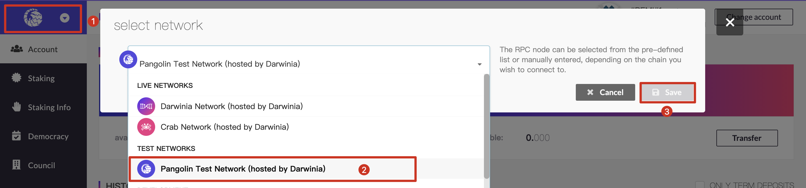
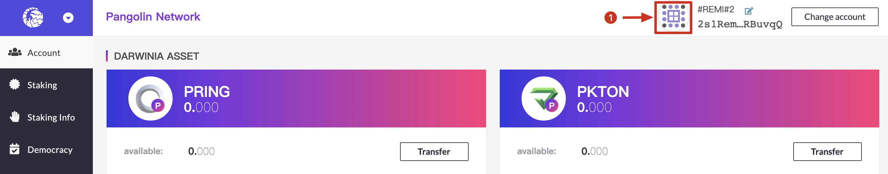
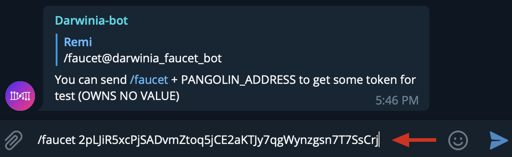
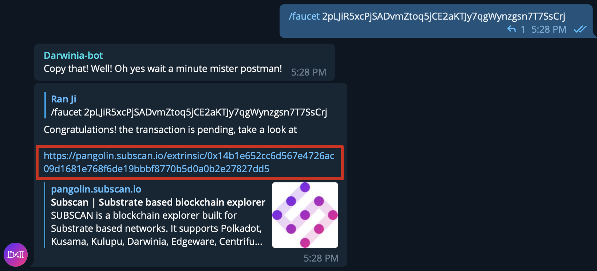
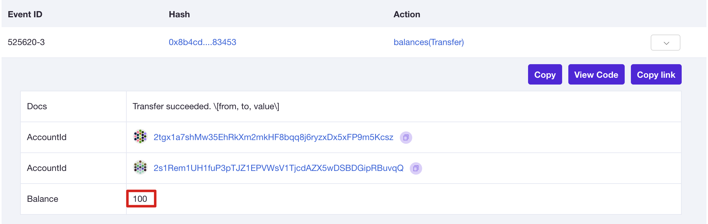
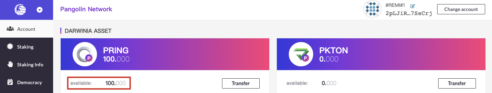

# Connect to Pangolin

## Introduction

The Darwinia official TestNet, named Pangolin, is the easiest way to get started with a Darwinia network environment. Follow this tutorial to connect to the Pangolin network.

The Pangolin Network has two endpoints available for users to connect to: one for HTTPS and one for WSS.

import Tabs from '@theme/Tabs';
import TabItem from '@theme/TabItem';

<Tabs
  defaultValue="wss"
  values={[
    {label: 'WSS Entry', value: 'wss'},
    {label: 'HTTPS Entry', value: 'https'},
  ]}>
  
  <TabItem value="https">

```
https://pangolin-rpc.darwinia.network
```

  </TabItem>
  <TabItem value="wss">

```
wss://pangolin-rpc.darwinia.network
```
    
   </TabItem>
</Tabs>

## Features

- Testing the latest technology products.
- Compatible with EVM, Ethereum contracts, Ethereum contract tools.
- Support substrate-substrate bi-directional bridge
- Support ethereum-substrate bi-directional bridge.
- Have some unstable features, may be reset.
  
## Get Tokens

To start building on Pangolin, you can get DEV tokens(PRING) from our [Pangolin Faucet Official](https://t.me/darwiniafaucet_official), in our Tg Group. For specific amounts, you can always reach out directly to us via our community channels.

### Pangolin Faucet Official

- Visit [Pangolin Apps Portal](https://apps.darwinia.network/#/account) and select the **Pangolin Test Network** in the network list in the upper left corner.



- Create an account on Pangolin Test Network. For detailed tutorials on creating an account, please refer to [here](https://docs.crab.network/crab-tut-create-account)!
- Click the avatar and you can copy your Pangolin address.



- Join the Telegram group named "[Darwinia Faucet Official](https://t.me/darwiniafaucet_official)".
- Send `/faucet`+ Pangolin address.



- You can open the link of the darwinia_bot to check the transaction on Subscan.





- When the transaction is successful, a certain number of test tokens will appear in your pangolin address.



- Each telegram account can get 100 PRINGs every seven days.

### Manual Procedure

For token requests of more than the limited account allowed by our Tg group, contact a moderator directly via our [Element](https://app.element.io/?pk_vid=6961ca0f7c45f8bf16052310122d2437#/room/#darwinia:matrix.org). We are happy to provide the tokens needed to test your applications.
