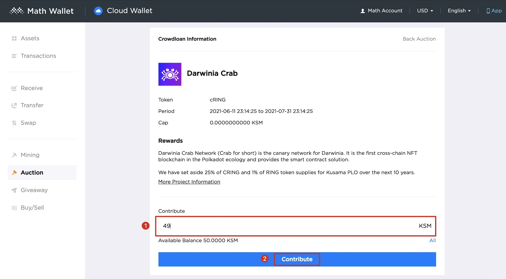

1. Go to https://cloud.mathwallet.xyz/#/auction

   

2. Select "Darwinia Crab", click to enter the project details, directly fill in the amount of KSM on this page and click "Contribute".

   

3. After the auction is over, the rewards will be issued directly in the Math Cloud Wallet, and users can see the rewards in the Math Cloud Wallet.
