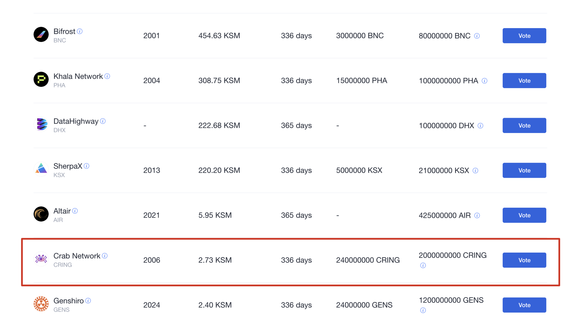
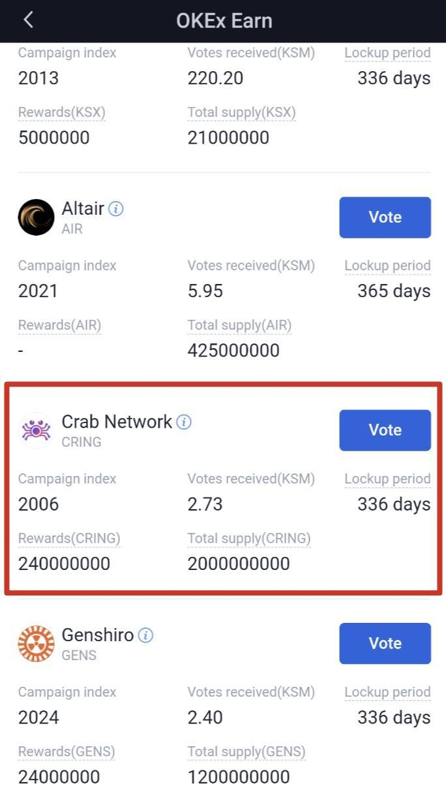

## Method 1: Join Crowdloan through the web version of OKEx

1. Visit the web version [OKEx](https://www.okex.com/) and go to s"Finance" > "Earn" > "Parachain Slot Auction":

   

2. Select "Crab Network" and click "Vote", enter the number of KSMs you want to contribute and confirm your vote:

   

## Method 2: Join Crowdloan through OKEx mobile application

1. Open OKEx app and go to "Assets" > "Finance" > "Earn" > "Parachain Slot Auction":

   

2. Select "Crab Network" and click click "Vote", enter the number of KSMs you want to contribute and confirm your vote:

   

> **Important 1**: We have set aside 25% of CRING and 1% of RING token supplies for Kusama PLO over the next 10 years. We will bid for 8 periods of one slot for 48 weeks to ensure that the stability of the network is not affected. Considering the instability of the first few slots, we plan to join the slot auction in the 4th round of.

> **Important 2**: We will provide users with **RING** and **CRING** token as rewards, as well as the Columbus continent built on the Crab network and the Heco network built on the Evolution Land. **NFT (including land, drill, and apostle) rewards in Dawn Continent**. Our **Super Jackpot is ** **1 BTC**, and the luckiest user can find this BTC “blind box” prize in the NFT. Users who support the Crab network through cooperative exchanges can also get these rewards.