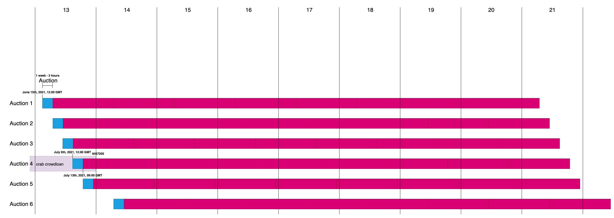

Kusama allows parachains to source KSM for their parachain bids in a decentralized crowdloan.

## What can you get?

We have set aside 25% of CRING and 1% of RING token supplies for Kusama PLO over the next 10 years.

In addition, Evolution Land NFT rewards (land, chests, apostles) on the Columbus continent launched on the Crab network and Dawning continent launched on Heco Chain will be provided to supporters after successful bidding.

Our super jackpot is 1 BTC, and one lucky user will find this BTC when they claim their land.

* Guaranteed rewards

  Every **1 KSM** donated by supporters of Crab during the Crowdloan will earn a reward of about **25 CRING** per day immediately at the end of the auction.

* Rewards for a successful bid

  After successfully winning the slot, we will distribute a 240,000,000 CRING prize pool and a 6,000,000 RING prize pool.

* BTC Prize Lotto

  In addition to NFT rewards, We will also offer a Mystery BTC Super Prize hidden somewhere in the NFT land. Within 20 days after the parachain auction is finished, all players who get the Evolution Land NFT Legendary Package lucky draw will have a chance to win the BTC lotto prize!

More details in [Darwinia Crab’s Kusama Parachain Auction Strategy](https://darwinianetwork.medium.com/darwinia-crabs-kusama-parachain-auction-strategy-3f37cbfdfe4)

## How to contribute?

### If your KSM is in your third-party platform account

* [OKEx](https://www.ouyi.cc/earn/slotauction)

  * [How-to](./crab-crowdloan-howto-okex.md)

* [Gateio](https://www.gateio.ch/cn/hodl/600)

* [Math cloud wallet](https://cloud.mathwallet.xyz/#/auction)

* Hotbit, coming soon

Of course, you can withdraw your KSM to your wallet.

### If your KSM is in your wallet

1. [Unstaking](./crab-crowdloan-howto-unstaking.md)

2. Contribute

    * [Contribute through our webpage](https://crab.network/plo)

    * [Polkadot.{js}](https://polkadot.js.org/apps/?rpc=wss%3A%2F%2Fkusama-rpc.polkadot.io#/parachains/crowdloan)

    	* [How-to](./crab-crowdloan-howto-polkadotjs.md)

    * [Nutbox](https://polkadot.nutbox.io/#/crowdloan/kusama/parachain/2006)

    	* [How-to](https://www.notion.so/Crab-Slot-Auction-7710b022aa8647cca7d782ab90f2aa05)

    	* [How-to(TP)](https://www.notion.so/Crab-Slot-Auction-TP-b62746eb90684d6c8ff96f2e83bb3622)

    * [Bounce](https://ksm.bounce.finance/#/)

    * [Atoken](https://atoken-plo.biliangwang.com/plo)

### About the crowdloan

Anyone can create a new crowdloan campaign for a parachain slot. A campaign is configured as a range of slots (i.e. the duration the parachain will bid for), a cap, and a duration. The duration can last over several auctions, meaning that the team will not need to restart the campaign just because they do not secure a slot on their first attempt.

Each created campaign will have an index. Once a crowdloan campaign is open, anyone can participate by sending a special transaction that references the campaign's index. KSM used to participate must be transferable --- that is, not locked for any reason, including staking, vesting, and governance --- because they will be moved into a module-controlled account that was generated uniquely for this campaign.

> Important: All crowdloan contributions are handled by the Crowdloan module's logic where a campaign is identified by index, not by address. Never transfer KSM to an address in support of a campaign.

If a crowdloan campaign is successful, that parachain will be on-boarded in Kusama. The collective KSM will be locked in that parachain's account for the entire duration that it is active (up to 1 year, the fuchsia bar in the below picture).

> Important: The user's KSM will not leave their wallet (except for those hosted by the exchange). 

Participants will be able to reclaim their KSM in one of two ways:

- If the auction was successful, then the parachain will enter a retirement phase at the end of its lease. During this phase, participants can withdraw the KSM with which they participated.

- If the auction was not successful, then this retirement phase will begin at the crowdloan's configured end, and participants can likewise withdraw their KSM (at the end of the light purple bar, which is the crab's first crowdloan ).

[More details in Kusama website](https://kusama.network/auctions)

