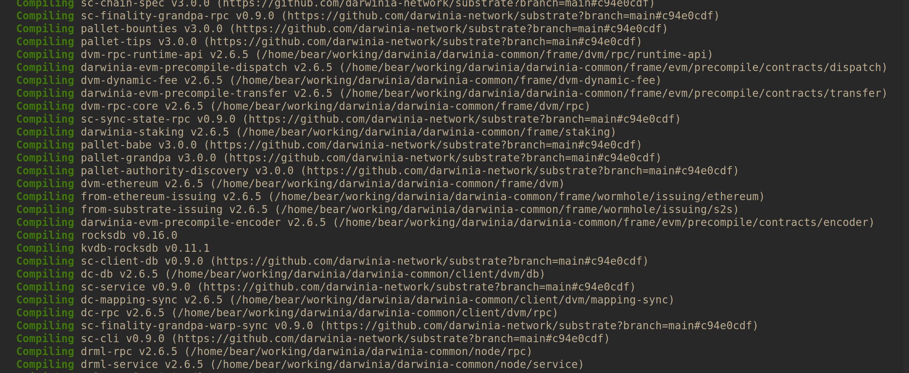
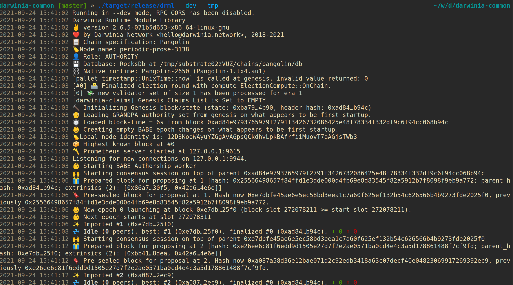
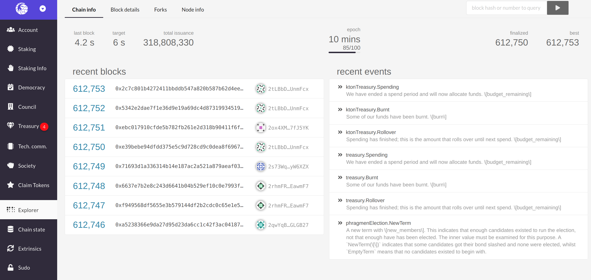
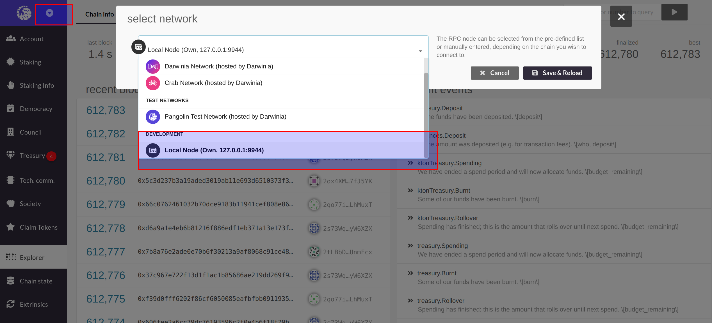
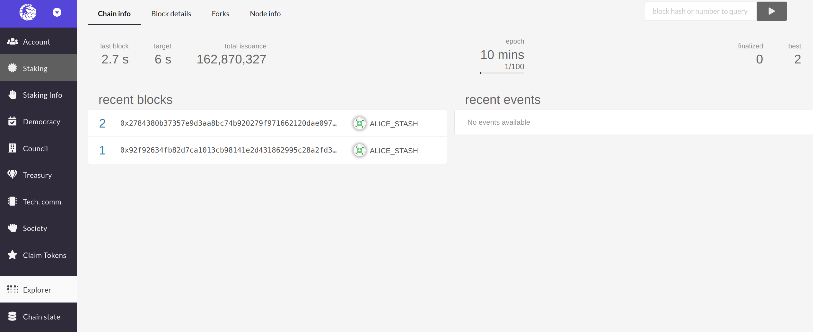

# Getting Started with a Darwinia Development Node

## Introduction

This guide outlines the steps needed to create a development node for latest features of Darwinia.

A Darwinia development node is your own personal development environment for building and testing applications on Darwinia. For Ethereum developers, it is comparable to Ganache. If you follow to the end of this guide, you will have a Darwinia development node running in your local environment, and will be able to connect it to the default Darwinia Apps GUI.

## Getting Started With The Binary

> If you know what you are doing, you can directly download the precompiled binaries attached to each release on the [Darwinia Release Page](https://github.com/darwinia-network/darwinia-common/releases). These will not work in all systems. For example, the binaries only work with x86-64 Linux with specific versions of dependencies. The safest way to ensure compatibility is to compile the binary in the system where it will be run from.

First, start by cloning the [darwinia-common](https://github.com/darwinia-network/darwinia-common) codebase:

```
git clone https://github.com/darwinia-network/darwinia-common
cd darwinia-common
```

If you already have Rust installed, you can skip the next two steps. Otherwise, install Rust and its prerequisites [via Rust's recommended method](https://www.rust-lang.org/tools/install) by executing:

```
curl --proto '=https' --tlsv1.2 -sSf https://sh.rustup.rs | sh
```

Next, update your PATH environment variable by running:

```
source $HOME/.cargo/env
```

Now, build the development node by running:

```
cargo build --release
```

If a _cargo not found error_ shows up in the terminal, manually add Rust to your system path or restart your system:
```
source $HOME/.cargo/env
```

> The initial build will take a while. Depending on your hardware, you should expect approximately 30 minutes for the build process to finish.

Here is what the tail end of the build output should look like:



Then, you will want to run the node in dev mode using the following command:

```
./target/release/drml --dev --tmp
```

> For people not familiar with Substrate, the `--dev` flag is a way to run a Substrate-based node in a single node developer configuration for testing purposes. You can learn more about `--dev` in [this Substrate tutorial](https://substrate.dev/docs/en/tutorials/create-your-first-substrate-chain/interact).

You should see an output that looks like the following, showing some blocks has been produced:



For more information on some of the flags and options used in the example, check out [Common Options](#common-options). If you want to see a complete list of all of the flags, options, and subcommands, open the help menu by running:

```
./target/release/drml --help
```
## Connecting To Darwinia Apps

Start by connecting to it with [Darwinia Apps Explorer](https://apps.darwinia.network/?rpc%3Dwss%253A%252F%252Fpangolin-rpc.darwinia.network#/explorer). This will automatically connects to Pangolin TestNet.



Click on the top left corner to open the menu to configure the networks, and then navigate down to open the Development sub-menu. In there, you will want to toggle the "Local Node" option, which points to `ws://127.0.0.1:9944`. Next, select the "Save & Reload" button, and the site should connect to your Darwinia development node.



With Darwinia Apps connected, you will see the the development node has began producing blocks.



## Common Options

Flags do not take an argument. To use a flag, add it to the end of a command. For example:

```
./target/release/drml --dev --tmp
```

- `--dev`: Specifies the development chain
- `--no-telemetry`: Disable connecting to the Substrate telemetry server. For global chains, telemetry is on by default. Telemetry is unavailable if you are running a development (`--dev`) node.
- `--tmp`: Runs a temporary node in which all of the configuration will be deleted at the end of the process
- `--rpc-external`: Listen to all RPC interfaces
- `--ws-external`: Listen to all Websocket interfaces

For a complete list of flags and options, spin up your Darwinia development node with `--help` added to the end of the command.
## Pre-funded Development Accounts

Your Darwinia development node comes with some pre-funded substrate accounts for development. There are two test accounts are derived from Substrate's canonical development mnemonic:

```
bottom drive obey lake curtain smoke basket hold race lonely fit walk
```

- Alice:
    - Public Address: `2sy7imEZs1Y9GgYrR5Vqkb8EZTmpv2BKr5QNRzB9gkzdAEU2`
    - Private Key: `0xe5be9a5092b81bca64be81d212e7f2f9eba183bb7a90954f7b76361f6edb5c0a`

- Bob
    - Public Address: `2rPxSh4RjHYF7g4Lz9Xu1FDGTckwTUmzMFG3Nd3Ucn5PPKJr`
    - Private Key: `0x398f0c28f98885e046333d4a41c19cee4c37368a9832c6502f6cfd182e2aef89`

Also, included with the development node is a prefunded evm account used for testing purposes:

- Public Address: `0x6be02d1d3665660d22ff9624b7be0551ee1ac91b`
- Private Key: `0x99b3c12287537e38c90a9219d4cb074a89a16e9cdb20bf85728ebd97c343e342`
