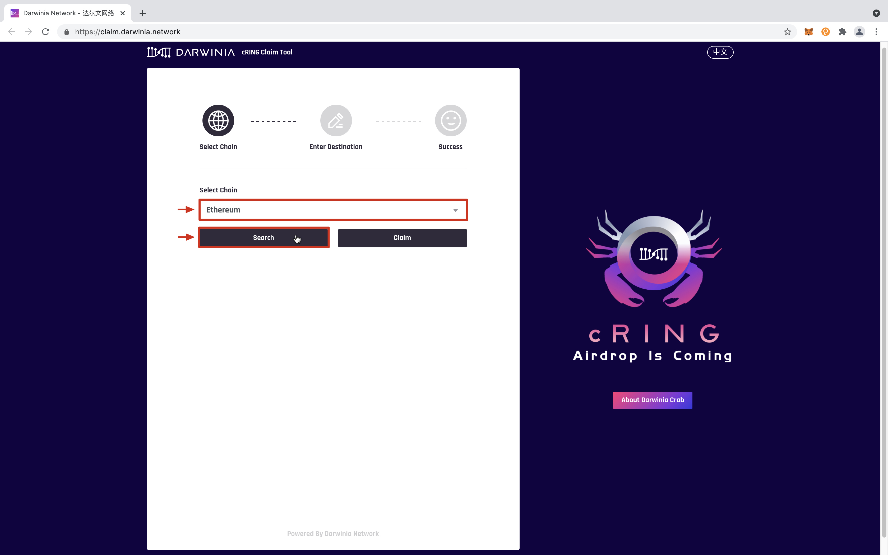
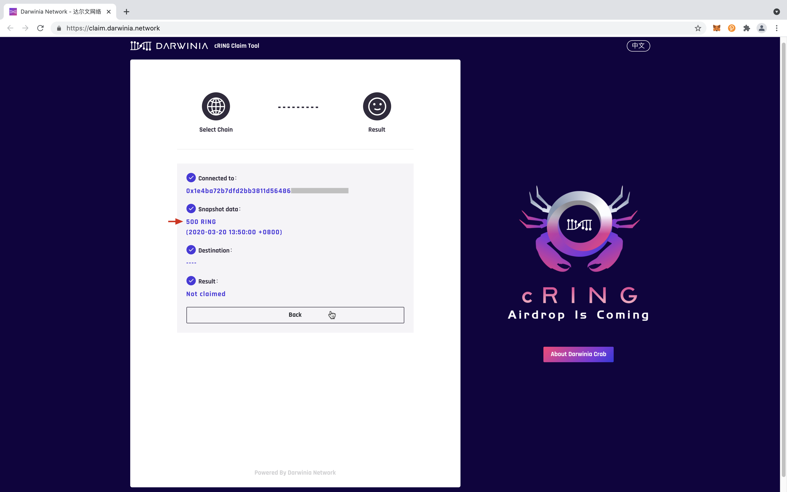
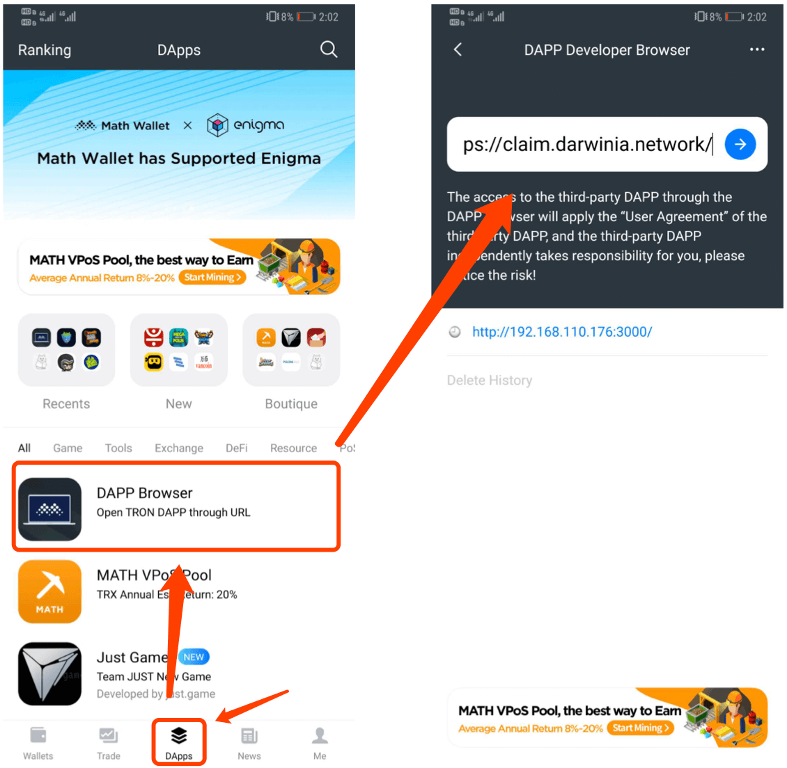
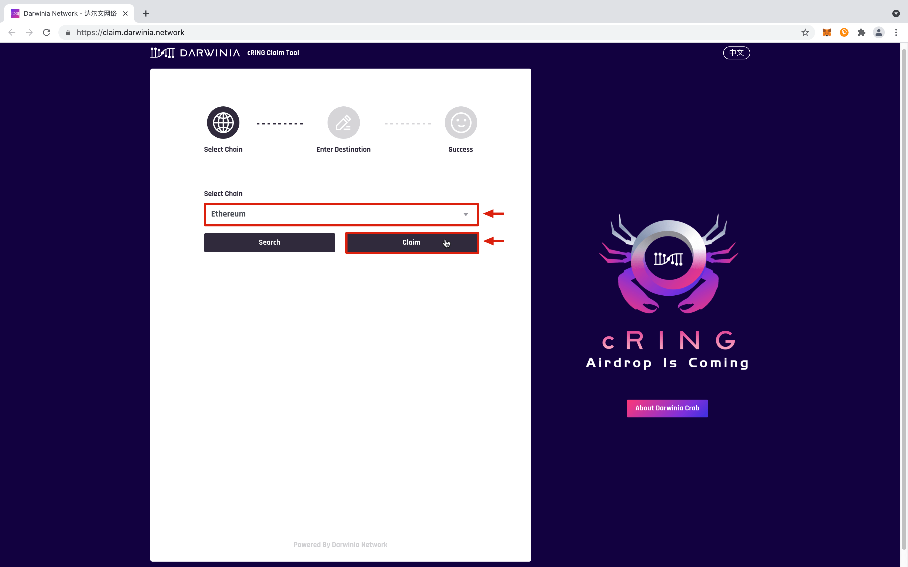
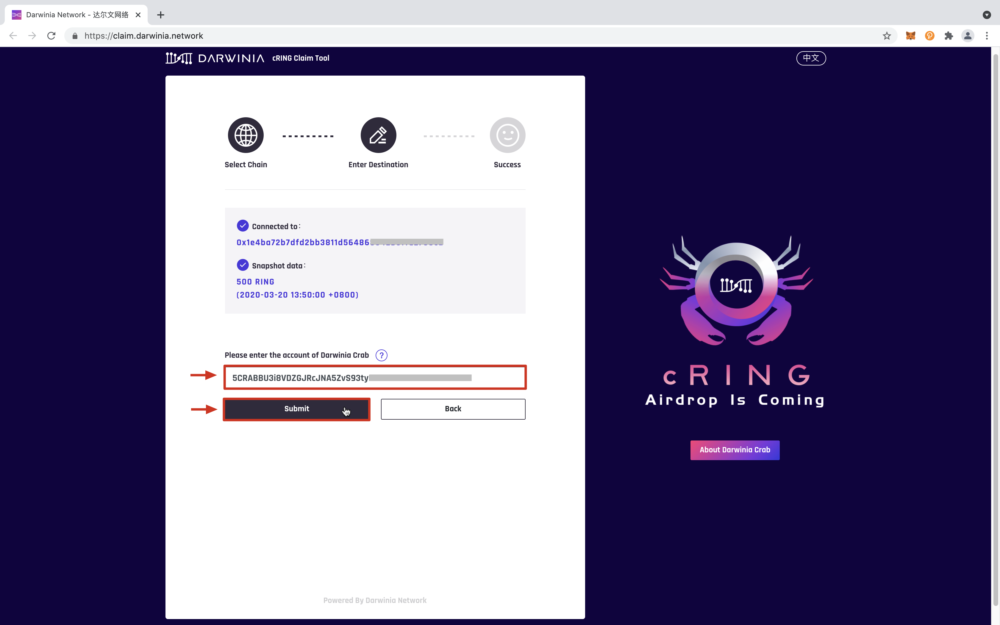
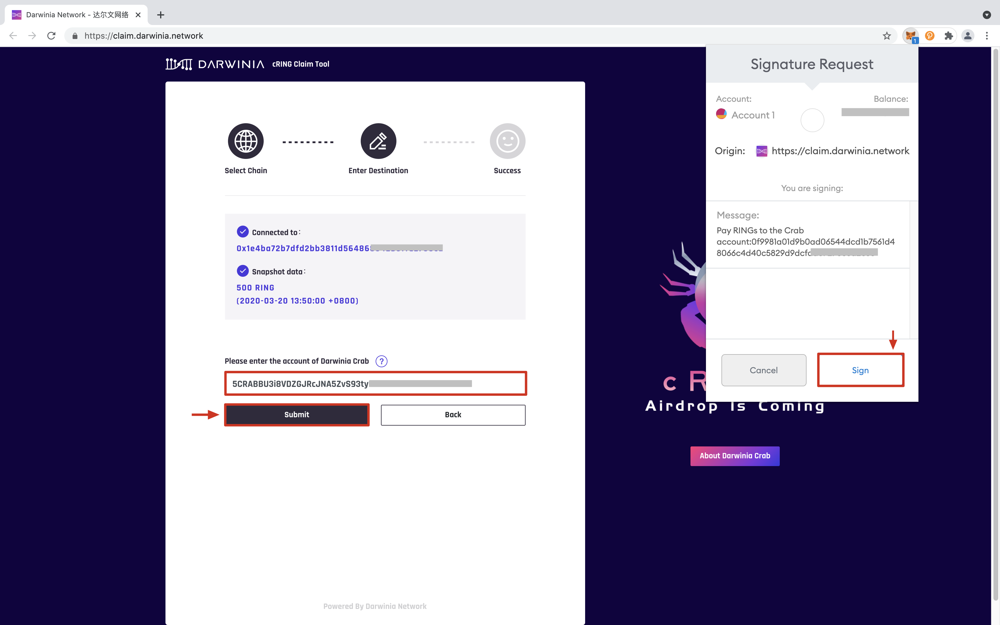
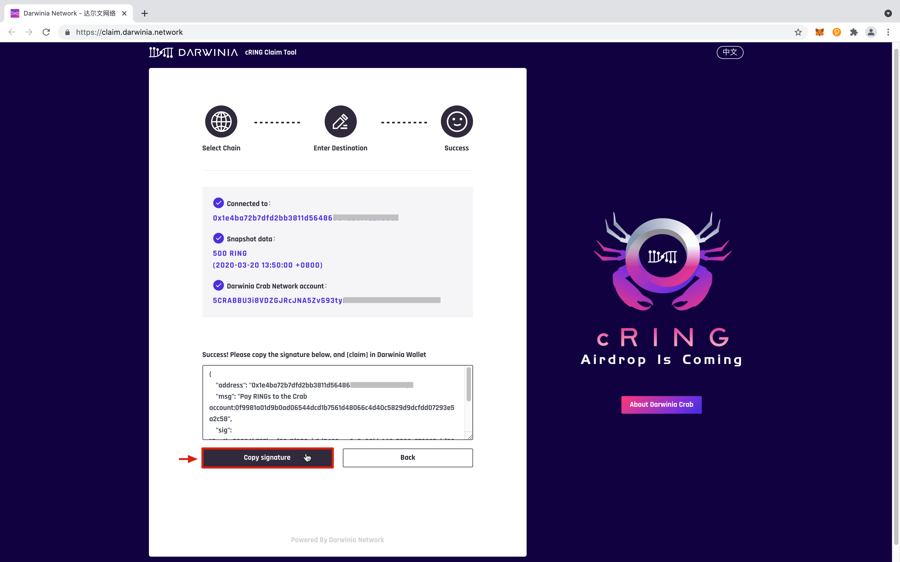
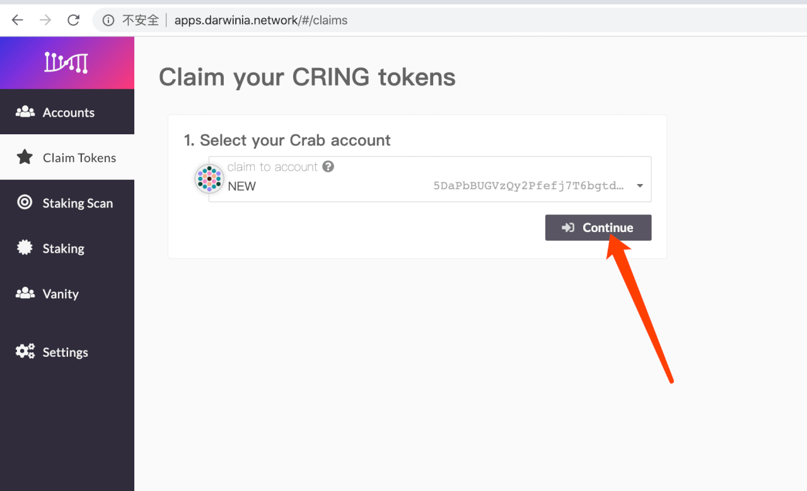
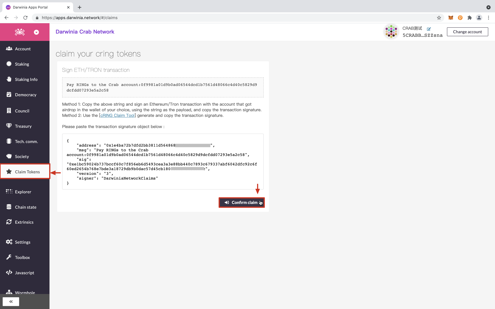
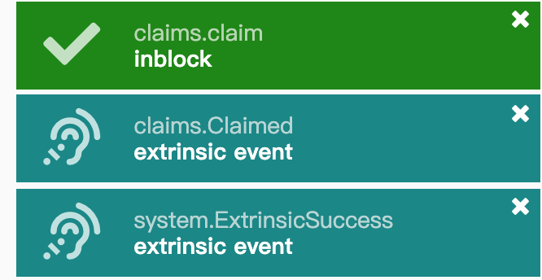

## Airdrop

A portion of the initial supply of the CRINGs have been airdropped to the holders of RING & DOT, they will get CRINGs for free.

Darwinia took a snapshot of RING & DOT holders on March 20, 2020 (GMT +8:00).

- DOT airdrop ratio: 1 DOT = 50 CRINGs
- RING airdrop ratio: 1 RING = 1 CRING

> The snapshot contains the RING of ERC-20 and TRC-20, including the deposit certificate part in Gringotts. KTON is not in the scope of this snapshot.

## Claim

### Environmental preparation

Please select the following signature tools and download according to the usage scenarios and the needs of the chain:

- For PC 

    Ethereum network : [Metamask](https://metamask.io/)

    TRON network : [Tronlink](https://www.tronlink.org/)

- For Mobile

    Ethereum / TRON wallet: [Math Wallet](http://www.mathwallet.org/)
    
    Ethereum wallet: [imToken](https://token.im/)

> The above is the recommended mobile wallet. If you encounter problems, please upgrade to the latest version. You can also use the mobile wallet that has been injected into the web3 environment to operate according to your usual usage habits. The use of non-recommended wallets or operational errors may cause asset losses, please carefully evaluate and bear the corresponding risks.

### Query the number of airdrops

1. Confirm that the signature environment is ready and unlocked

2. PC: Visit [CRING claim tool](http://claim.darwinia.network/) through chrome browser or mobile wallet

3. Select the network you want to query (Ethereum / TRON) and click [Search]. (The Ethereum network is used as an example below)

4. Get query results

### Claim CRING Airdrop

1. Confirm that the signature environment is ready and unlocked

2. PC: Visit [CRING claim tool](http://claim.darwinia.network/) through chrome browser or mobile wallet

  Mobile: Take the math wallet as an example, click [Dapps]-[DAPP Browser]-enter `http://claim.darwinia.network/` to access.

3. Select the network you want to query (Ethereum / TRON) and click [Claim]. (The Ethereum network is used as an example below)

4. Fill in the Darwinia Crab address that accepts CRING. After confirming that it is correct, click [Submit].

    >️ If there is no Darwinia Crab address, please refer to the generation method: [How to create Crab account](crab-tut-create-account)

5. Sign through mobile wallet or browser plug-in (signature does not consume fees)

6. After successfully obtaining the signature information, click [Copy Signature]. (Please pay attention to save the signature information, it is recommended not to close this page temporarily before successfully receiving the airdrop)

7. Open [Darwinia wallet - Claim](https://apps.darwinia.network#/claims)：<https://apps.darwinia.network#/claims>, Select the address just received to receive the airdrop and click [Continue].

8. Paste the signature information just generated in the `CRING Claim Tool`, and click [Confirm claim]-[Redeem]-[Submit]

9. After successful receipt, you will receive the following prompt. At this time, it means your airdrop has been successfully received, you can check the balance in [Darwinia Wallet-Account](https://apps.darwinia.network#/accounts) or [subscan](https://crab.subscan.io/).

## Contact Us

If you encounter other problems in the process of receiving the airdrop, please join our community to communicate.

- WeChat public account: DarwiniaNetwork    
- WeChat assistant: Darwinia_Network
- Telegram: <https://t.me/DarwiniaNetwork>
