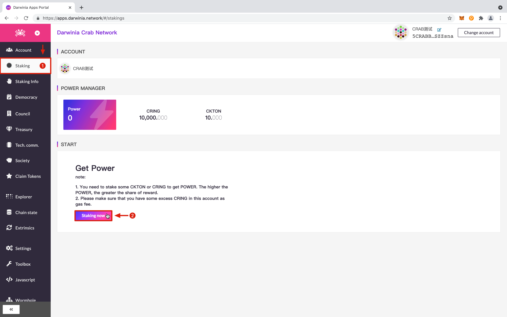
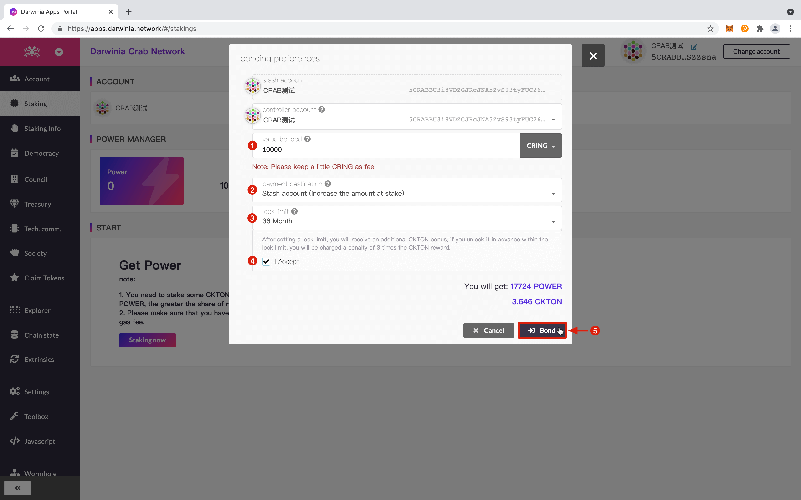
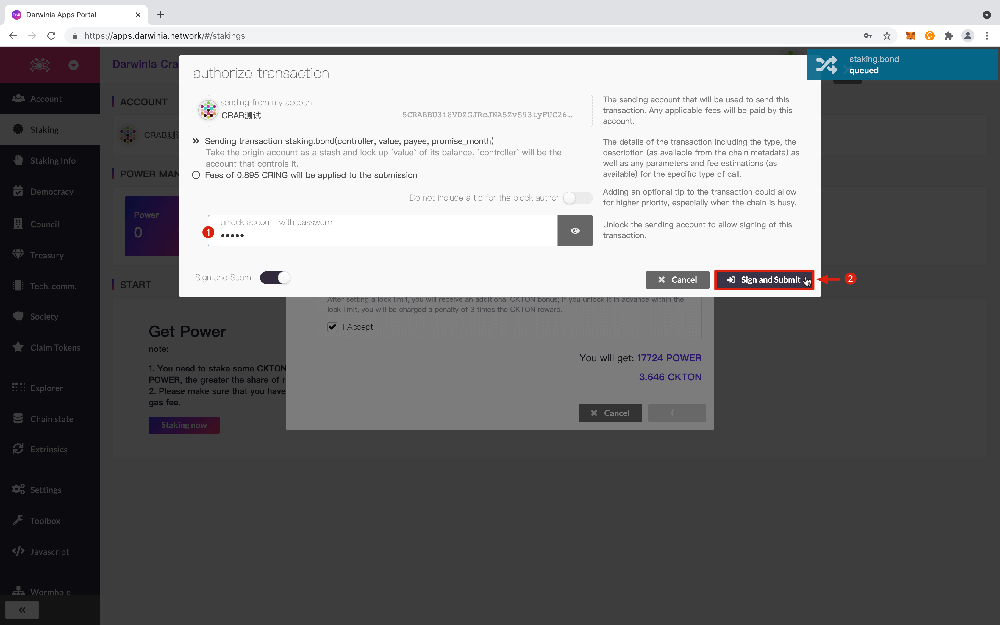

> - Staking is a consensus mechanism based on PoS (Proof of Stake / Proof of Stake). Token holders obtain rewards and benefits through pledge, voting, delegation, and locking.  
> - Before participating in staking, please make sure you have at least **1** Crab address. If you hold more tokens or have higher security requirements, it is recommended to prepare **2** Crab addresses. If there is no address, please refer to: [How to create an account](crab-tut-create-account.md).  
> - A small amount of CRAB must be prepared in Crab Network's address as fee.

## Start Staking

Enter [Darwinia Wallet](https://apps.darwinia.network) and lick the `Staking` column on the left , Click `Start staking`

Fill in the staking parameters 

`Stash account` Account for stashing tokens. Tokens participating in staking will come from this account. The operations of this account are mostly related to changes in stash.

`Controller account`  The controller is the account that will be used to control any nominating or validating actions. Should not match another stash or controller.

 > The `Stash account` and `Controller account` can be set to the same account. If you hold more tokens or have higher security requirements, it is recommended to set up different accounts here.

`Value bonded` The total amount of the stash balance that will be at stake in any forthcoming rounds (should be less than the total amount available).  This part of the tokens will be temporarily bonded. bonding takes 14 days to unbond; you can choose to bond CRAB or CKTON.

`Payment destination` The destination account for any payment as either a nominator or validator.

`Bond period` Optional; bond CRAB promise for 3-36 months to get additional CKTON rewards. (Promise to lock to accept user terms)

 > If you unlock CRAB in advance within the lock limit, you will be charged  a penalty of 3 times the CKTON reward (In the absence of sufficient CKTON, the CRAB can not be used for payment of fines).

After filling in the staking parameters, please click `bond` and `submit`

## Nominate a validator

> The identities of the validator and the nominator are mutually exclusive and cannot coexist. If you are running a validator, you need to cancel the validator before proceeding with the nomination.

After completing the staking parameters, click `Nominate` on this page

Choose your favorite validator

Sign and submit

View information about nominated validators

> The operation of nominating validators will take effect from the next era, and it is normal to temporarily delay.

## Tokens' statuses

The tokens' statuses are following:

`Available` The amount of tokens that are able to transfer, bond and transfer.

`Bonded` The amount of tokens that cannot operated directly but does not have lock limit, which is used to gain voting power and can be taken out at any time (with a 14-day unbonding period) or add lock limit.

`Locked` The amount of tokens that cannot be operated and has a lock limit, which is used to gain voting power and earn additional KTON rewards.

`Unbonding` The amount of tokens that has been unlocked but in the unbonding period.

## Other Staking operations

There are other operations in staking for the following purposes:

`Stop nomination` Cancels all nominees.

`Bond` & `Bond more` Adds bonded tokens for staking to obtain more power.

`Unbond` Unbond tokens for staking, and at the same time the power will be reduced proportionally.

 > The 14-day bond period is required to unbond. Tokens that are in the bond period cannot be operated. Please be careful.

`Reward history` Go to Subscan explorer to view historical reward records

`Claim reward` Manually claim the reward, and the reward will be distributed in units of era.

> Please note: 56 era (about 56 days) will be saved, and you will not be able to claim it if it expires.

`Claim Reward` Manually claim the reward, and the reward will be distributed in units of era.

`Bond more funds` Adds bonded tokens for staking to obtain more power.

`Unbond funds` Unbond tokens for staking, and at the same time the power will be reduced proportionally. 

`Lock extra` Add lock limit for bonded tokens to obtain KTON rewards.

`Rebond funds` Rebond the unbonding funds to earn power.

`Change controller account` Change the account  that will be used to control any nominating or validating actions. Should not match another stash or controller.

`Change reward destination` Change the destination account for any payment as either a nominator or validator.

`Set nominees` Re-nominate validator

`Change session key` If you want to upgrade to become a validator, you need to fill in this item. [How to become a validator](crab-tut-validator.md)

`Set on-chain identity` Set your personal information, such as display, legal name, email, website, twitter and riot. Other users can view this information and contact you.

