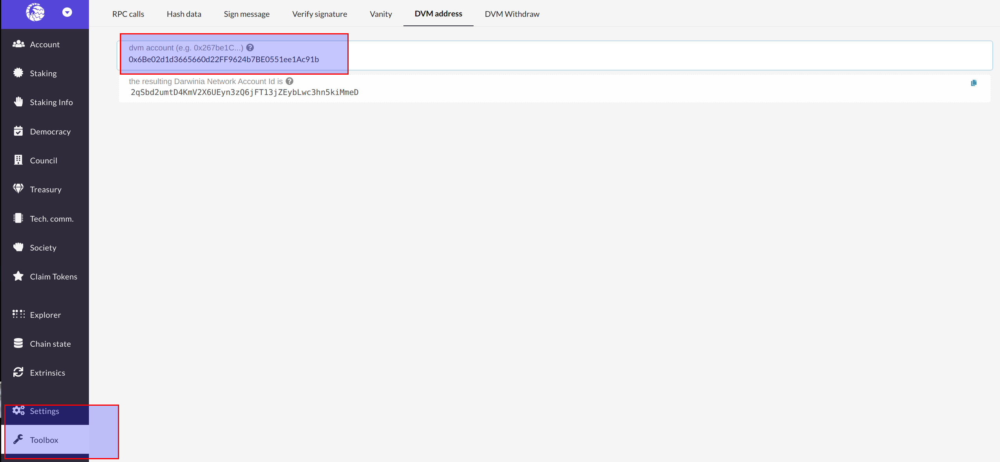

The Darwin Network is a cross-chain network developed based on Substrate, with an account address format based on the [SS58 Address](https://substrate.dev/docs/en/knowledgebase/advanced/ss58-address-format) model. In order to be compatible with the ethereum smart contract ecosystem, a second address format is introduced on top of the existing network, namely
DVM address.

## Address Conversion

DVM account address and Ether account address are in the same format and are generated in the same way, with each DVM account address corresponding to a Substrate account address.

For example, the DVM account address 0x6Be02d1d3665660d22FF9624b7BE0551ee1Ac91b corresponds to a Substrate account address of 2qSbd2umtD4KmV2X6UEyn3zQ6jFT13jZEybLwc3hn5kiMmeD.

The rules for address conversion are shown in the following diagram:

## Address Conversion Tool

Address conversion is currently done using the [Web Apps](https://apps.darwinia.network/#/account) tool by clicking on `Toolbox` > `DVM Address`, enter the address of the DVM account to be converted.

