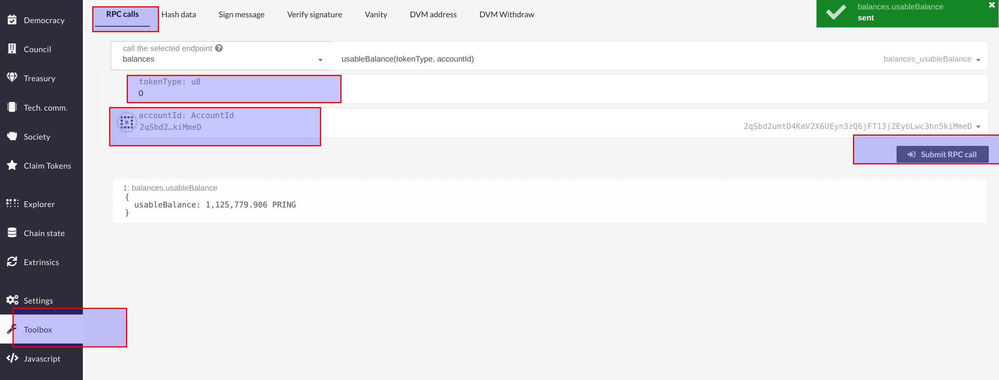

As the DVM account corresponds to the Substrate account, the DVM account balance can be checked at [Web Apps](https://apps.darwinia.network/#/account).

## Address Conversion

The way to generate the corresponding Substrate account address based on the DVM account address. See [address conversion](dvm-address).

For example, the DVM account address `0x6Be02d1d3665660d22FF9624b7BE0551ee1Ac91b` corresponds to the Substrate account address `2qSbd2umtD4KmV2X6UEyn3zQ6jFT13jZEybLwc3hn5kiMmeD`.

## Query Balance

Click on `Toolbox` > `RPC Requests` > `balances` and enter:
    
- accountId： Substrate account id
- tokentype： 0 for RING balance, 1 for KTON balance

