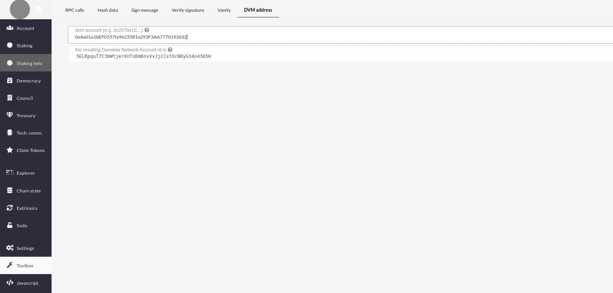
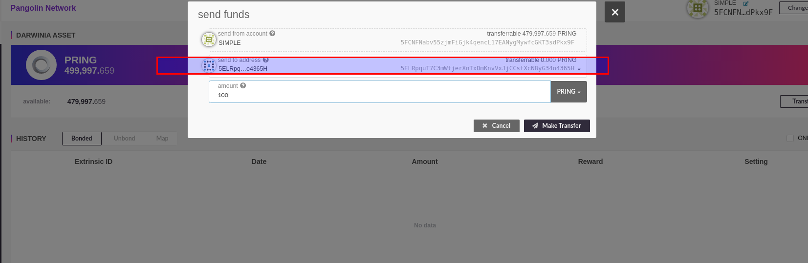
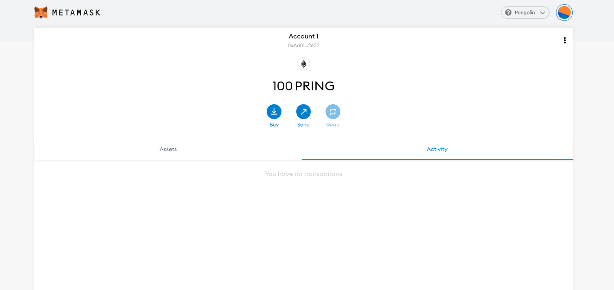

## Preparation

Using Metamask to generate one DVM address. See [How to use Metamask](./pangolin-home.md)

## Address Conversion

`Apps` > `ToolBox` > `DVM address`, input your DVM address, the corresponding Darwinia address will be generated, which represent your DVM address to send or receive PRING.

## Deposit

Use [Darwinia Web Wallet(Apps)](https://apps.darwinia.network/#/account) to transfer some PRINGs to the Darwinia address

Click `Make Transfer` and wait until the extrinsic been finalized in block.

## Comfirm the balance

