It is an action of transferring assets from a Substrate account to a DVM account. The receiving address is the Substrate address of the DVM account.

## Preparation

You should have a DVM account to receive `PRING/PKTON`, if not, please use Metamask to generate one. See [How to use Metamask](dvm-metamask).

## Deposit

> Note: [The Polkadot Js extension](https://polkadot.js.org/extension/) needs to be installed before using the Smart App.

Click [Smart App](https://smart.darwinia.network/) -> `Connect Wallet` to connect to the account in Polkadot Js.

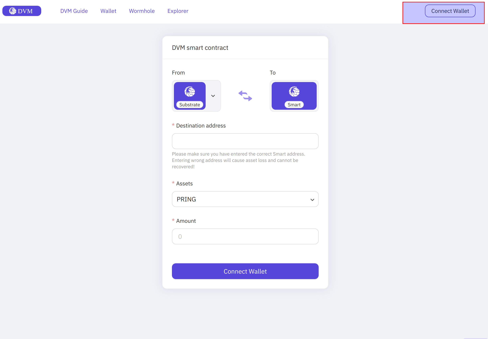

Select the account that you want to transfer assets from and click `Confirm`. Free `PRING` can be got at [Element](https://app.element.io/?pk_vid=6961ca0f7c45f8bf16052310122d2437#/room/#darwinia:matrix.org).

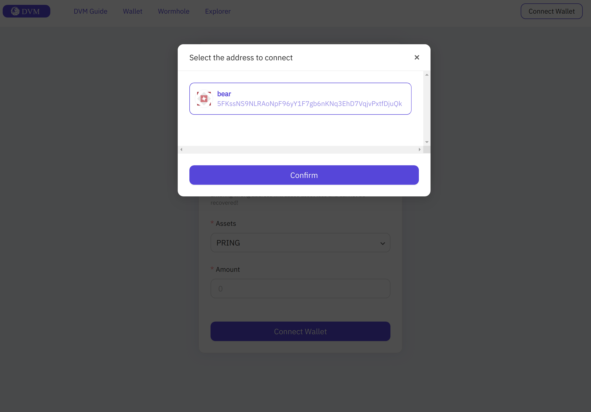

Once the Substrate account has been successfully connected.

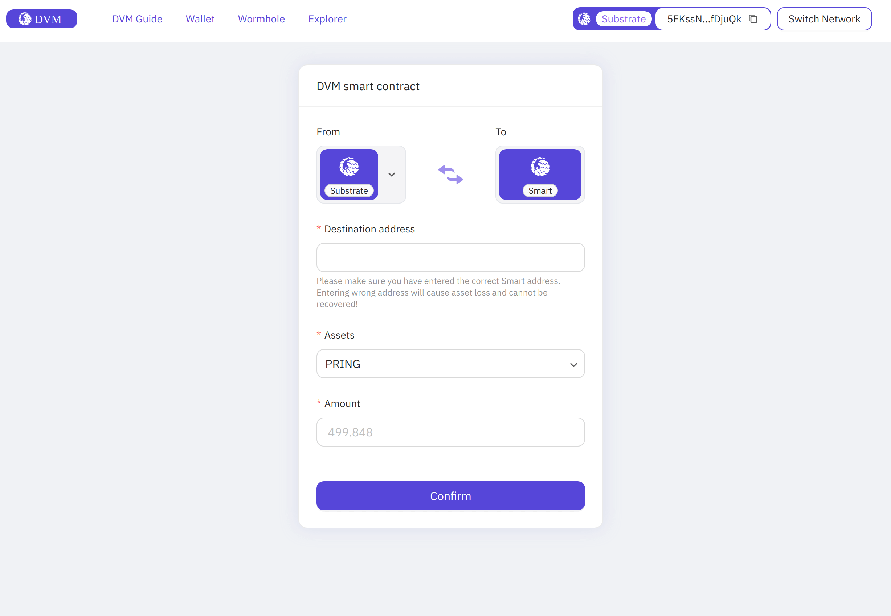

Enter the DVM account address your prepared and the amount to be transfered and click on `Confirm`. The DVM account in the example is `0xB3A77a84E132465530cdb5738203eb00215D780b`

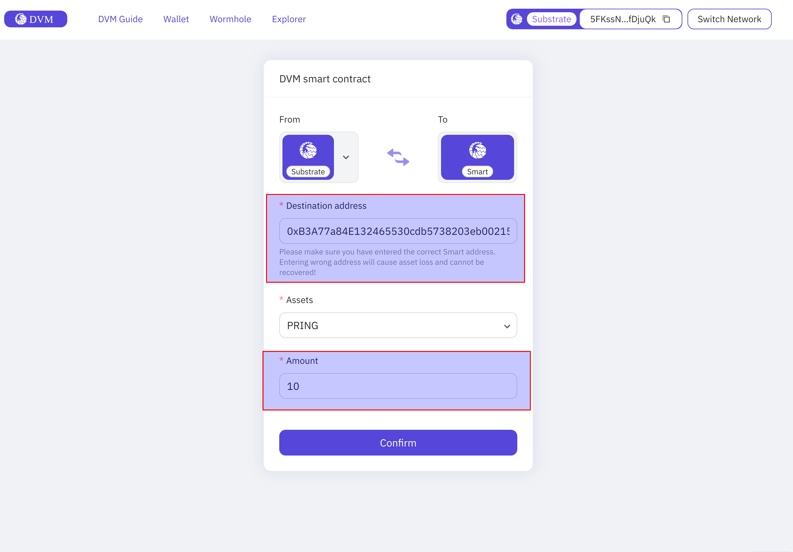

Click `Next`. 

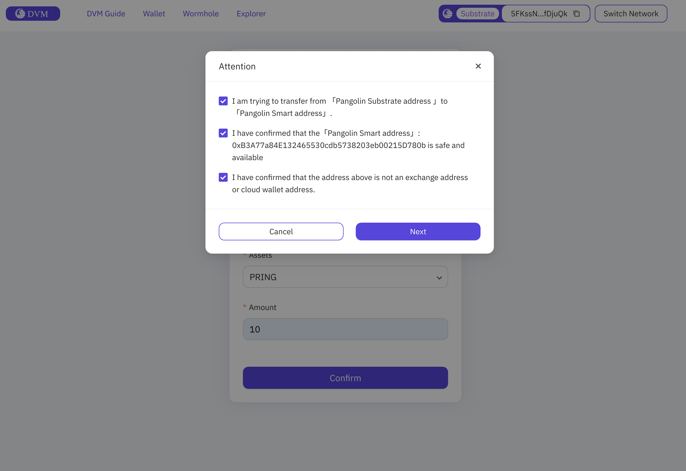

Click `Confirm`.

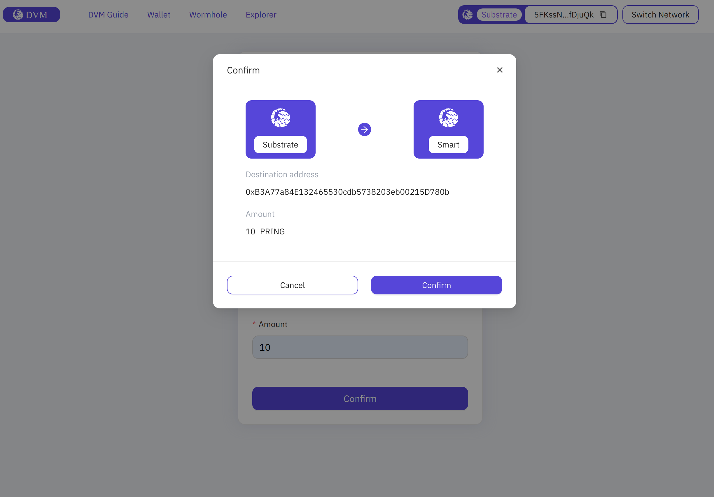

Enter your password in the Polkadot Js, sign and send the transaction.

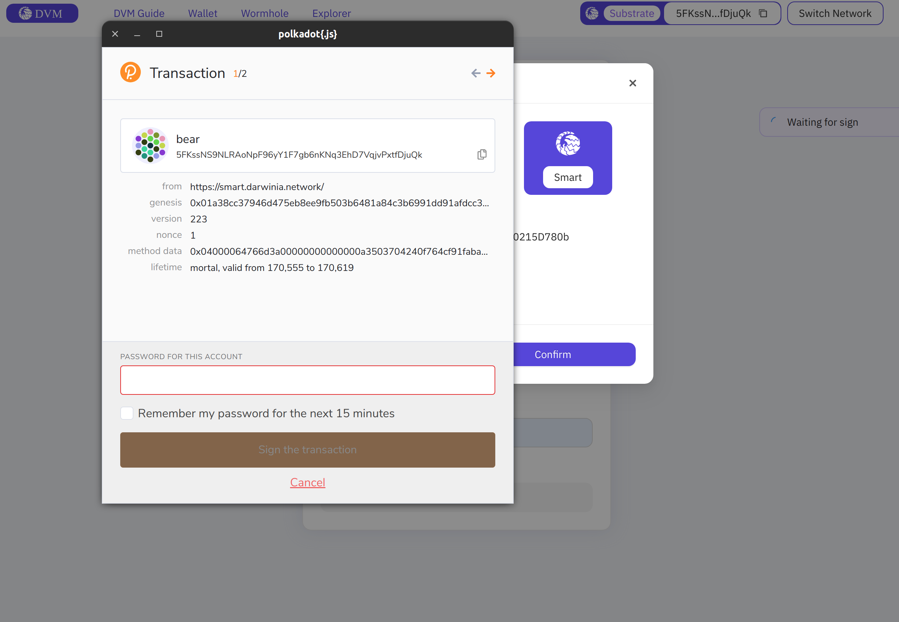

## Check transaction

See transaction execution result in Subscan.

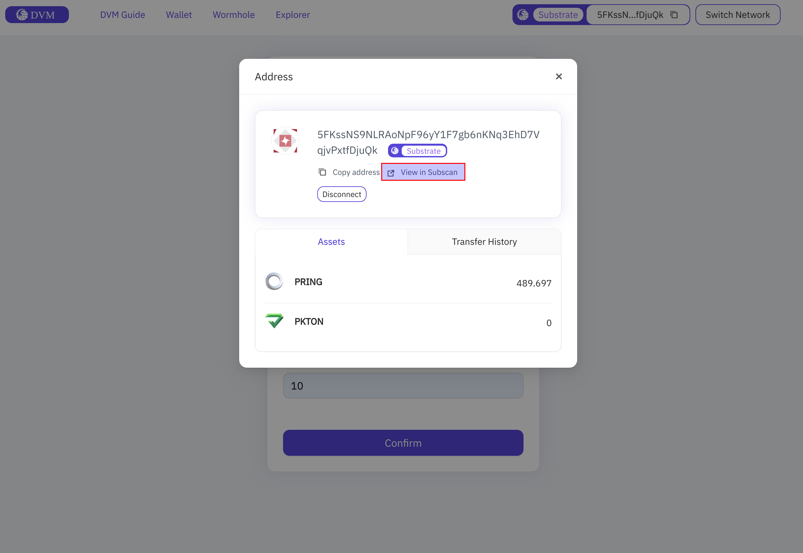
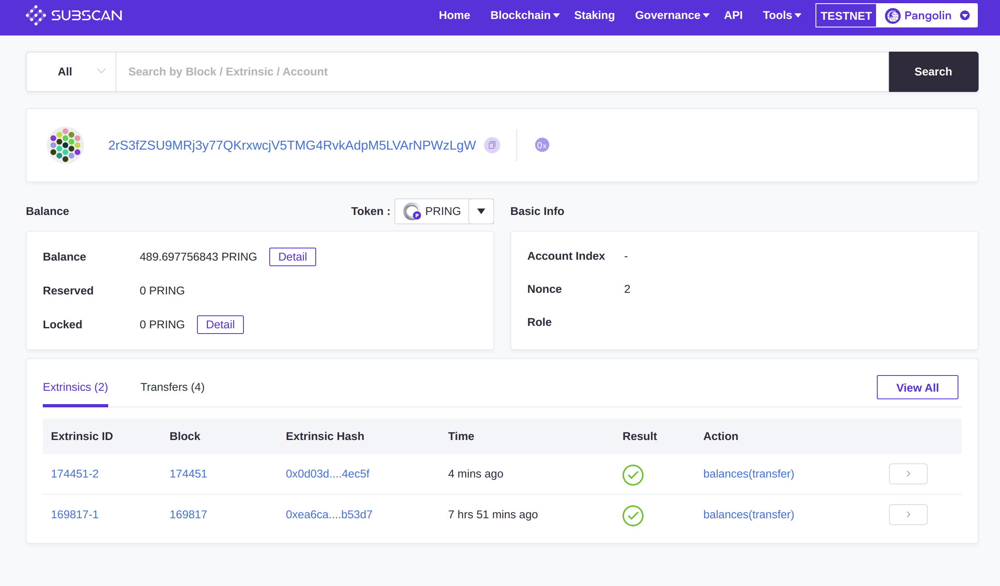

## Check if the transfer is successful

Check the balance in Subscan:

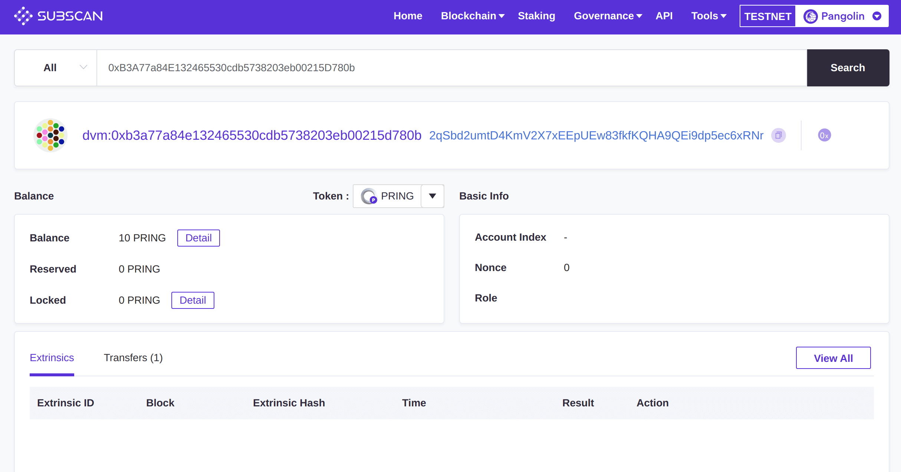

Check the balance in Metamask:

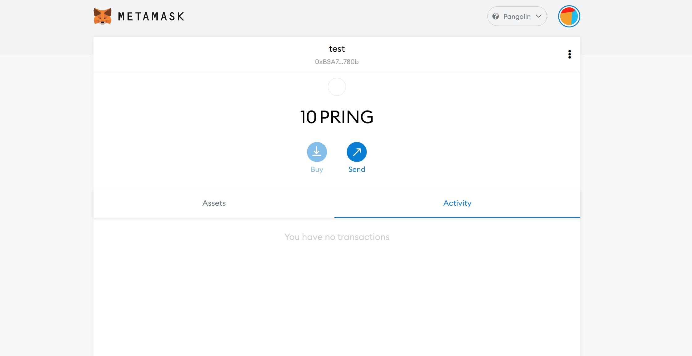

