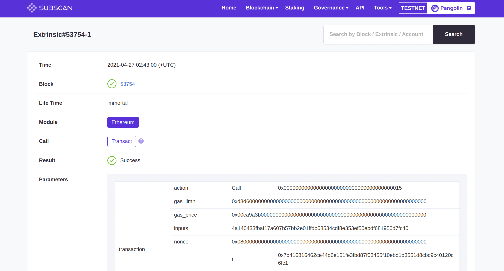

[Subscan](https://crab.subscan.io/) is a powerful, user-friendly multi-chain browser that adds support for DVM smart contract solutions now.

## Preparation

Switch network and select the network for which you want to query data.

## Get transaction information

Enter the DVM transaction hash in the search box and click `Search`.

## Get account information

As shown above, the relationship between the DVM account and the Substrate account, the account balance, the staking and the transaction history can be clearly displayed.
