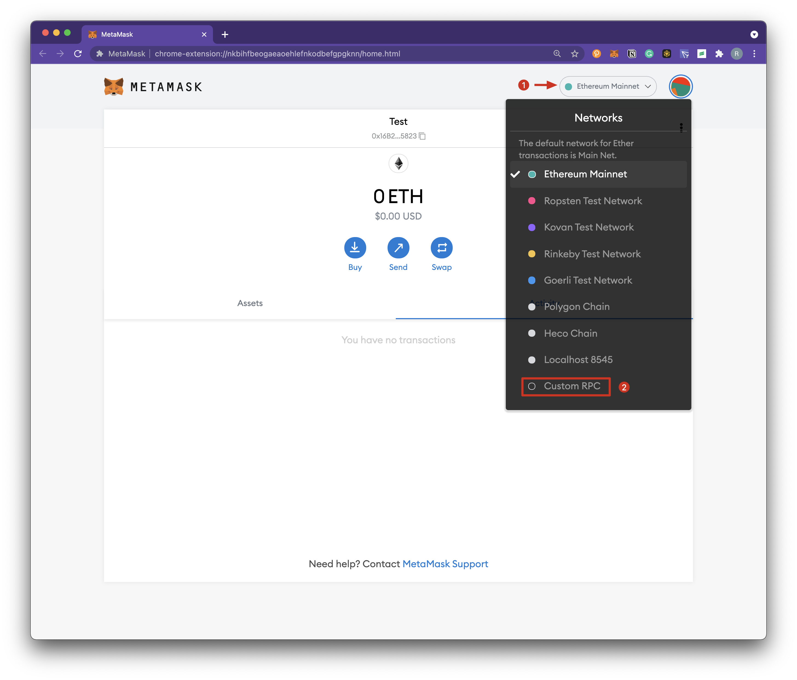
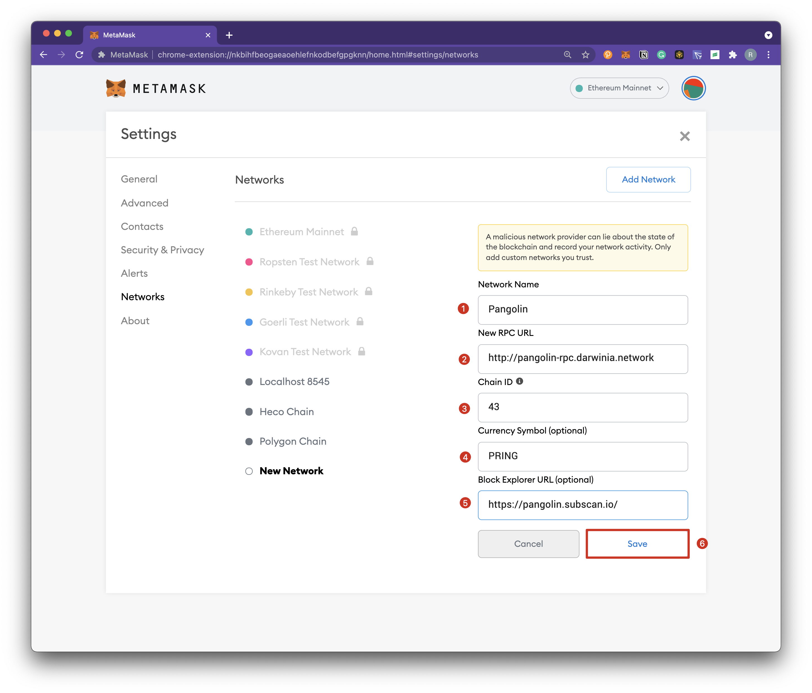
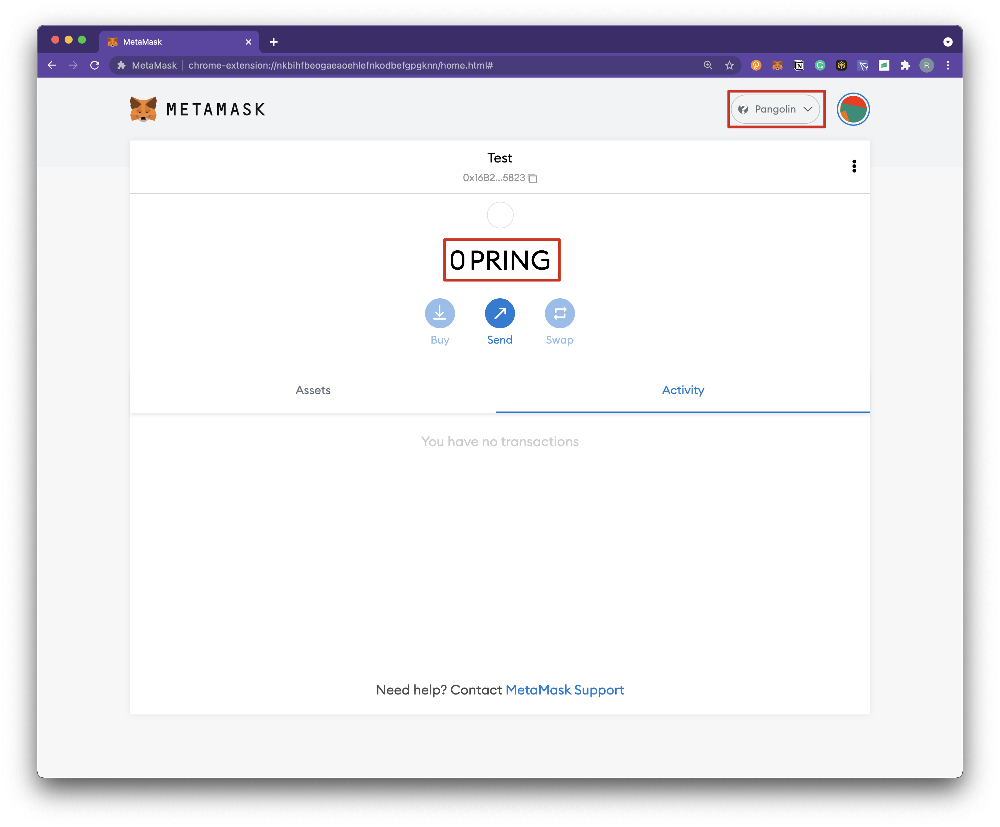
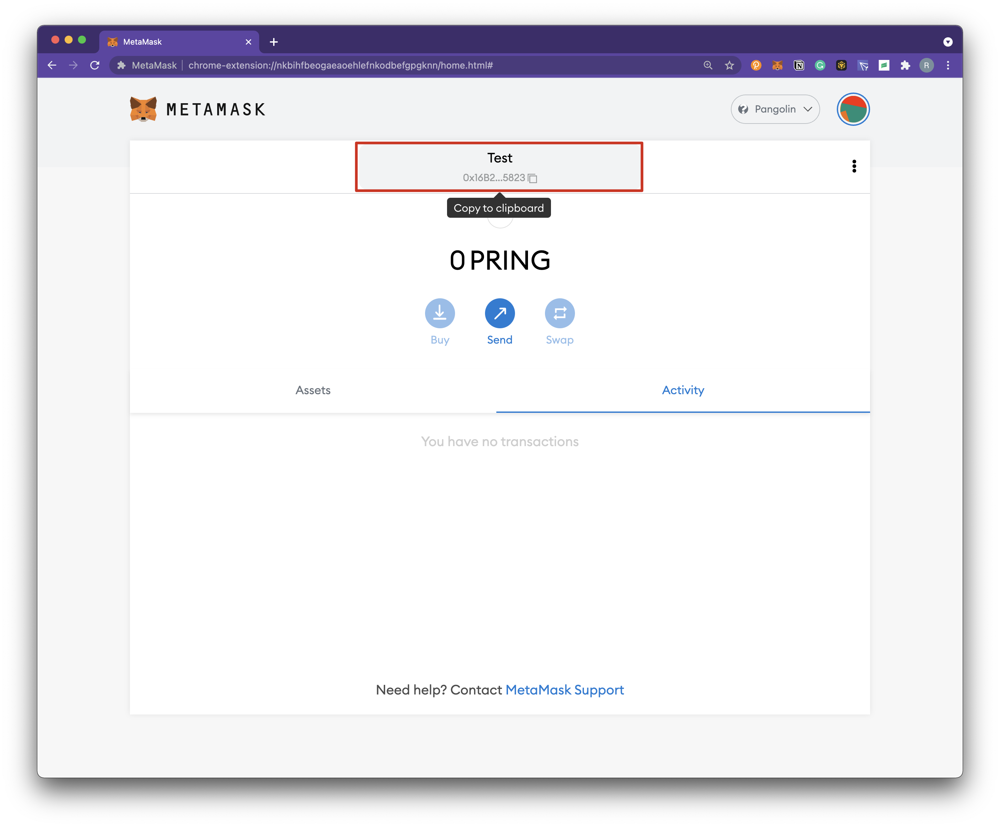

Since the DVM and the Ethereum virtual machine are compatible in the underlying specifications, users can use the wallets from the existing Ethereum ecosystem to manage their assets. Here we will introduce how to use Metamask.

### Connect with Metamask

1. Install the Metamask plugin, download and install it yourself. 
2. Add a custom network, here is an example of adding a Pangolin test network, different networks have different configuration parameters.

The different network configuration are as follows.

| Network  | RPC URL                             | ChainId | Currency| Block Explorer URL |
| ---------| ------------------------------------ | -------| --------|---------- |
| Pangolin | http://pangolin-rpc.darwinia.network | 43     | PRING   | https://pangolin.subscan.io/ |
| Crab     | http://crab-rpc.darwinia.network     | 44     | CRING   | https://crab.subscan.io/      |   

### Transfer

Demonstrating how to use Metamask to transfer and query transactions in a DVM on the Pangolin test network.

1. Click `Send` and enter the transfer parameters. 

2. Click `Confirm` to send transaction.

3. The transfer executed successfully.

4. View details of the transaction execution in your browser.

