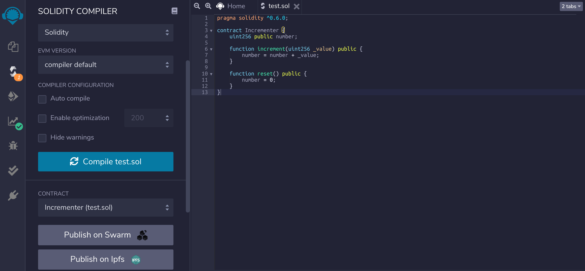
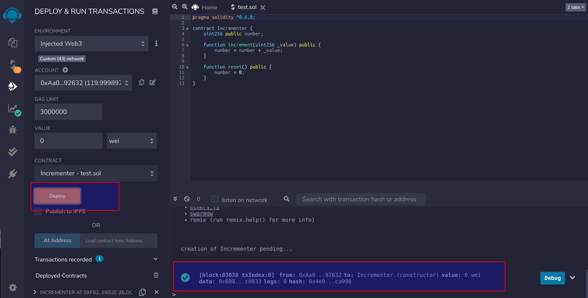

Since the DVM and the Ethereum virtual machine are compatible in the underlying specifications, users can use the the existing contract development tools of Ethereum ecosystem. Here we will introduce how to use Remix to execute contracts.

## Prepare a contract

```js
pragma solidity ^0.6.0;

contract Incrementer {
    uint256 public number;

    function increment(uint256 _value) public {
        number = number + _value;
    }

    function reset() public {
        number = 0;
    }
}
```

Click on `Compile` to compile the program and make sure it compiles successfully.



## Connect to Metamask

Remix can use a DVM account on Metamask and deploy the contract directly to the corresponding network. Note that DVM accounts need to be bound to Metamask first, see [Using Metamask with DVM accounts](dvm-metamask). ENVIRONMENT Select `Injected Web3`, select the DVM account in the Metamask pop-up window and click `Next`.


## Execute the contract

Once you have successfully connected to Metamask, click `Deploy` to deploy the contract and the console will display the execution process of the transaction.



When the contract is successfully deployed, Click `number` to make a contract call, which returns 0.


Click `increment` to make another call.


Click `number` again to make a contract call, and the result is 5 now.


