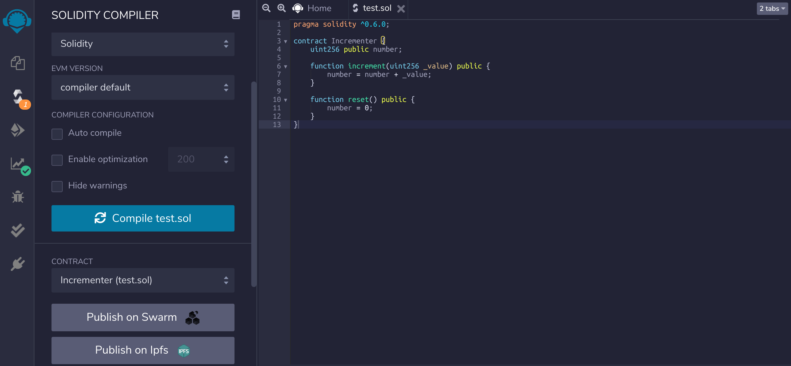
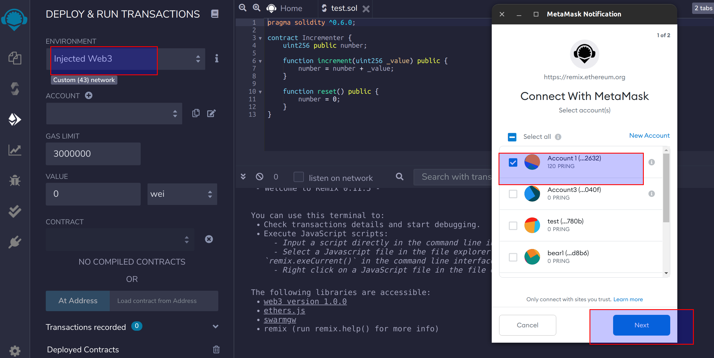
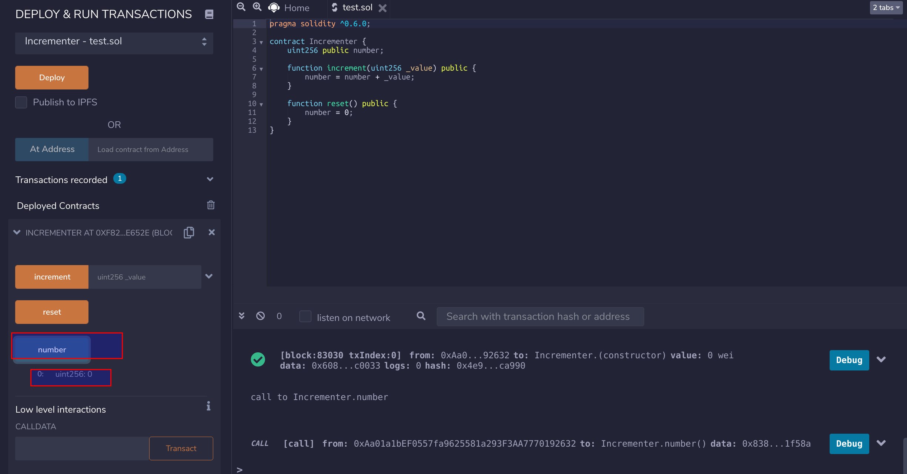
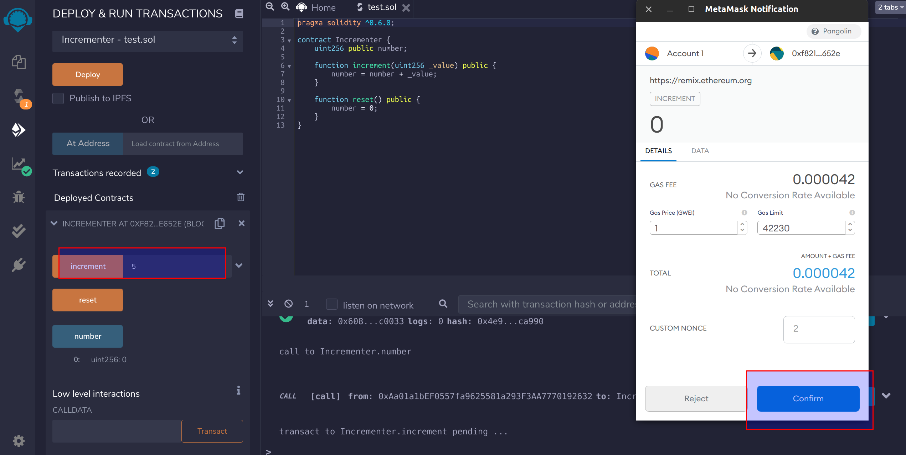
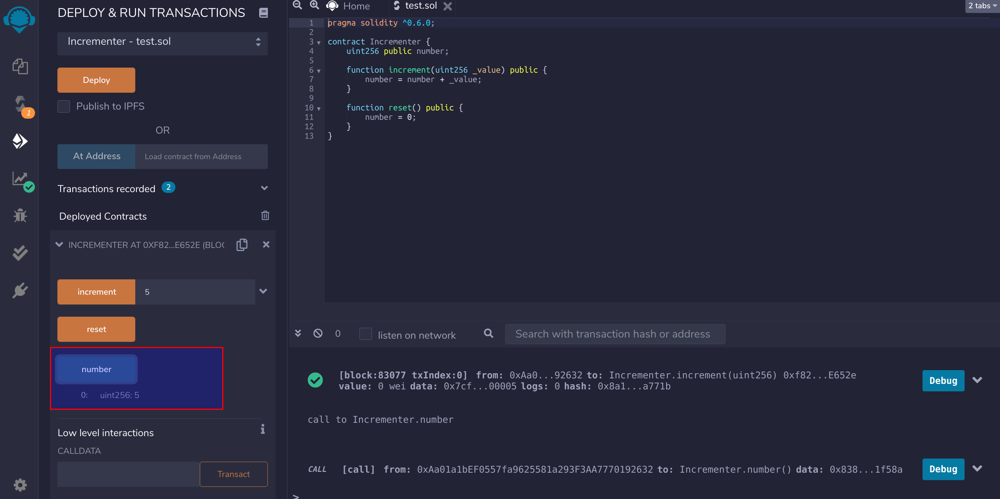

As the DVM and the Ethereum Virtual Machine are consistent in their underlying specifications, users can use the existing Ethereum ecosystem smart contract development tools, followed by a description of how to execute contracts using Remix.

## Prepare Contrace code

```js
pragma solidity ^0.6.0;

contract Incrementer {
    uint256 public number;

    function increment(uint256 _value) public {
        number = number + _value;
    }

    function reset() public {
        number = 0;
    }
}
```

Click on `Compile` to debug the program and make sure it compiles successfully.



## Connect Metamask

Remix can associate a DVM account on Metamask and deploy the contract directly to the corresponding network. Note that DVM accounts need to be bound to Metamask in advance, see [Using Metamask with DVM accounts](dvm-metamask). ENVIRONMENT Select `Injected Web3`, select the associated DVM account in the Metamask pop-up window and click `Next`.



## Execute Contract

Once you have successfully connected to Metamask, click `Deploy` to deploy the contract and the console will display the execution of the transaction.


When the contract is successfully deployed, Click `number` to make a contract call, which returns 0.



Click `increment` to make another call.



Click `number` again to make a contract call, and the result is 5.

