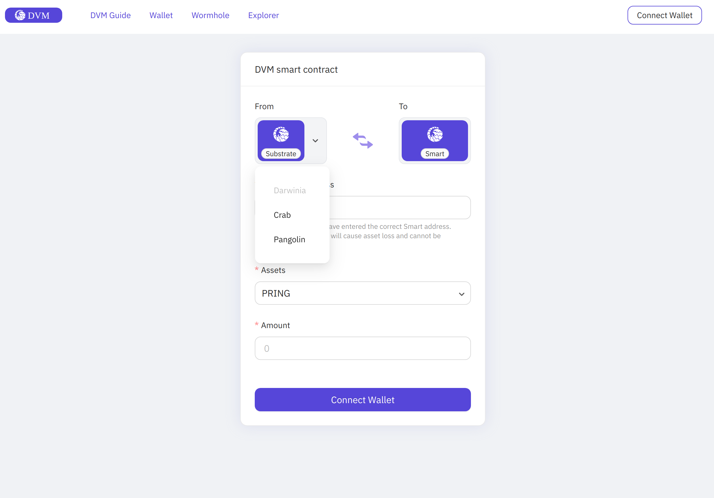

The [Smart App](https://smart.darwinia.network/) is Darwinia's self-developed wallet that provides a user-friendly solution for transferring assets between DVM accounts and Substrate accounts.

## Switch Network

The Smart App currently only supports the Crab and Pangolin networks(the default network), not the Darwinia network at the moment.

Take the example of switching to the Crab network:

