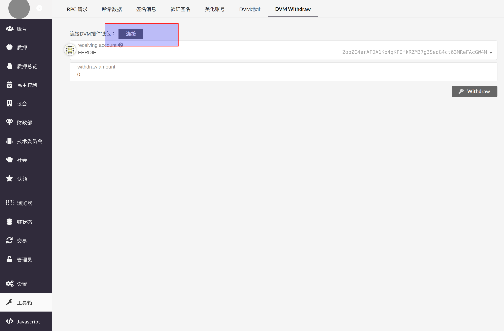
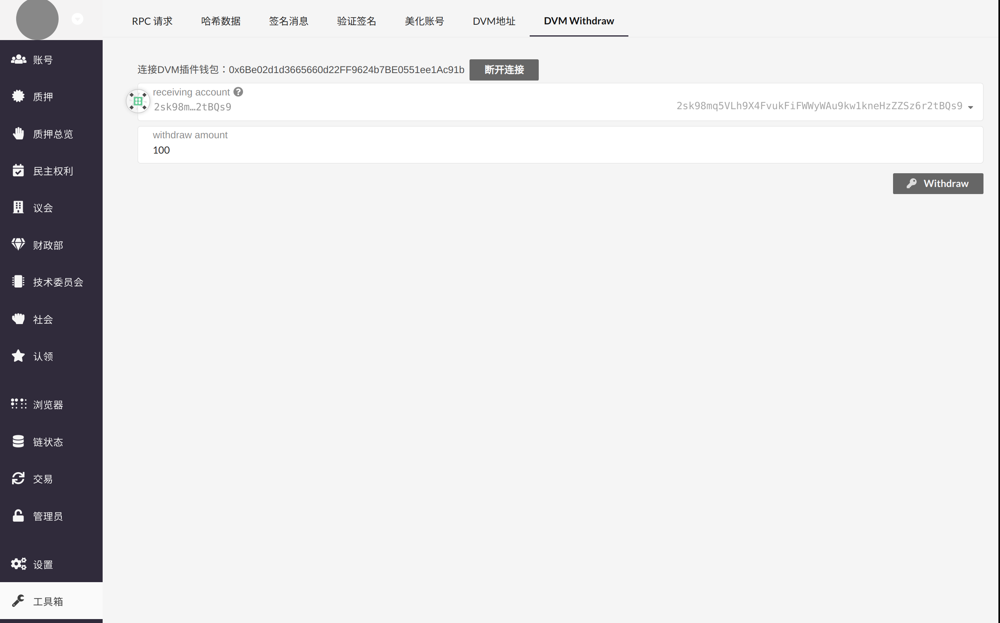

DVM account withdrawal refers to the action of transfering tokens from a DVM address to a Darwinia address.

### Preparations

- Metamask (with dvm account imported)
- [Darwinia Web Wallet(Apps)](https://apps.darwinia.network/#/account), which provides withdraw tool
- Target Darwinia address

### Withdraw

1. Connect [Apps](https://apps.darwinia.network/#/account) with Metamask

`Apps` > `Toolbox` - `DVM Withdraw`, and click `Connect`.

2. Withdraw

Once you connected to Metamask successfully, fill in the withdrawal address and amount. Then click `Withdraw`.

