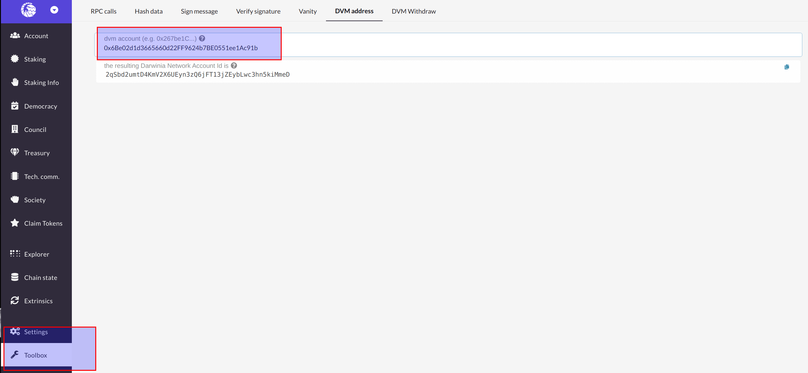

The Crab Network and the Pangolin testnet use the account address format based on the [SS58 Address](https://substrate.dev/docs/en/knowledgebase/advanced/ss58-address-format). In order to be compatible with the ethereum smart contract ecosystem, a second address format is introduced on top of the existing network, namely DVM address.

## Address Conversion

The DVM account address shares the same address format with Ethereum, while each DVM account has a corresponding Substrate address.

For example, the DVM account 0x6Be02d1d3665660d22FF9624b7BE0551ee1Ac91b has a corresponding Substrate address that is 2qSbd2umtD4KmV2X6UEyn3zQ6jFT13jZEybLwc3hn5kiMmeD.

The rules for address conversion are shown in the following diagram:

## Address Conversion Tool

Address conversion can be done by using the [Web Apps](https://apps.darwinia.network/#/account) tool. Click on `Toolbox` > `DVM Address`, enter the address of the DVM account to be converted.

