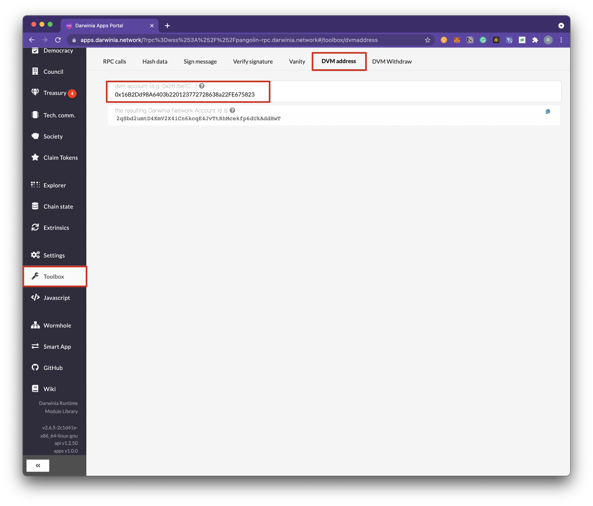
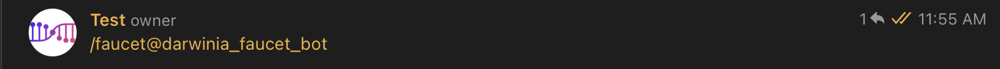
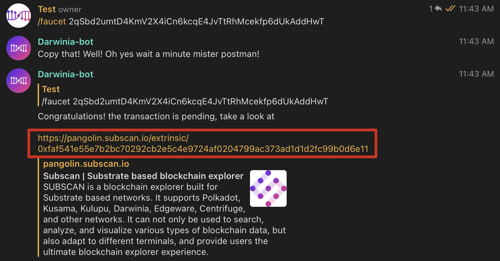
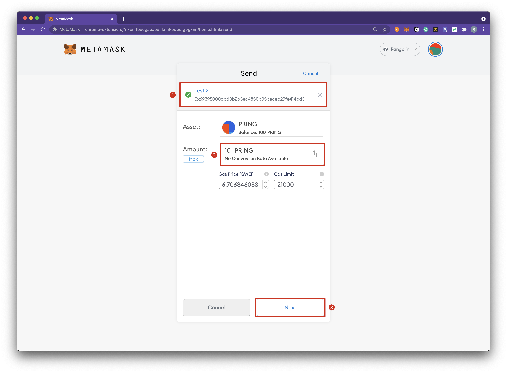

The DVM account address format is consistent with the Ethereum account address format and the generation method. The difference is that each DVM account address corresponds to a unique Substrate account address. In other words, the DVM address is first an Ethereum address, but it also corresponds to a Substrate address in addition to the Ethereum address. Currently, you can use the Apps tool to generate the Stustrate address corresponding to the DVM address. Since the DVM and the Ethereum virtual machine are compatible in the underlying specifications, users can use the wallets from the existing Ethereum ecosystem to manage their assets, such as Metamask.

### Connect with Metamask

1. Install the Metamask plugin, download and install it yourself. 
2. Add a custom network, here is an example of adding a Pangolin test network, different networks have different configuration parameters.
+ Click `Custom RPC`.

+ Add Pangolin Test Network configuration parameters.

+ After the connection is successful, as shown in the figure below.

The different network configuration are as follows.

| Network  | RPC URL                             | ChainID | Currency| Block Explorer URL |
| ---------| ------------------------------------ | -------| --------|---------- |
| Pangolin | https://pangolin-rpc.darwinia.network | 43     | PRING   | https://pangolin.subscan.io/ |
| Crab     | https://crab-rpc.darwinia.network     | 44     | CRAB   | https://crab.subscan.io/      |   

### Address Conversion

Use Apps tool to generate the Stustrate address corresponding to the DVM address.
1. Copy the DVM address.

2. Address conversion can be done by using the [Apps](https://apps.darwinia.network/#/toolbox/dvmaddress) tool. Click on `Toolbox`, `DVM Address`, enter the address of the copied DVM account.

3. This address is the only Substrate address corresponding to the DVM address. Click the upper right corner to copy the Substrate address.

4. You can apply for the test token from the Faucet through the generated Substrate address. For details, please refer to the following.

### Apply for the test token

1. Join the Telegram group named ["Darwinia Faucet Official"](https://t.me/darwiniafaucet_official).

2. Send `/faucet@darwinia_faucet_bot`.

3. Send `Faucet`+ the copied Substrate address corresponding to the DVM account address.

4. You can open the link of the Darwinia_bot to check the transaction on Subscan. 

5. Since this Substrate address corresponds to a specific DVM address, when the test token is sent to the Substrate address, the corresponding DVM address can be managed through Metamask to achieve the purpose of managing this Substrate address.

6. When querying the DVM address through Subscan, you can see its corresponding Substrate address at the same time.

### Transfer

Demonstrating how to use Metamask to transfer and query transactions in a DVM on the Pangolin test network.

1. Click `Send` and enter the transfer parameters. 

2. Click `Confirm` to send transaction.

3. The transfer executed successfully.

4. View details of the transaction execution in your browser.

