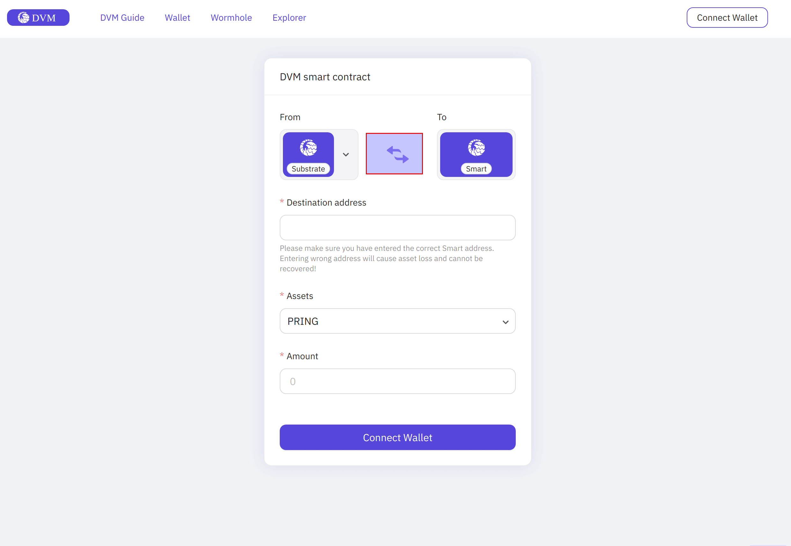
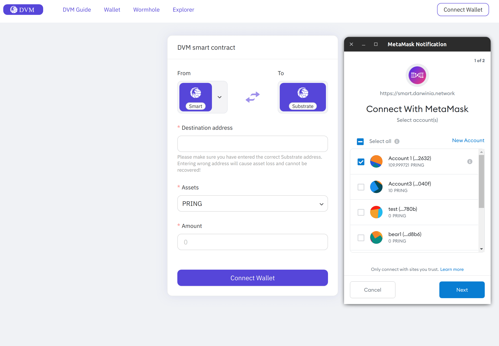
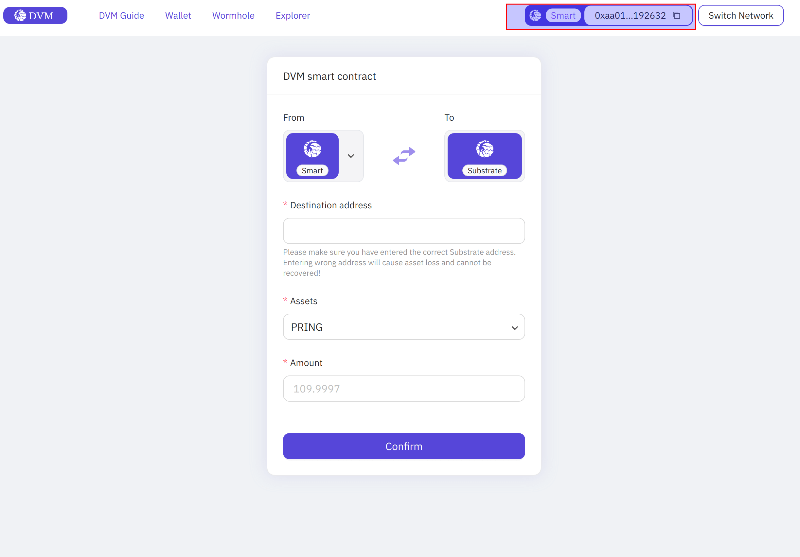
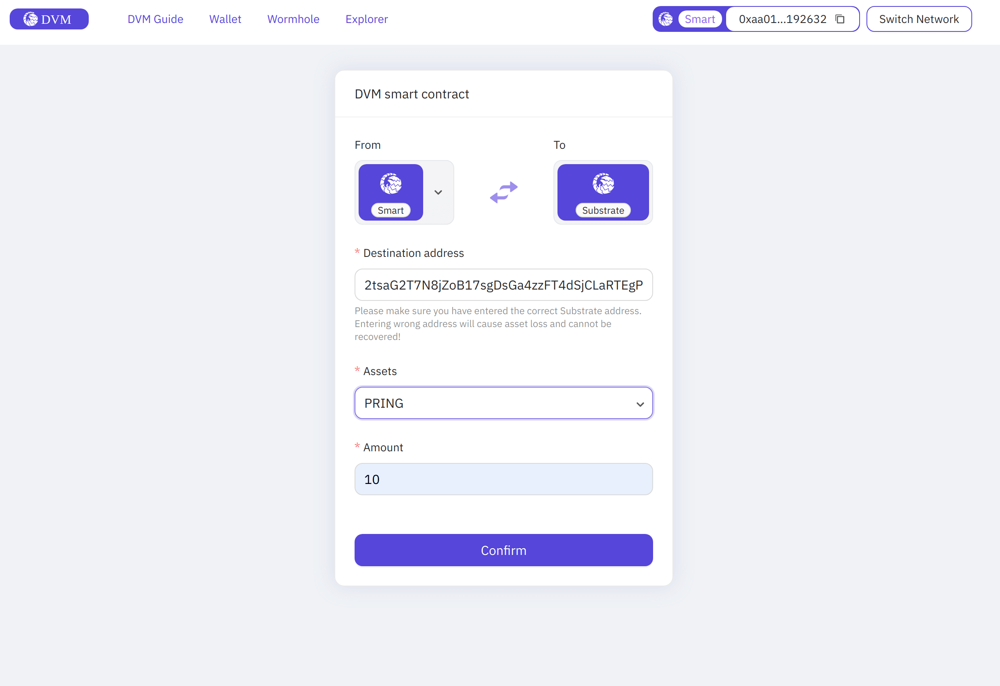
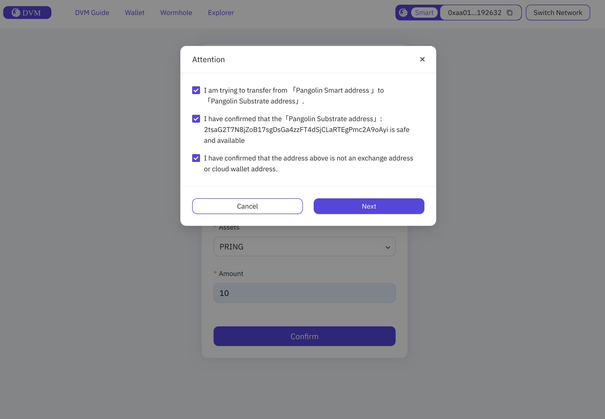
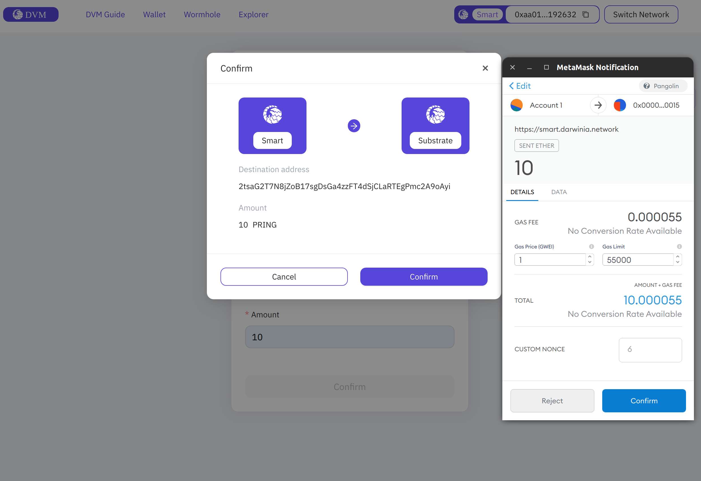
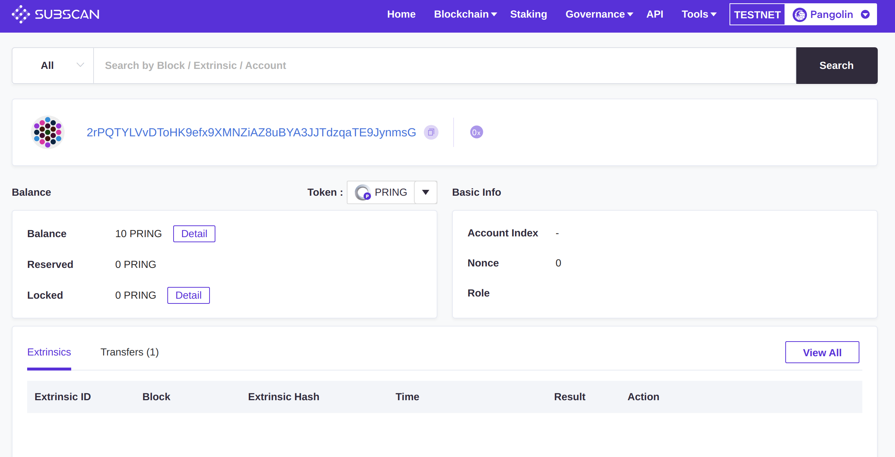

It is an action of transferring assets from a DVM account to a Substrate account.

## Preparation

You should have a Substrate account to receive `PRING/PKTON`.

## Withdraw

> Note: The [Metamask Extension](https://metamask.io/) is required before you can use the Smart App.

Open [Smart App](https://smart.darwinia.network/), and set `From` to `Smart` and `To` to `Substrate`.

Select the DVM account(the balance of this account should not be empty).

Once the association has been successfully established, like this:

Enter the address of your Substrate account prepared before, here is `2rPQTYLVvDToHK9efx9XMNZiAZ8uBYA3JJTdzqaTE9JynmsG`.

Click `Confirm` and then `Next`. 

And then click the `Confirm` to sign and send the transaction.

## Check if the transfer is successful

Check your balance in Subscan:

