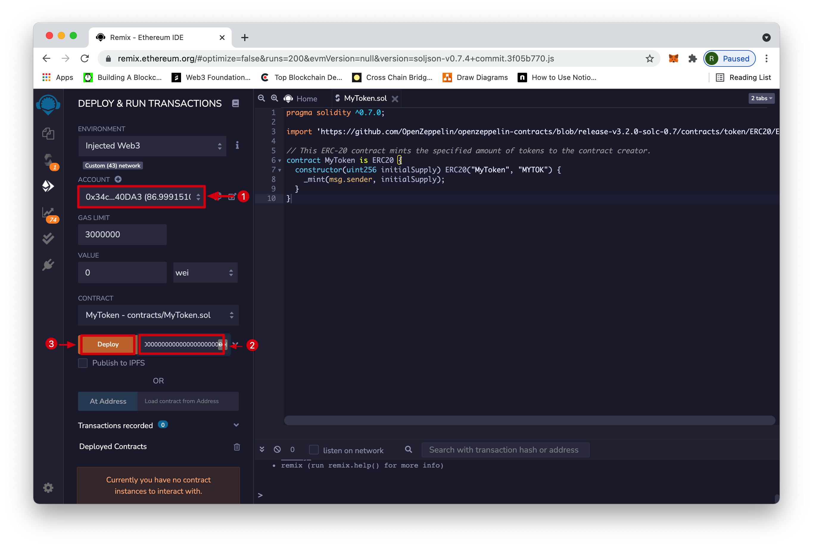

# Using Remix to Deploy to Pangolin

## Introduction

Remix is one of the commonly used development environments for smart contracts on Ethereum. Given Darwinia’s Ethereum compatibility features, Remix can be used directly with a Darwinia development node or the Pangolin Node.

This guide walks through the process of creating and deploying a Solidity-based smart contract to a Darwinia development node using the [Remix IDE](https://remix.ethereum.org/).

:::note
This tutorial was created using the v2.6.4 tag which is based on the v2.6.4 release of [Darwinia-Common](https://github.com/darwinia-network/darwinia-common/releases/tag/v2.6.4). The Darwinia platform and the [Frontier](https://github.com/paritytech/frontier) components it relies on for Substrate-based Ethereum compatibility are still under very active development.
:::

## Checking Prerequisites

This guide assumes that you have a local Darwinia node running in `--dev` mode and that you have a [MetaMask](https://metamask.io/) installation configured to use this local node. You can find instructions for running a local Darwinia node [here](../../get-started/darwinia-dev/) and instructions to connect MetaMask to it [here](../../wallets/dvm-metamask.md).

If you followed the guides above, you should have a local Darwinia node which will begin to author blocks as transactions arrive:


And you should have a MetaMask installation connected to your local Darwinia dev node with at least one account that has a balance. It should look something like this (expanded view):


:::note
Make sure you are connected to your Darwinia node and not another network!
:::

## Getting Started with Remix

Now, let’s fire up Remix to exercise more advanced functionalities in Darwinia.

Launch Remix by navigating to [https://remix.ethereum.org/](https://remix.ethereum.org/). In the main screen, under Environments, select Solidity to configure Remix for Solidity development, then navigate to the File Explorers view:


We will create a new file to save the Solidity smart contract. Hit the + button under File Explorers and enter the name "MyToken.sol" in the popup dialog:


Next, let's paste the following smart contract into the editor tab that comes up:

```solidity
pragma solidity ^0.7.0;

import 'https://github.com/OpenZeppelin/openzeppelin-contracts/blob/release-v3.2.0-solc-0.7/contracts/token/ERC20/ERC20.sol';

// This ERC-20 contract mints the specified amount of tokens to the contract creator.
contract MyToken is ERC20 {
  constructor(uint256 initialSupply) ERC20("MyToken", "MYTOK") {
    _mint(msg.sender, initialSupply);
  }
}
```

This is a simple ERC-20 contract based on the current Open Zeppelin ERC-20 template. It creates MyToken with symbol MYTOK and mints the entirety of the initial supply to the creator of the contract.

Once you have pasted the contract into the editor, it should look like this:


Now, navigate to the compile sidebar option to press the “Compile MyToken.sol” button:


You will see Remix download all of the Open Zeppelin dependencies and compile the contract.

## Deploying a Contract to Darwinia Using Remix

Now we can deploy the contract by navigating to the Deployment sidebar option. You need to change the topmost “Environment” dropdown from “JavaScript VM” to “Injected Web3.” This tells Remix to use the MetaMask injected provider, which will point it to your Darwinia development node. If you wanted to try this using the Pangolin Network, you would have to connect MetaMask to the Pangolin Network instead of your local development node.

As soon as you select "Injected Web3", you will be prompted to allow Remix to connect to your MetaMask account.


Press “Confirm” in Metamask to allow Remix to access the selected account.


Back on Remix, you should see that the account you wish to use for deployment is now managed by MetaMask. Next to the Deploy button, let’s specify an initial supply of 8M tokens. Since this contract uses the default of 18 decimals, the value to put in the box is `8000000000000000000000000`.

Once you have entered this value, select "Deploy."



You will be prompted in MetaMask to confirm the contract deployment transaction.

:::note
If you have problems deploying any specific contract, you can try manually increasing the gas limit. You can do this under Settings -> Advanced -> Advanced Gas Controls = ON.
:::

After you press confirm and the deployment is complete, you will see the transaction listed in MetaMask. The contract will appear under Deployed Contracts in Remix.


Once the contract is deployed, you can interact with it from within Remix.

Drill down on the contract under “Deployed Contracts.” Clicking on name, symbol, and totalSupply should return “MyToken,” “MYTOK,” and “8000000000000000000000000” respectively. If you copy the address from which you deployed the contract and paste it into the balanceOf field, you should see the entirety of the balance of the ERC20 as belonging to that user. Copy the contract address by clicking the button next to the contract name and address.


## Interacting with a Darwinia-based ERC-20 from MetaMask

Now, open MetaMask to add the newly deployed ERC-20 tokens. Before doing so, make sure you have copied the contract's address from Remix. Back in MetaMask, click on “Add Token” as shown below. Make sure you are in the account that deployed the token contract.


Paste the copied contract address into the “Custom Token” field. The “Token Symbol” and “Decimals of Precision” fields should be automatically populated.


After hitting “Next,” you will need to confirm that you want to add these tokens to your MetaMask account.


 Hit “Add Token” and you should see a balance of 8M MyTokens in MetaMask:


Now we can send some of these ERC-20 tokens to the other account that we have set up in MetaMask. Hit “send” to initiate the transfer of 500 MyTokens and select the destination account.


After hitting “next,” you will be asked to confirm (similar to what is pictured below).


Hit “Confirm” and after the transaction is complete, you will see a confirmation and a reduction of the MyToken account balance from the sender account in MetaMask:


If you own the account that you sent the tokens to, you can add the token asset to verify that the transfer arrived.


