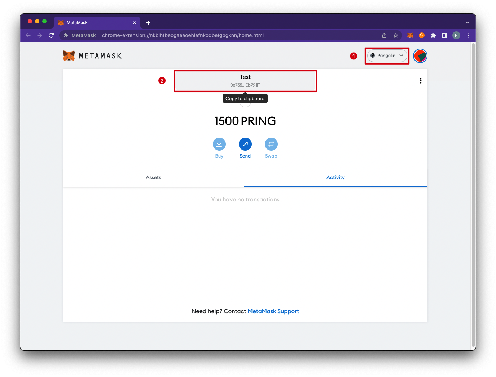
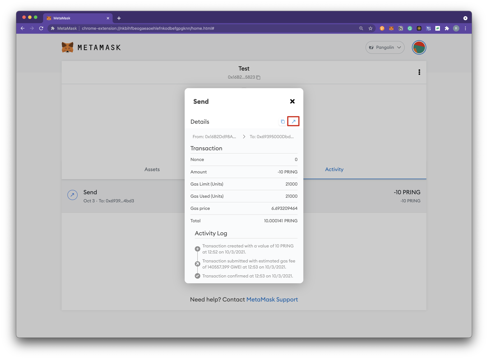

MetaMask is the most widely used wallet in the Ethereum ecosystem. We have deployed the DVM module in Crab Network and other testnets, which provides Ethereum compatibility. Users can connect to Crab Network and other testnets with MetaMask. There is a corresponding standard Substrate address for every Ethereum-like address, which is called a DVM address. Both addresses point to the same account but are used in different scenarios.

> Detailed explanation of address formats can be found in [DVM Address](../builders/advanced/dvm-address.md).

### Connect with Metamask

1. Install the Metamask plugin, download and install it yourself. 
2. Add the Network RPC automatically, go to https://docs.crab.network/ and click the `Connect Wallet` on the right upper corner, then you can see the RPC configuration parameters of Pangolin and Crab, click and then the corresponding network RPC will be added automatically. The network configuration blow can be used as a reference if you want to add the Network RPC manually.

| Network  | RPC URL                             | ChainID | Currency| Block Explorer URL |
| ---------| ------------------------------------ | -------| --------|---------- |
| Pangolin | https://pangolin-rpc.darwinia.network | 43     | PRING   | https://pangolin.subscan.io/ |
| Crab     | https://crab-rpc.darwinia.network     | 44     | CRAB   | https://crab.subscan.io/      |   

### Address Conversion

Use Apps tool to generate the Substrate address corresponding to the DVM address.
1. Copy the DVM address.

1. Address conversion can be done by using the [Apps](https://apps.darwinia.network/toolbox) tool. Click on `Toolbox`, `DVM Address`, enter the address of the copied DVM account.

3. This address is the only Substrate address corresponding to the DVM address. Click the upper right corner to copy the Substrate address.

4. You can apply for the test token from the Faucet through the generated Substrate address above. For details, please refer to the following.

### Apply for the test token

To start building on Pangolin, you can click [here](https://docs.crab.network/evm-compatible-crab-smart-chain/get-started/darwinia-pangolin) and get DEV tokens(PRING) by logging in with your Github Account and claim tokens to substrate-based address that you generated above. There is an IP address limit that one IP address can claim once within 12 hours. For token requests of more than the limited account allowed by the faucet, contact an admin directly via our [Darwinia Technical Telegram Group](https://t.me/DarwiniaDev). We are happy to provide the tokens needed to test your applications.

### Transfer

Demonstrating how to use Metamask to transfer and query transactions in a DVM on the Pangolin test network.

1. Click `Send` and enter the transfer parameters. 

2. Click `Confirm` to send transaction.

3. The transfer executed successfully.

4. View details of the transaction execution in your browser.

