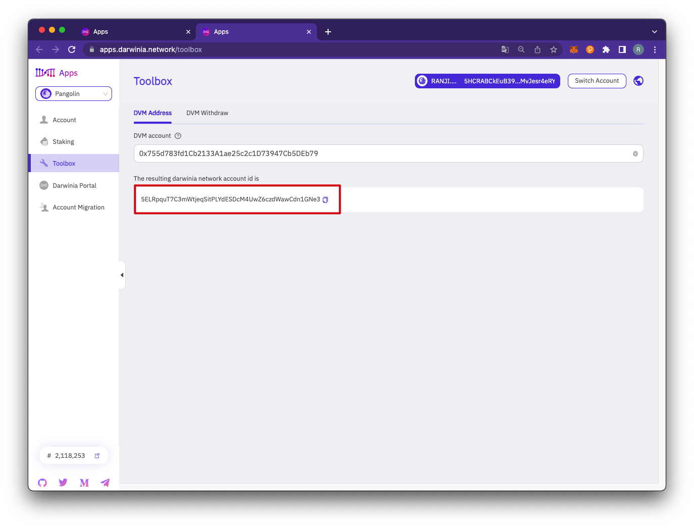
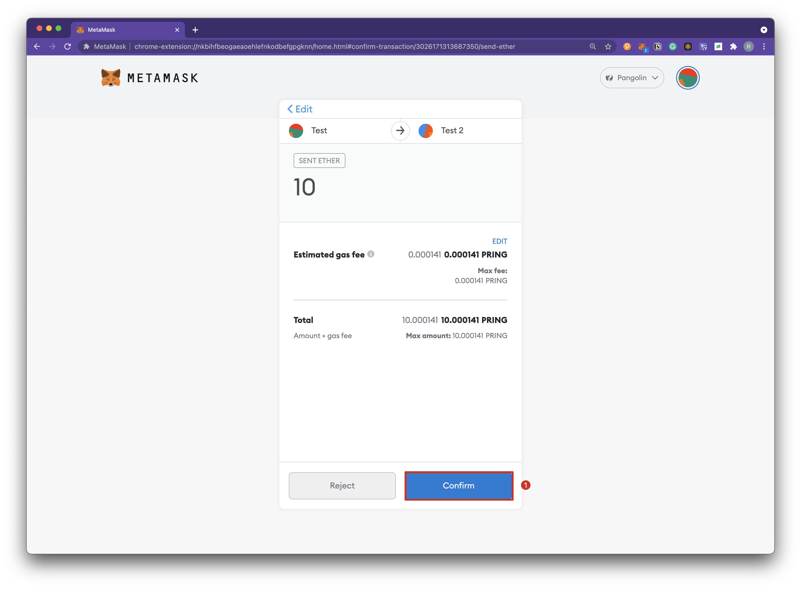
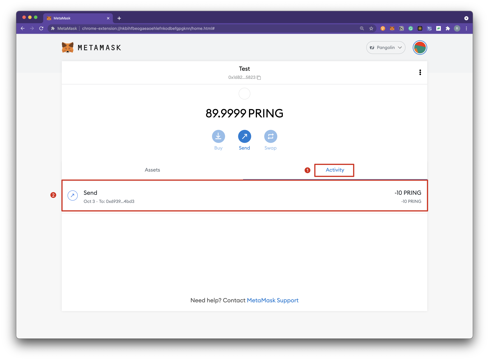

MetaMask is the most widely used wallet in the Ethereum ecosystem. We have deployed the DVM module in Crab Network and other testnets, which provides Ethereum compatibility. Users can connect to Crab Network and other testnets with MetaMask. There is a corresponding standard Substrate address for every Ethereum-like address, which is called a DVM address. Both addresses point to the same account but are used in different scenarios.

> Detailed explanation of address formats can be found in [DVM Address](../builders/advanced/dvm-address.md).

### Connect with Metamask

1. Install the Metamask plugin, download and install it yourself. 
2. Add a custom network, here is an example of adding a Pangolin test network, different networks have different configuration parameters.
+ Click `Custom RPC`.

+ Add Pangolin Test Network configuration parameters.

+ After the connection is successful, as shown in the figure below.

### Network Configuration

The different network configuration are as follows.

| Network  | RPC URL                             | ChainID | Currency| Block Explorer URL |
| ---------| ------------------------------------ | -------| --------|---------- |
| Pangolin | https://pangolin-rpc.darwinia.network | 43     | PRING   | https://pangolin.subscan.io/ |
| Crab     | https://crab-rpc.darwinia.network     | 44     | CRAB   | https://crab.subscan.io/      |   

### Address Conversion

Use Apps tool to generate the Substrate address corresponding to the DVM address.
1. Copy the DVM address.

2. Address conversion can be done by using the [Apps](https://apps.darwinia.network/#/toolbox/dvmaddress) tool. Click on `Toolbox`, `DVM Address`, enter the address of the copied DVM account.

3. This address is the only Substrate address corresponding to the DVM address. Click the upper right corner to copy the Substrate address.

4. You can apply for the test token from the Faucet through the generated Substrate address. For details, please refer to the following.

### Apply for the test token

1. Join the Telegram group named ["Darwinia Faucet Official"](https://t.me/darwiniafaucet_official).

2. Send `/faucet@darwinia_faucet_bot`.

3. Send `Faucet`+ the copied Substrate address corresponding to the DVM account address.

4. You can open the link of the Darwinia_bot to check the transaction on Subscan. 

5. Since this Substrate address corresponds to a specific DVM address, when the test token is sent to the Substrate address, the corresponding DVM address can be managed through Metamask to achieve the purpose of managing this Substrate address.

6. When querying the DVM address through Subscan, you can see its corresponding Substrate address at the same time.

### Transfer

Demonstrating how to use Metamask to transfer and query transactions in a DVM on the Pangolin test network.

1. Click `Send` and enter the transfer parameters. 

2. Click `Confirm` to send transaction.

3. The transfer executed successfully.

4. View details of the transaction execution in your browser.

