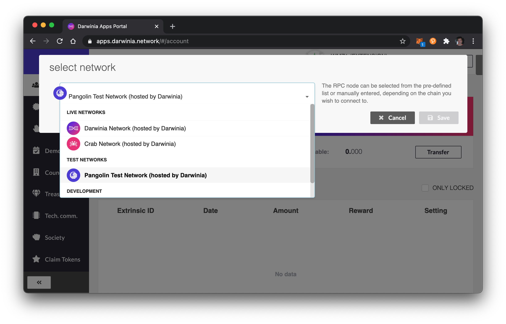

Pangolin is the test network of Darwinia and Crab network.

## Features

- Test the latest technology.
- Compatible with Ethereum Virtual Machine.
- Compatible with Ethereum contract infrastructure Metamask, Remix, etc.
- Smart contracts supporting solidity language.
- May be reset

Developers can apply for free `PRING`s for test in [Element](https://app.element.io/?pk_vid=6961ca0f7c45f8bf16052310122d2437#/room/#darwinia:matrix.org).

## Add Pangolin to Metamask 

Parameters:

- Network Name: `Pangolin`
- RPC URL: `https://pangolin-rpc.darwinia.network`
- Chain ID: `43`
- Currency Symbol: `PRING`

Click [Save], the pangolin network will be added in metamask successfully. Then, you could transfer token or deploy contracts in metamask.

## Use Pangolin in Darwinia Web Wallet

https://apps.darwinia.network/

