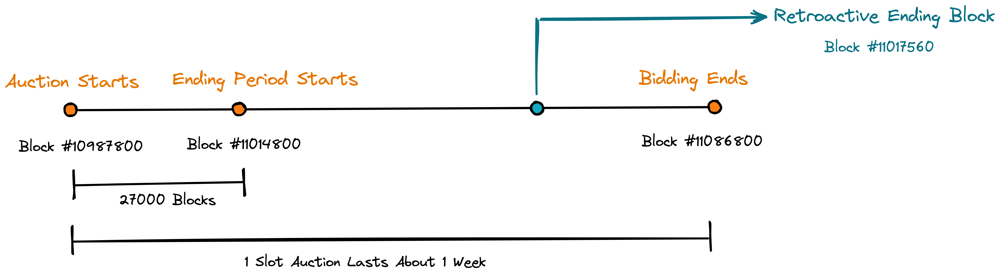

## Introduction

The parachain slot auction is a way for blockchain company to compete by bidding in an auction for the privilege of launching and operating on Kusama while also benefiting from its security and design. By connecting to Kusama, its future-proof technology, and its engaged community of users with billions in value at play, blockchain networks like Crab can access key requirements for a successful launch while focusing on what they do best, whether that’s gaming, privacy, or even social media.

## Parachain Slot

For a parachain to be added to Kusama it must inhabit one of the available parachain slots. A parachain slot is a scarce resource on Kusama and only a limited number will be available. As parachains ramp up, there may only be a few slots that are unlocked every few months. Eventually there will be 100 parachain slots available on Kusama. If a parachain wants to have guaranteed block inclusion at every Relay Chain block, it must acquire a parachain slot.

## Mechanics of a Candle Auction

Parachain slot auctions follow a modified [candle auction](https://wiki.polkadot.network/docs/en/learn-auction#mechanics-of-a-candle-auction) format, with each auction lasting approximately 1 week. To prevent auction sniping (the strategy of bidding at the last moment) and promote more accurate price discovery, the exact endpoint of a particular auction remains unknown until after the auction’s close.

Candle auctions are a variant of open auctions where bidders submit bids that are increasingly higher and the highest bidder at the conclusion of the auction is considered the winner.

Candle auctions were originally employed in 16th century for the sale of ships and get their name from the "inch of a candle" that determined the open period of the auction. When the flame extinguished and the candle went out, the auction would suddenly terminate and the standing bid at that point would win.

When candle auctions are used online, they require a random number to decide the moment of termination.

Parachain slot auctions differ slightly from a normal candle auction in that it does not use the random number to decide the duration of its opening phase. Instead, it has a *known open phase* and will be retroactively determined (at the normal close) to have ended at some point in the past during the ending phase. So during the open phase, bids will continue to be accepted, but later bids have higher probability of losing since the retroactively determined close moment may be found to have preceded the time that a bid was submitted.

## Randomness in Action

The following example will showcase the randomness mechanics of the candle auction for the 22nd auction on Kusama. Keep in mind that the candle phase has a uniform termination profile and has an equal probability of ending at any given block, and the termination block cannot be predicted before or during the auction.

According to [Proposal #384](https://kusama.subscan.io/council/384):

- The 22nd slot auction was included in the batch 5 auction, and ***it’s the second slot of batch 5***, as shown in the picture above: auction 22 starts at `block #10887000 + 100800`, which equals `10987800`.

    >
    > `1`: The 1st auction of batch 5 slot auction starts at `block #10887000`.
    >
    >`2`: There are `100800` blocks between each slot auction start block.
    >
    >`3`: There are `5` slots in the batch 5 auction.
    >
    >`4`: There are `27000` blocks between “slot auction start” and “ending period starts”.
    > 
- A note on ***“Auction Ending Period”(Candle Phase)***:
    
   
    
    
    > Each slot auction lasts about 1 week, and each auction has an ***"ending period”*** that begins approximately 27000 blocks after the ***“auction starts”*** and lasts until the end of the 1-week bidding period. The auction’s end point(***retroactive ending block***) can be any time within the ending period, and is automatically and randomly chosen by the [VRF](https://wiki.polkadot.network/docs/learn-randomness#vrf) at the close of the 1-week bidding period. In other words, during the ending period, each block will be recorded with a snapshot, and one of the blocks will be randomly selected as the result of the auction.
    
    
    > The auction has a full duration equal to block 99000 `(block #11086800 - 10987800)`.
    Here, block 72000 `(block #11086800 - 11014800)` is the "ending period". Figuratively, the candle is lit, and the candle phase lasts for 72,000 blocks.
    >