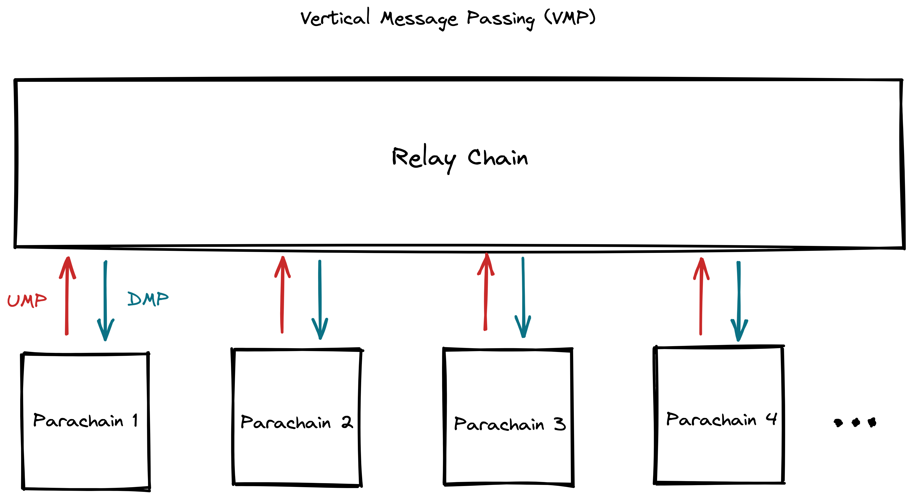
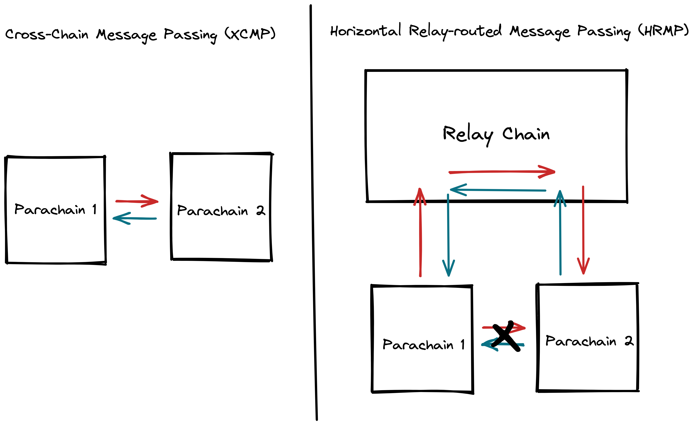

## Introduction

[Cross-Consensus Message (XCM)](https://wiki.polkadot.network/docs/learn-crosschain) format defines a language around how the message transfer between two interoperating blockchains should be performed. XCM is not specific to Kusama or Polkadot, as it aims to be a generic and extensible language between different consensus systems.

> XCM is a messaging **format**. It is not a messaging **protocol**. It cannot be used to actually “send” any message between systems; its utility is only in expressing what should be done by the receiver.
> 

## Cross-Consensus Protocols

Polkadot/Kusama implements two cross-consensus or transport protocols for acting on XCM messages between its constituent parachains:

### Vertical Message Passing (VMP)

VMP divided into two kinds of message-passing transport protocols:

- **Upward Message Passing (UMP)** — allows parachains to send messages to their relay chain, for example, from Crab to Kusama
- **Downward Message Passing (DMP)** — allows the relay chain to pass messages down to one of their parachains, for example, from Kusama to Crab

### Cross-Chain Message Passing (XCMP)

XCMP allows two parachains to exchange messages as long as they are connected to the same relay chain. Collators exchange messages between parachains, while the relay chain validators will verify that the message transmission happened.

> Because of XCMP proper is still in development, HRMP(XCMP-Lite) is a working replacement. HRMP(Horizontal Relay-routed Message Passing) has the same interface and functionality as XCMP but is much more demanding on resources since it stores all messages in the relay chain storage. When XCMP has been implemented, HRMP is planned to be deprecated and phased out in favor of it.
> 

## Cross-Chain Asset Transfer

### Methods for Cross-Chain Asset Transfer

The two most common methods for cross-chain asset transfer, at least in the early stages of XCM implementations, are:
`Teleporting`: movement of an asset happens by destroying it on one side and creating a clone on the other side.
`Remote Transfers`: control an account on a remote chain, allowing the local chain to have an address on the remote chain for receiving funds and to eventually transfer those funds it controls into other accounts on that remote chain.

### How to Make Cross-Chain Transfer

**Relay Chain & Parachains**

- Upward Asset Transfer
    
    Upward asset transfers are when an account on the parachain sends a transfer to account on the relay chain. This method of transfer uses `Teleporting`, meaning that when the token leave the sender's account on the parachain and are transferred into an account on the relay chain, the parachain burned a corresponding amount tokens and the relay chain mints a corresponding amount of tokens on the relay chain.
    
- Downward Asset Transfer
    
    Downward asset transfers are when an account on the relay chain sends a transfer to their account on a different parachain. This method of transfer uses `Teleporting`, meaning that when the token leave the sender's account on the relay chain and are transferred into an account on a parachain, the relay chain burned a corresponding amount tokens and the parachain mints a corresponding amount of tokens on the parachain.
    

**Parachain & Parachain**

Asset transfer between parachains use the method of `Remote Transfers`, moving an asset from one blockchain to another via an “intermediate account” in the origin chain that is trustlessly owned by the target chain. In such cases, the origin chain asset is not destroyed but held by the “intermediate account”. The XCM execution in the target chain mints a wrapped tokens to a target address. The wrapped token is always interchangeable on a 1:1 basis with the native asset on the origin chain.

> More detailed article about XCM, please refer to [Polkadot Wiki](https://wiki.polkadot.network/docs/learn-crosschain).
