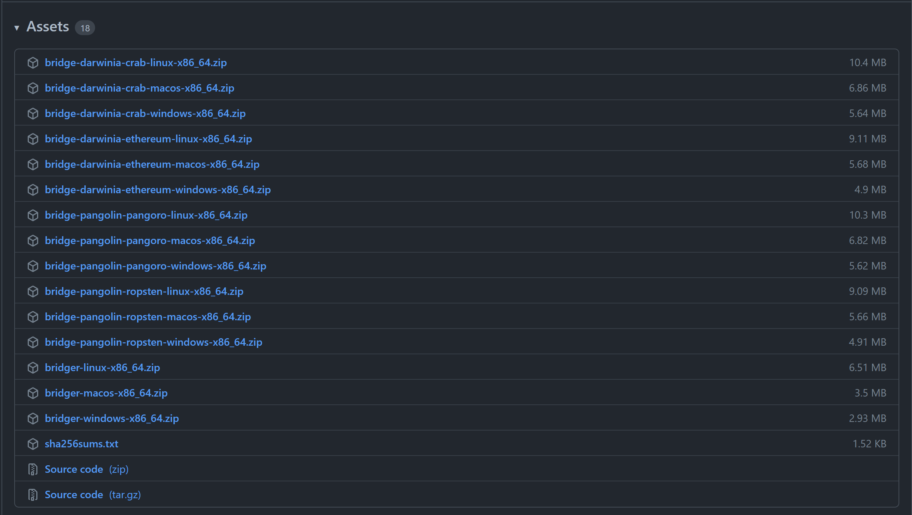

## Intro

We have identified some issues that need to be addressed since the latest launch of ***Bridgers***.

- In the previous design, all bridges were put in a single large Workspace and managed in one project. Therefore bridges might depend on different versions of upstream libraries, resulting in frequent dependency conflicts. For the same cause, compiling time becomes longer as the number of bridges increases, because we are unable to compile a specific bridge module separately.
- The previous design manages all bridges as a web server, increasing the memory overhead of Bridger programs.

To address these problems, we have launched [an upgrade](https://github.com/darwinia-network/bridger/pull/364) to the design of ***Bridgers***. We manage to address the aforementioned issues as well as optimize some functionalities in the new design.

- Every bridger is executed as an independent binary;
- Every bridger can be compiled independently;
- Every bridges is launched separately rather than managed in a Web Server manner;
- Memory overhead is significantly reduces;

Other optimizations include:

- Logs support the JSON format which facilitates monitoring the state of Bridgers;
- Optimize the content of logs;
- Streamline CI/CD procedures, which enables cross-compiling for different platforms;
- Centralize the management of Subql/Subgraph and automate the deployment.

## Migration

Every time we release a new version of ***Bridger*** since v0.4.8, we will provide an upgrade guide if any configuration files are modified. The guides for the latest releases are as follows.

[Upgrade guide for version v0.4.8 or later](https://github.com/darwinia-network/bridger/issues/315)

[Upgrade guide for version v0.5.x](https://github.com/darwinia-network/bridger/issues/390)

## Usage

From now on, the usage guide will consist of two parts, development(local) mode and production mode. First, let’s take a look at the helper.

```bash
$ bridger -h
bridger 0.5.0
Darwinia bridger

USAGE:
    bridger <SUBCOMMAND>

FLAGS:
    -h, --help       Prints help information
    -V, --version    Prints version information

SUBCOMMANDS:
    help        Prints this message or the help of the given subcommand(s)
    kv          Kv options
    list        List all bridges
    registry    Registry option
```

### Production mode

The production mode is the default mode of ***Bridger***. Users can check(get) or set via the `registry`  command.

```bash
$ bridger registry get
TYPE: Github
PATH: https://github.com/darwinia-network/bridger
```

Every time a new version of ***Bridger*** is released, CI/CD system automatically builds every executable and upload them to the Github Release page. For instance

[https://github.com/darwinia-network/bridger/releases/tag/v0.5.0](https://github.com/darwinia-network/bridger/releases/tag/v0.5.0)




You can choose the right version according to your operating system and networks. Then we can continue to launch the ***bridger***.

```bash
$ bridger pangolin-ropsten -h
2022-01-06 03:07:49 DEBUG bridger: Found subcommand (pangolin-ropsten) and args: -h
2022-01-06 03:07:49 TRACE bridger: Try execute external command
2022-01-06 03:07:49 TRACE bridger: Force mode: false
2022-01-06 03:07:49 TRACE bridger: Download package path is: /tmp/bg2/bridge-pangolin-ropsten-linux-x86_64.zip
Downloading `https://github.com/darwinia-network/bridger/releases/download/v0.5.0/bridge-pangolin-ropsten-linux-x86_64.zip`
2022-01-06 03:07:49 TRACE bridger: Response code is: 200
Downloaded
Start extract /tmp/bg2/bridge-pangolin-ropsten-linux-x86_64.zip
2022-01-06 03:07:49 DEBUG bridger: File 0 extracted to "/tmp/bg2/bridge-pangolin-ropsten" (27136024 bytes)
2022-01-06 03:07:50  INFO bridger::external::provider::common: Execute `bridge-pangolin-ropsten -h` in path: /tmp/bg2/
pangolin-ropsten 0.5.0
Bridge pangolin-ropsten

USAGE:
    bridge-pangolin-ropsten <SUBCOMMAND>

FLAGS:
    -h, --help       Prints help information
    -V, --version    Prints version information

SUBCOMMANDS:
    affirm     Affirm options
    confirm    Confirm options
    ecdsa      Ecdsa options
    guard      Guard
    help       Prints this message or the help of the given subcommand(s)
    info       Ecdsa options
    keys       Keys
    mmr        MMR options
    parcel     Basic command options
    relay      Relay options
    start      Start bridge pangolin-ropsten
```

 `$HOME/.bridger` is the default location of configuration files. You may also define your own configuration folder by setting the environment variable `BRIDGER_HOME`.

> There are also other environment variables for use, which you can refer to [Usage](https://github.com/darwinia-network/bridger/blob/7c5fdf4a64/docs/Useage.md#env).
> 

Copy the template configuration for the specified briger to the folder `BRIDGER_HOME`,replace the private key with your own, 

- [bridge-pangolin-ropsten.toml](https://github.com/darwinia-network/bridger/blob/7c5fdf4a64/.maintain/config/bridge-pangolin-ropsten.toml)
- [bridge-pangolin-pangoro.toml](https://github.com/darwinia-network/bridger/blob/7c5fdf4a64/.maintain/config/bridge-pangolin-pangoro.toml)
- [bridge-darwinia-ethereum.toml](https://github.com/darwinia-network/bridger/blob/7c5fdf4a64/.maintain/config/bridge-darwinia-ethereum.toml)
- [bridge-darwinia-crab.toml](https://github.com/darwinia-network/bridger/blob/7c5fdf4a64/.maintain/config/bridge-darwinia-crab.toml)

and finally execute the command  `start` to launch the bridger.

```bash
$ bridger pangolin-ropsten start
2022-01-06 03:23:13 DEBUG bridger: Found subcommand (pangolin-ropsten) and args: start
2022-01-06 03:23:13 TRACE bridger: Try execute external command
2022-01-06 03:23:13 TRACE bridger: Force mode: false
2022-01-06 03:23:13  INFO bridger::external::provider::common: Execute `bridge-pangolin-ropsten start` in path: /tmp/bg2/
2022-01-06 03:23:13  INFO bridge_pangolin_ropsten::command::handler::start: Start bridge pangolin-ropsten
2022-01-06 03:23:13 DEBUG lifeline::dyn_bus::storage: BridgeState stored in PangolinRopstenBus    
2022-01-06 03:23:13 DEBUG lifeline::dyn_bus::storage: ToExtrinsicsMessage linked in PangolinRopstenBus    
2022-01-06 03:23:13 DEBUG lifeline::spawn: START AffirmService/task-pangolin-ropsten-service-affirm-scan    
2022-01-06 03:23:13 DEBUG lifeline::spawn: START AffirmService/task-pangolin-ropsten-service-affirm-relay    
2022-01-06 03:23:13 DEBUG lifeline::dyn_bus::storage: ToRelayMessage linked in PangolinRopstenBus    
2022-01-06 03:23:13 DEBUG lifeline::spawn: START AffirmService/task-pangolin-ropsten-service-affirm-command    
2022-01-06 03:23:13 DEBUG lifeline::spawn: START CheckService/task-pangolin-ropsten-service-check    
2022-01-06 03:23:13 DEBUG lifeline::dyn_bus::storage: ToRedeemMessage linked in PangolinRopstenBus    
2022-01-06 03:23:13  INFO pangolin-ropsten: SERVICE RESTARTING...
2022-01-06 03:23:13 DEBUG lifeline::spawn: START RedeemService/task-pangolin-ropsten-service-redeem-scan    
2022-01-06 03:23:13 DEBUG lifeline::spawn: START RedeemService/task-pangolin-ropsten-service-redeem-command    
2022-01-06 03:23:13  INFO pangolin-ropsten: SERVICE RESTARTING...
2022-01-06 03:23:13 DEBUG lifeline::dyn_bus::storage: ToGuardMessage linked in PangolinRopstenBus    
2022-01-06 03:23:13 DEBUG lifeline::spawn: START GuardService/task-pangolin-ropsten-service-guard    
2022-01-06 03:23:13 DEBUG lifeline::spawn: START PangolinService/task-pangolin-ropsten-service-pangolin-scan    
2022-01-06 03:23:13  INFO pangolin-ropsten: SERVICE RESTARTING...
2022-01-06 03:23:13 DEBUG lifeline::spawn: START ExtrinsicsService/task-pangolin-ropsten-service-extrinsics    
2022-01-06 03:23:13 DEBUG lifeline::dyn_bus::storage: DarwiniaEthereumMessage linked in PangolinRopstenBus    
2022-01-06 03:23:13  INFO pangolin-ropsten: ROPSTEN CHECK SERVICE RESTARTING...
2022-01-06 03:23:13  INFO pangolin-ropsten: SERVICE RESTARTING...
2022-01-06 03:23:13  INFO pangolin-ropsten: SERVICE RESTARTING...
2022-01-06 03:23:13  INFO pangolin-ropsten: SERVICE RESTARTING...
2022-01-06 03:23:13  INFO pangolin-ropsten: EXTRINSICS SERVICE RESTARTING...
```

### Development mode

Under the development mode, developers use a script [bridger.sh](https://github.com/darwinia-network/bridger/blob/7c5fdf4a64/bridger.sh) to specify the bridger they intend to compile and run. In addition,  `registry` should be changed to `local`, otherwise it will download the current bridger from the server as in the production mode.

```bash
$ ./bridger.sh registry set --type local
```

Some additional conventions are to be followed.

- All embedded bridges should be put in the folder *bridges* and named as the intended sub-commands(e.g. pangolin-pangoro/pangolin-ropsten);
- A ***bridge*** is a project using Rust programming language which comes with a binary crate. The naming should follow the format `bridge-<BRIDGE_NAME>` (e.g.[bridge-pangolin-ropsten](https://github.com/darwinia-network/bridger/blob/7c5fdf4a6442a158129db689933359569ae7c2e1/bridges/pangolin-ropsten/bridge/Cargo.toml?_pjax=%23js-repo-pjax-container%2C%20div%5Bitemtype%3D%22http%3A%2F%2Fschema.org%2FSoftwareSourceCode%22%5D%20main%2C%20%5Bdata-pjax-container%5D#L2)).

Now you can compile and launch the specified bridge by running  `bridger.sh`

```bash
$ ./bridger.sh pangolin-ropsten -h
+ dirname ./bridger.sh
+ cd .
+ pwd -P
+ BIN_PATH=/data/bridger
+ cargo build --manifest-path /data/bridger/frame/Cargo.toml --package darwinia-bridger
    Finished dev [unoptimized + debuginfo] target(s) in 0.44s
+ /data/bridger/frame/target/debug/bridger pangolin-ropsten -h
2022-01-06 04:13:40 DEBUG bridger: Found subcommand (pangolin-ropsten) and args: -h
2022-01-06 04:13:40 TRACE bridger: Try execute external command
2022-01-06 04:13:40 TRACE bridger: The execute path is: /data/bridger/frame/target/debug/
2022-01-06 04:13:40 TRACE bridger: Try detect binary fo path: /data/bridger/frame/target/debug/../../../bridges/pangolin-ropsten
2022-01-06 04:13:40  INFO bridger: Try compile bridge-pangolin-ropsten in path: /data/bridger/frame/target/debug/../../../bridges/pangolin-ropsten
2022-01-06 04:13:40  INFO bridger: Execute `cargo build -p bridge-pangolin-ropsten` in path: /data/bridger/frame/target/debug/../../../bridges/pangolin-ropsten
   Compiling support-terminal v0.5.0 (/data/bridger/frame/supports/support-terminal)
   Compiling support-primitives v0.5.0 (/data/bridger/frame/supports/support-primitives)
   Compiling support-common v0.5.0 (/data/bridger/frame/supports/support-common)
   Compiling support-lifeline v0.5.0 (/data/bridger/frame/supports/support-lifeline)
   Compiling support-tracker v0.5.0 (/data/bridger/frame/supports/support-tracker)
   Compiling component-http-client v0.5.0 (/data/bridger/frame/components/http-client)
   Compiling component-thegraph-liketh v0.5.0 (/data/bridger/frame/components/thegraph-liketh)
   Compiling component-subquery v0.5.0 (/data/bridger/frame/components/subquery)
   Compiling support-ethereum v0.5.0 (/data/bridger/frame/supports/support-ethereum)
   Compiling component-state v0.5.0 (/data/bridger/frame/components/state)
   Compiling component-ethereum v0.5.0 (/data/bridger/frame/components/ethereum)
   Compiling client-pangolin v0.5.0 (/data/bridger/bridges/pangolin-ropsten/client-pangolin)
   Compiling component-shadow v0.5.0 (/data/bridger/frame/components/shadow)
   Compiling bridge-pangolin-ropsten v0.5.0 (/data/bridger/bridges/pangolin-ropsten/bridge)
    Finished dev [unoptimized + debuginfo] target(s) in 34.20s
2022-01-06 04:14:14  INFO bridger: Execute `bridge-pangolin-ropsten -h` in path: /data/bridger/frame/target/debug/../../../bridges/pangolin-ropsten

USAGE:
    bridge-pangolin-ropsten <SUBCOMMAND>

FLAGS:
    -h, --help       Prints help information
    -V, --version    Prints version information

SUBCOMMANDS:
    affirm     Affirm options
    confirm    Confirm options
    ecdsa      Ecdsa options
    guard      Guard
    help       Prints this message or the help of the given subcommand(s)
    info       Ecdsa options
    keys       Keys
    mmr        MMR options
    parcel     Basic command options
    relay      Relay options
    start      Start bridge pangolin-ropsten
```

## Development

*Lifeline* is a library for Event Bus developed in Rust programming language which suits the development of *Bridge*. A detailed description on how to use it can be found [here](https://github.com/austinjones/lifeline-rs). There are some use cases in the documentation. The following three parts are essential and need more attention.

- Create a *Bus*
- Create a *Message*
- Create a *Service*

*Bus* is the core of *Event Bus*. *Bus* can be used to send a message by requesting a Channel or schedule a *Service*. We divide the responsibilities of a bridge into a myriad of functions, each of which is accomplished by a *Service*. We provide [a template](https://github.com/darwinia-network/bridger/tree/master/bridges/template) in the Bridger repository which can be used to create a new *Bridge* project.

Since every bridge becomes independent in the new design, *Lifeline **i***s not the only way to build a bridge. You are free to implement your *bridge* in your favourite manner. If you want your bridge to be scheduled by *bridger* (the development part), you should store and name your bridge following the convention.

If you are an outside developer, you can implement a new bridge in your way and then submit a pull request to the repository  [darwinia-network/bridger](https://github.com/darwinia-network/bridger). Or you can create your own repository.

For instance:

```bash
$ bridger registry set --type server --path https://github.com/fewensa/bridger
```