# Introduction

We define Smart App as an application that transfers tokens from the Substrate address to the Smart address ***within the same chain***.

## Substrate address

Substrate-based blockchains such as Polkadot and Darwinia adopt the address format of SS58, which is usually referred to as ***Substrate address***.

## Smart address

Smart Contract-based blockchains adopt the address format of Ethereum format address, a 42-character hexadecimal address that starts with "0x". In our documentation, we name this address format as ***Smart address***.

# Step-by-Step Instructions for Smart App

## 1. P**reparation**

### Create a polkadot{.js} account(**skip this step if you have already**)

- Download [Polkadot{.js} extension](https://polkadot.js.org/extension/) for Chrome or Firefox and add it to your browser.

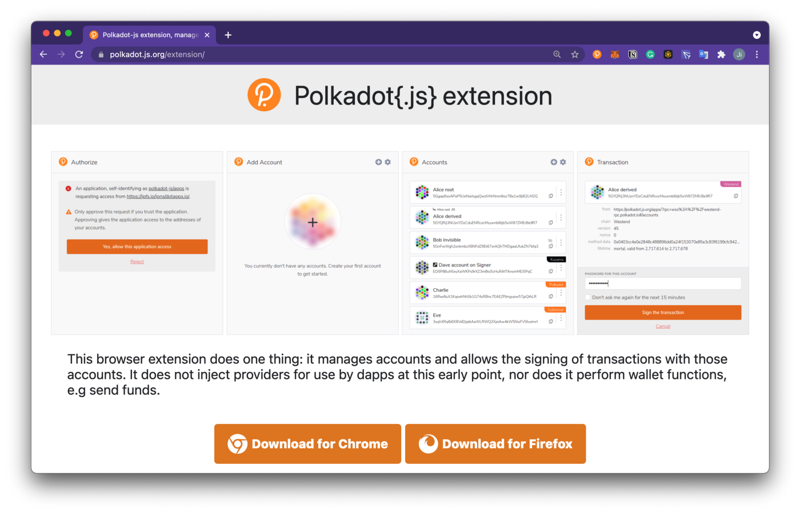

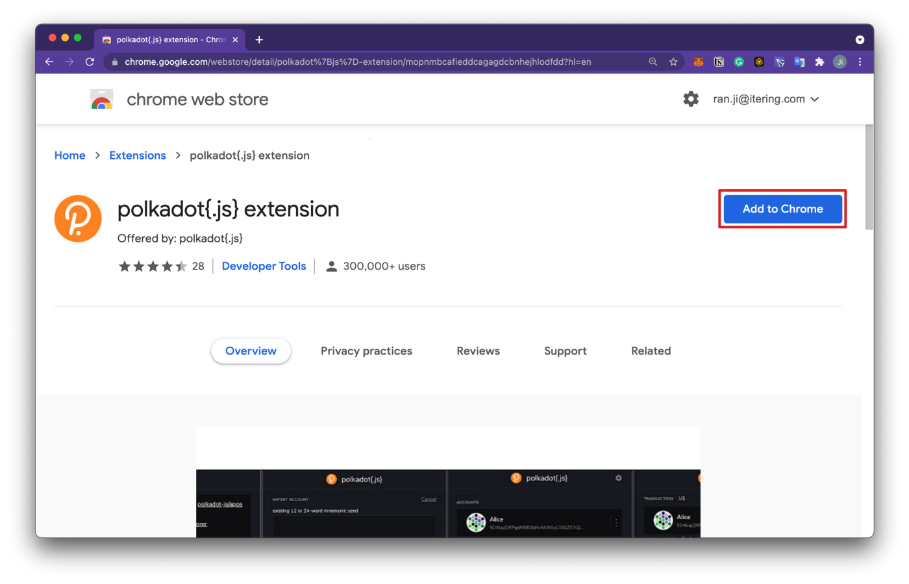

- After the download completes, create a new account. Please store your password and mnemonic seed safely. Do not screenshot and share with others!

> *You can also import an account from pre-existing seed.*
> 

### Create an account on MetaMask Wallet(**skip this step if you have already**)

- Download [MetaMask Wallet](https://metamask.io/) for Chrome or Firefox and add it to your browser.

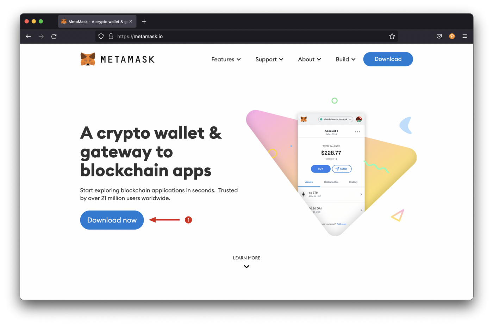

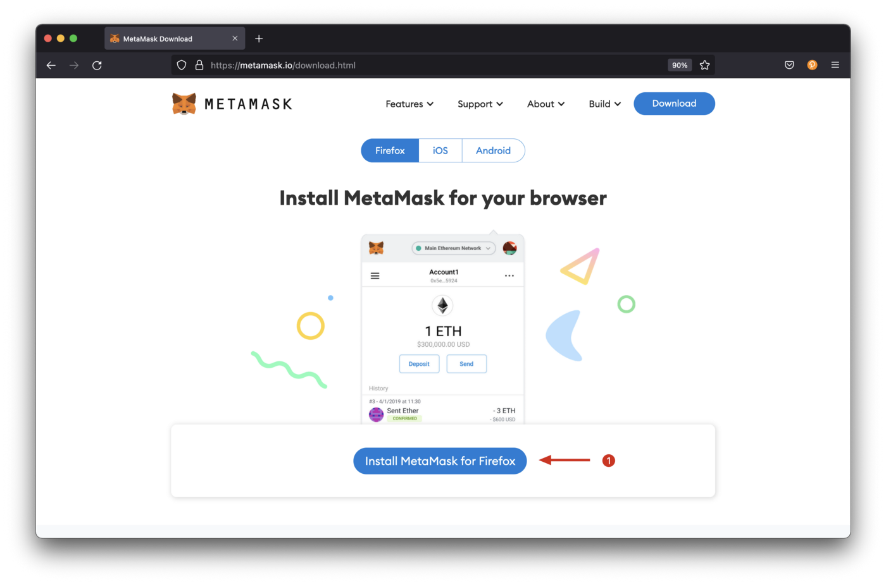

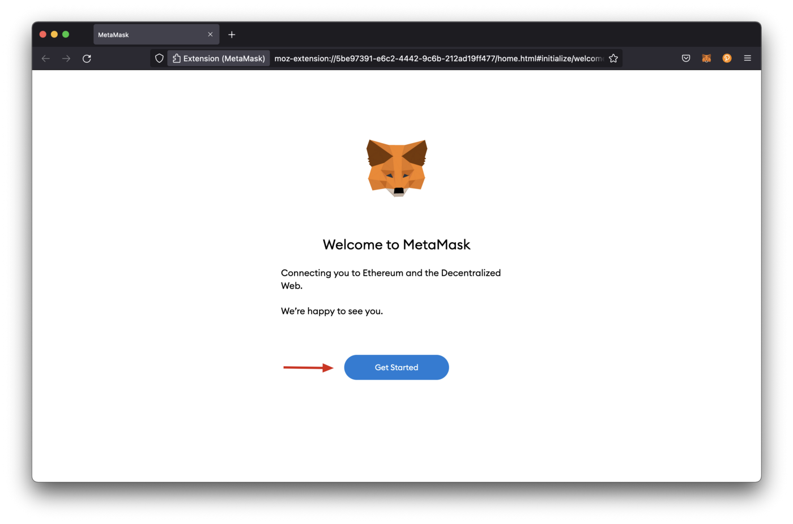

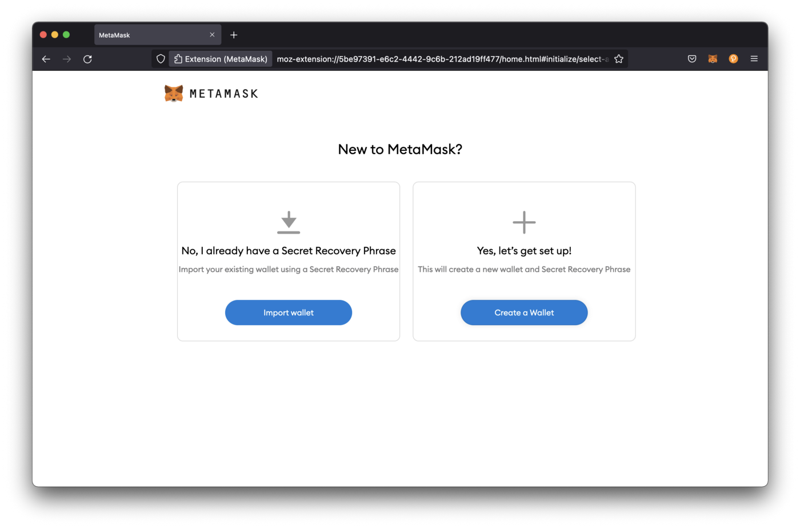

- Please store your password and secret recovery phrase safely when you create a new account. Do not screenshot and share with others!

> *You can also import an account using a **secret recovery phrase**.*
> 

### Setup MetaMask to connect to Crab Network

- Add a custom network in MetaMask, click `Add Network`.

- Add Crab Network configuration parameters.

> `Network Name` : Crab
> 
> 
> `New RPC URL`: [http://crab-rpc.darwinia.network](http://crab-rpc.darwinia.network/)
> 
> `Chain ID`: 44
> 
> `Currency`: CRAB
> 
> `Block Explorer URL`: [https://crab.subscan.io/](https://crab.subscan.io/)
> 
- When the connection is successfully established, you will see the figure below.

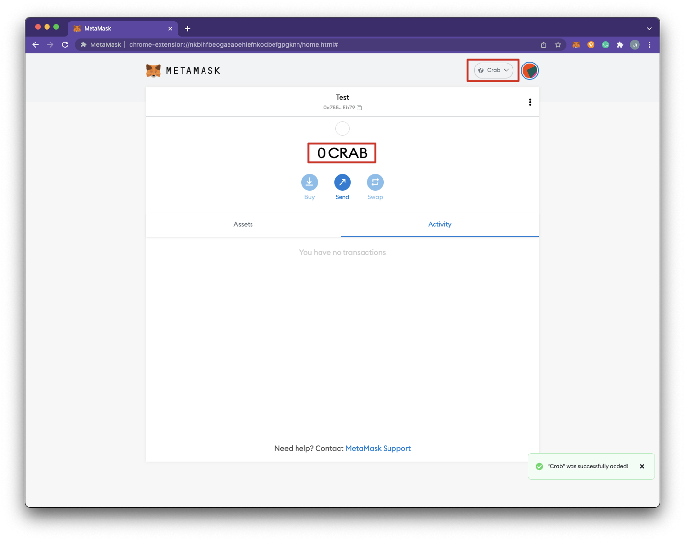

## 2. Select network and connect wallet

- Select network through the [Smart App](https://smart.darwinia.network/#f%3Dsmart).

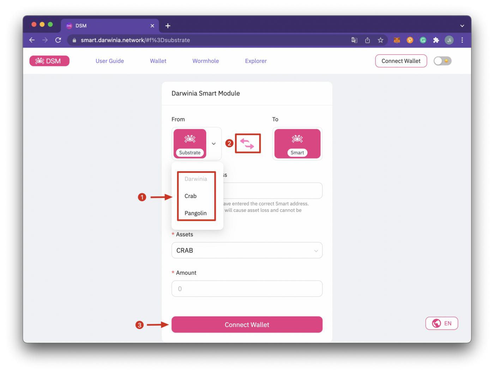

> `Select network`: Select network to transfer assets on a certain blockchain. 
`Quick switch button`: "Substrate" and "Smart" below the icon refer to "Substrate address" and "Smart address", and the current picture shows that the assets on the Crab chain are transferred from the substrate address to the smart address. You can click the ***Quick switch button*** to switch the source address and the target address.
`Connect Wallet`: After selecting the network, you can select which account to transfer assets from the drop list. The account in the drop list is read by Smart App from the plugin.
> 

## 3. Fill in the transfer form

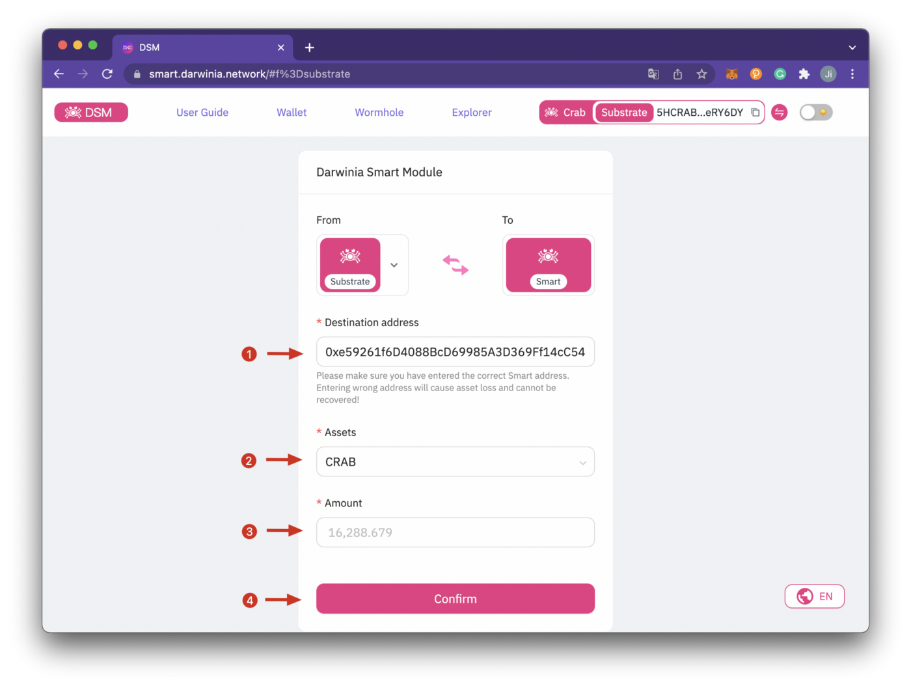

> `Destination address`: Fill in the account address to receive the assets from the sender account. E.g. If you choose to transfer assets from a substrate address to a smart address, the destination address must be a smart address starting with "0x".⚠️ Please do **NOT** fill in the address of your exchange account.
`Asset chosen button`: Select the asset that you want to transfer.
`Asset amount`: Fill in the asset amount you want to transfer.
`Confirm button`: Confirm the transfer form, click ***Confirm***, and sign the transaction if there is no problem.
> 

## 4. Submit and confirm transfer details

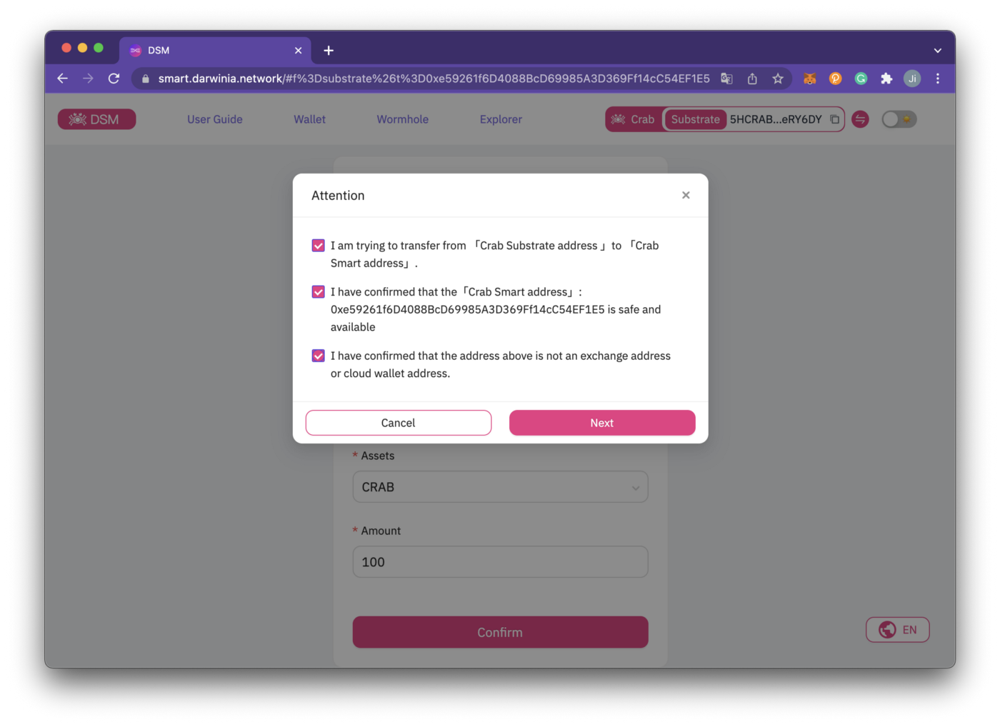

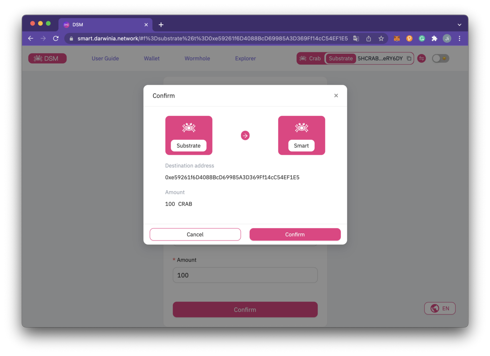

## 5. Sign the transaction

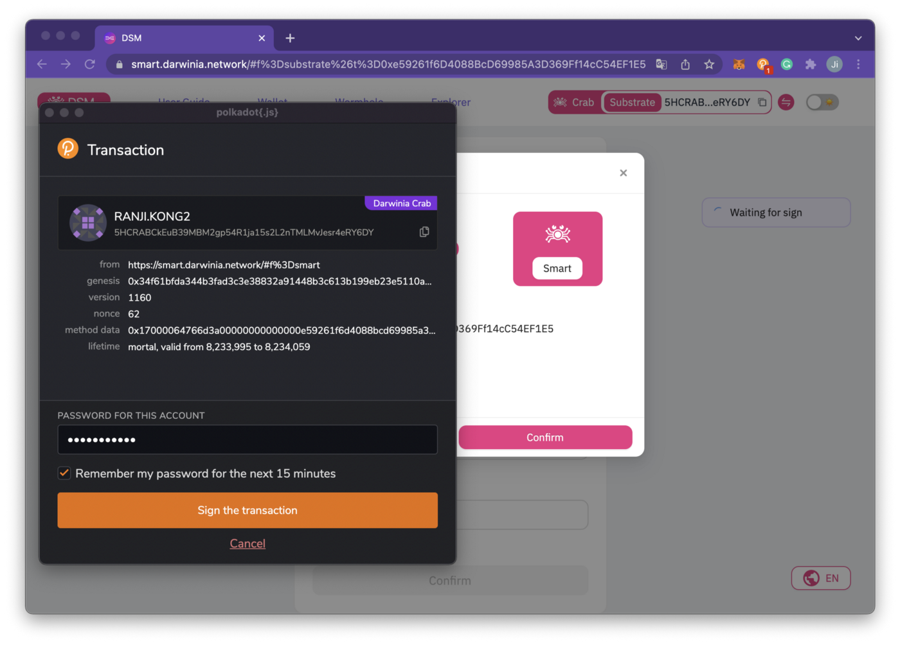

## 6. Claim tokens

You need to claim your assets **only when you transfer CKTON from substrate address to smart address.** After transferring CKTON from the substrate address to the smart address, please switch the address from Smart address to Substrate address, and then you will find a tip to claim your CKTON.

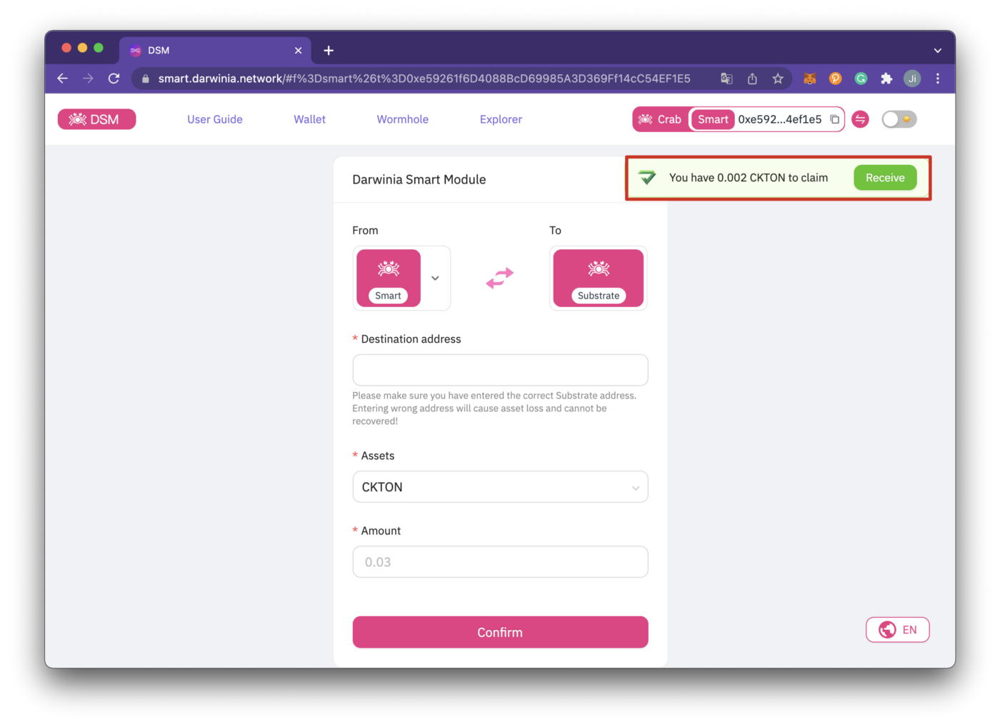

# FAQs

## How do we understand the substrate address and the smart address are on the same chain?

Crab Network is a Substrate-based blockchain, and it uses the substrate address format based on the SS58 Address. But in order to be compatible with Ethereum smart contract ecosystem, this blockchain added a module named Smart Module which relies on DVM(**D**arwinia **V**irtual **M**achine) technology. DVM is consistent with Ethereum Virtual Machine in the underlying paradigm. Meanwhile, a second address format is introduced on top of the existing network, namely a smart address.

## Both Wormhole and Smart App contain transfer assets, but what is the difference between Wormhole and Smart App?

Cross-chain transfer of assets between multiple blockchains can be realized through [Wormhole](https://wormhole.darwinia.network/#fm%3Dnative%26tm%3Dnative), but [Smart App](https://smart.darwinia.network/#f%3Dsmart) focuses on transferring assets within the same chain.

|  | Wormhole | Smart App |
| --- | --- | --- |
| A Chain —> B Chain | ✅ | ❌ |
| C Chain —> D Chain | ✅ | ❌ |
| A Chain —> C Chain | ✅ | ❌ |
| A Chain —> D Chain | ✅ | ❌ |
| A Chain Substrate Address —> A Chain DVM Address | ❌ | ✅ |
| B Chain Substrate Address —> B Chain DVM Address | ❌ | ✅ |

## What can we do after transferring tokens to the smart address?

After transferring tokens to the smart address, builders who want to develop DApps on Crab Network will use the tokens as a gas fee. For more detailed operations, please refer to the [Builders](../builders/get-started/darwinia-dev.md).

## How to add **Crab Network to Metamask?**

Please refer to the [Setup MetaMask to connect to Crab Network](#setup-metamask-to-connect-to-crab-network) parts of this article.

## How to add token CRAB and CKTON to Crab Network on MetaMask?

After adding the Crab Network on MetaMask, the token CRAB has been there as the gas fee on the Crab Network. For token CKTON, we need to add it smart contract manually.

- Add a custom token in MetaMask, click `Import tokens`.

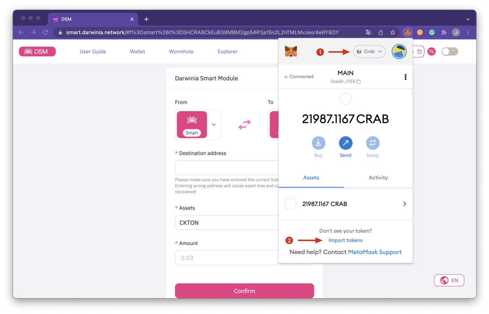

- Fill in the token contract address.

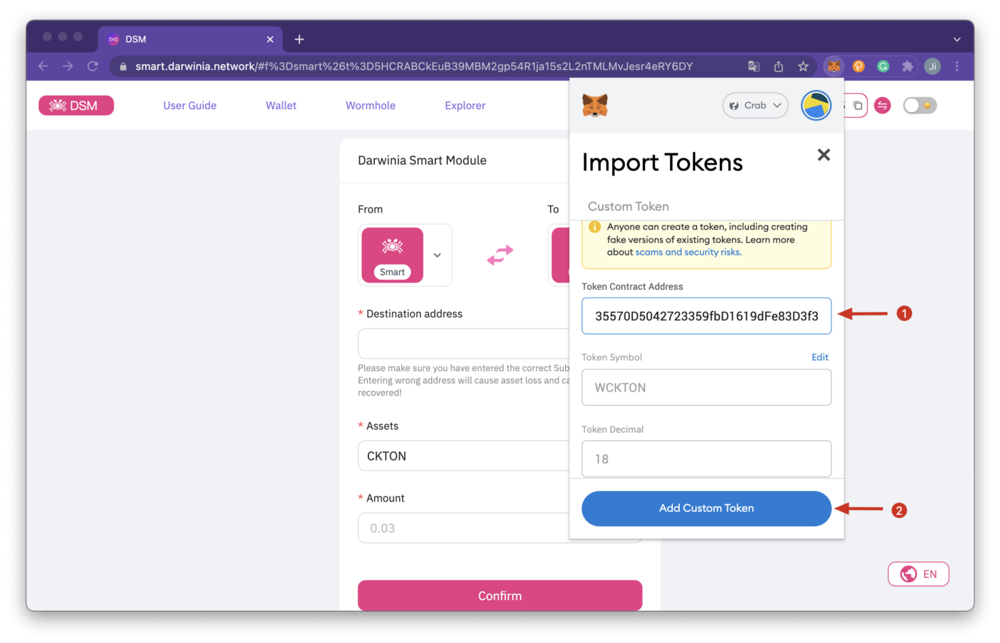

> WCKTON contract address: `0x159933C635570D5042723359fbD1619dFe83D3f3`
> 

> NOTE: The Darwinia Virtual Machine only supports 1 native token, but Crab Network has 2 native tokens, one is CRAB(Crab Network Native Token), another is CKTON(Crab Network Commitment Token). Therefore,  when the token CRAB name displayed on MetaMask has no change, another token CKTON name must change. So the "W" of "WCKTON" represents *wrapped*, and it refers to the CKTON(Crab Network Native Token) which is stored in the contract in the form of "WCKTON".
> 

## How to add Pangolin Test **Network to MetaMask?**

- Add a custom network in MetaMask, click `Add Network`.

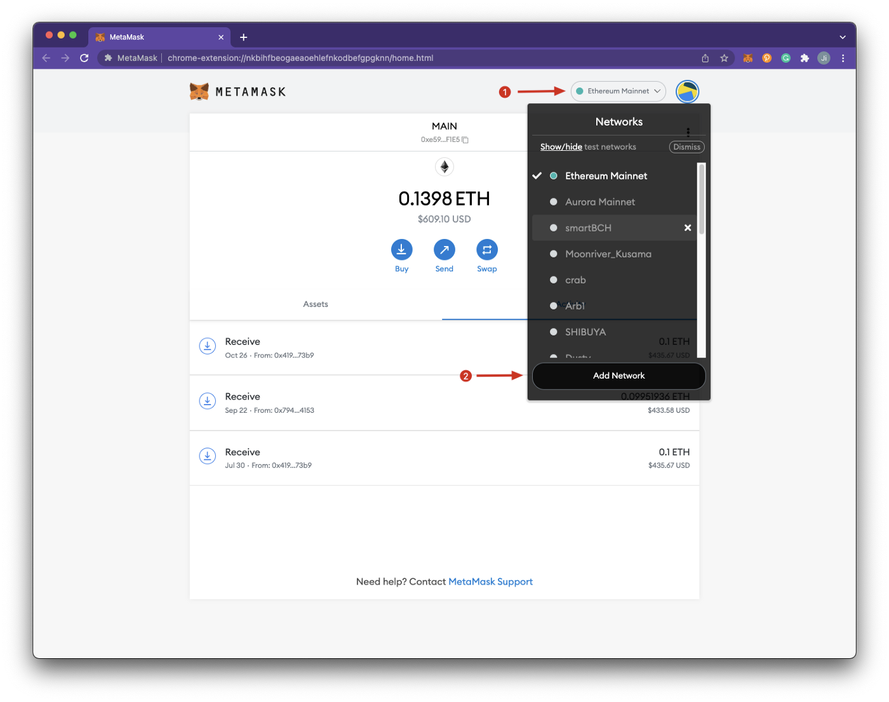

- Add Pangolin Test Network configuration parameters.

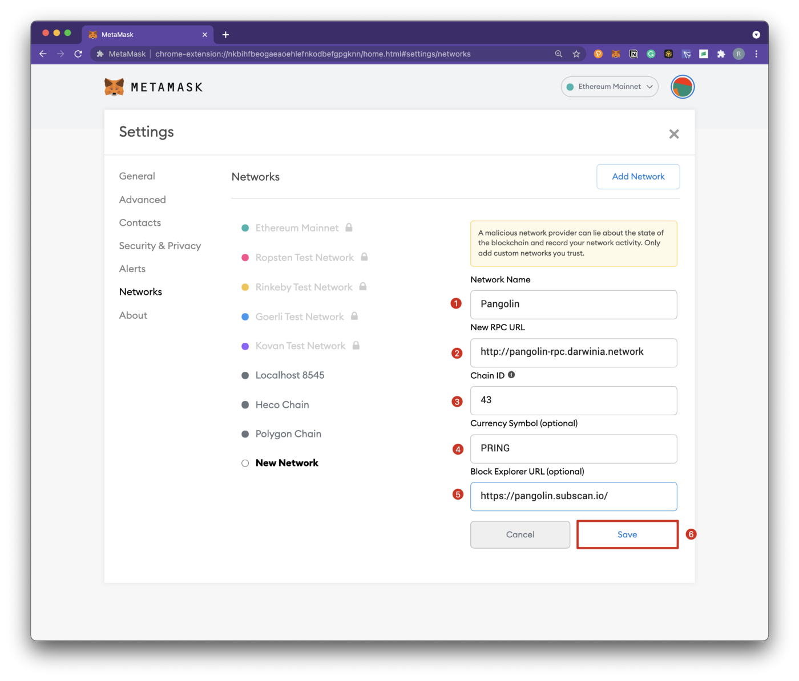

> `Network Name` : Pangolin
> 
> 
> `New RPC URL`: [http://pangolin-rpc.darwinia.network](http://pangolin-rpc.darwinia.network/)
> 
> `Chain ID`: 43
> 
> `Currency`: PRING
> 
> `Block Explorer URL`: [https://pangolin.subscan.io/](https://pangolin.subscan.io/)
> 
- When the connection is successfully established, you will see the figure below.

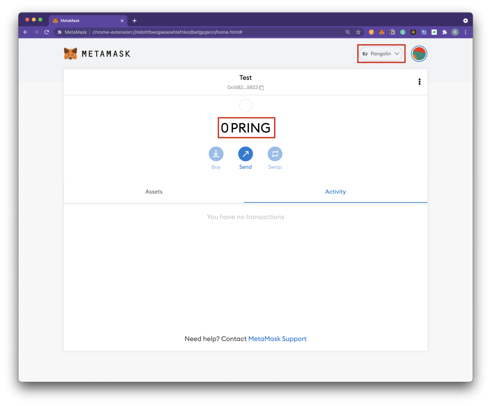