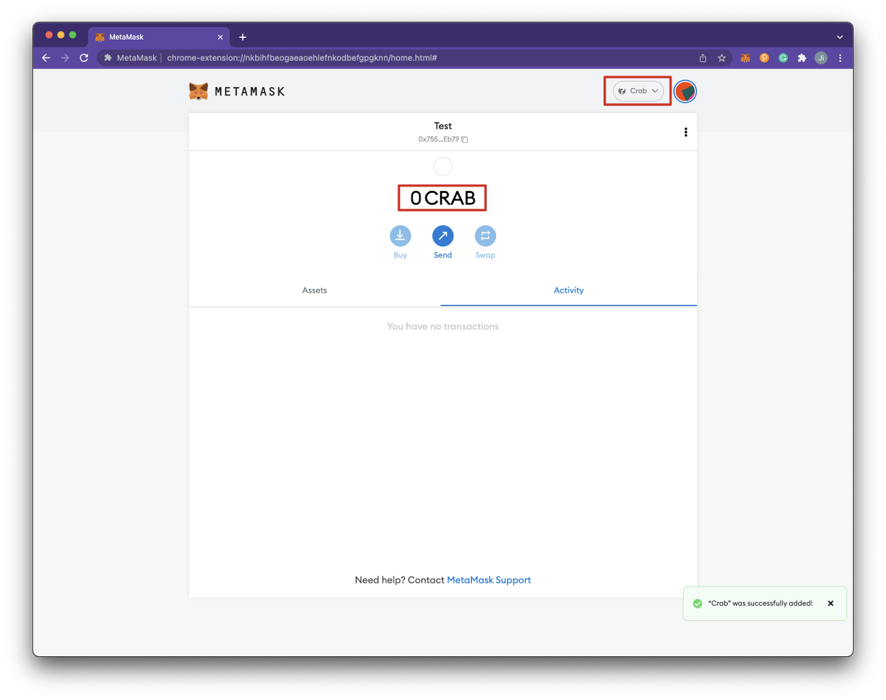
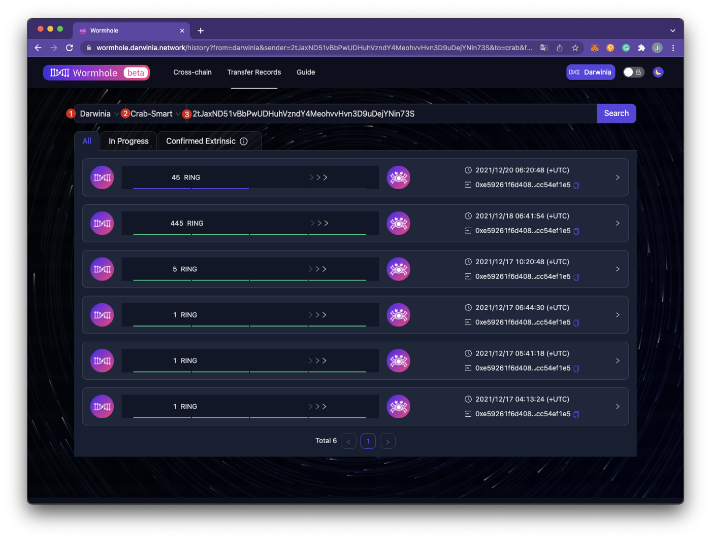

*We will demonstrate how to transfer assets between the **Darwinia Network** and **Crab Network** through the **[Wormhole](https://wormhole.darwinia.network/)**. Before using **Substrate-to-Substrate** Bridge, we must do the following preparation:*

## Create an Account**(skip this step if you have one)**

### 1. Create a Darwinia account and transfer the token RING to this account

- Download and install the [polka{.js}](https://polkadot.js.org/extension/) plugin;
- Click [Polkadot Apps](https://polkadot.js.org/apps/), select `LIVE NETWORKS`, switch the network to `Darwinia`, and check `Accounts` after the switching completes;
    
    
    
    
    
- For more tutorials on creating an account, please refer [here](https://docs.darwinia.network/tutorials/quick-start-account);
- Copy the Darwinia address and transfer token RING to this address through the bridge from Ethereum to Darwinia by using [*Wormhole*](https://wormhole.darwinia.network/). For more tutorials on *Wormhole*, please refer [here](https://docs.darwinia.network/tutorials/wiki-tut-wormhole).

> Note: Cross-chain fees are denominated and charged in the native assets of the source chain of the cross-chain operation. 
`Darwinia → Crab-Smart`: Take RING as the cross-chain fee. 
`Crab-Smart → Darwinia`: Take CRAB as the cross-chain fee. 
This is why we must transfer respective tokens(RING/CRAB) to Darwinia/Crab address after creating the account.
> 

### 2. **Create a Crab-Smart account and transfer token CRAB **to **this account**

The full name of Crab-Smart is Crab Smart Module, which is a module on the Crab chain. Since this module relies on DVM (Darwinia Virtual Machine) technology, at the same time, DVM and EVM (Ethereum Virtual Machine) are consistent in the underlying paradigm. Users can use wallets in the existing Ethereum ecosystem to manage assets in Crab-Smart, such as MetaMask.

- Add a custom network in MetaMask, click `Add Network`.

- Add Crab Network configuration parameters. You can go to [https://docs.crab.network/](https://docs.crab.network/), click the `Connect Wallet`, and select the `Crab` to add parameters automatically.

Or you can add the following parameters manually:

> `Network Name` : Crab
> 
> 
> `New RPC URL`: [http://crab-rpc.darwinia.network](http://crab-rpc.darwinia.network/)
> 
> `Chain ID`: 44
> 
> `Currency`: CRAB
> 
> `Block Explorer URL`: [https://crab.subscan.io/](https://crab.subscan.io/)
> 
- After the connection is successful, as shown in the figure below.

- This address is the Crab-Smart address, which is usually referred to as ***DVM Address***. More explain about DVM address, please refer to the [**FAQs**](#faqs) part of this article.

- Transfer token CRAB to this DVM address. There are two ways to transfer assets. This article will explain one of them in detail, and the other method will be explained in the Smart App of the subsequent series of articles on Darwinia Tools .
    1. Click [Darwinia Apps](https://apps.darwinia.network/?rpc%3Dwss%253A%252F%252Fcrab-rpc.darwinia.network#/toolbox), switch to `Crab Network`.
        
        
        
    2. Select `Toolbox`, and fill in your `DVM address` to convert a substrate address on Crab Network. Copy this address and transfer token CRAB to this converted address.
    
    
    
    1. Transfer token CRAB to this address that has converted. Click `Account` and select `Transfer`, paste the converted address below `Send to address`, and click `Make Transfer`.
    
    
    
    
    
    1. Fill in the password, click `Sign and Submit`, then check your asset in Metamask.
    
    
    
    
    

## Transfer Assets between the **Darwinia Network** and **Crab Network**

### 1. Darwinia → Crab-Smart

- Click the [Wormhole](https://wormhole.darwinia.network/), select `Darwinia` as the source chain, and select `Crab-Smart` as the target chain, click `Connect To Darwinia`.

- Select `Sender Account`, and fill in the Crab DVM Address of the receiving asset. ⚠️ Please do **NOT** fill in the exchange account address. For more explain of Crab DVM address, please refer to the [`FAQs`](#faqs) part of this article.

- Select the asset that needs to be cross-chain operation and fill in the amount.

> `Cross-chain Fee`: The cross-chain fee is denominated in the source chain assets. Here, the source chain is Darwinia, and the native token on this chain is RING, so RING will be used for the payment for cross-chain operations. The amount of the cross-chain fee will be queried in real-time during cross-chain operations, please refer to the actual result. The amount of the cross-chain fee will decrease when the relayer competition is fierce, and it will increase when the relayer competition is low. It depends on the market, users need to pay attention to the amount of cross-chain fee to decide whether to initiate a transfer.
> 
> 
> `Recipient will receive`: The user is prompted for the name and quantity of the mapping token that will be received on the target chain. This amount is equal to the assets you want to transfer minus the cross-chain fee.
> 🔔 NOTE: At present, the Substrate-to-Substrate bridge between Darwinia Network and Crab Network supports RING only. We will support KTON soon.
> 
- Select `Submit`, after confirming the cross-chain information, click `Confirm` .

- After the transaction is completed, you can click `Cross-chain history` to view the cross-chain history.

> `Source Chain`: **Darwinia**
> 
> `Target Chain`: **Crab-Smart**
> 
> `Darwinia Network Address` : 2tJaxND51vBbPwUDHuhVzndY4MeohvvHvn3D9uDejYNin73S
> 
> 🔔 NOTE: At present, Wormhole `transfer records` can only support searching through the sender address of the source chain.
> 
- You can manage the mapping token `xRING` through MetaMask.

> `xRING smart contract address`: `0x7399Ea6C9d35124d893B8d9808930e9d3F211501`
> 

### 2. Crab-Smart → Darwinia

- Click the [Wormhole](https://wormhole.darwinia.network/), select `Crab-Smart` as the source chain, and select `Darwinia` as the target chain, click `Connect To Crab-Smart` .

- Fill in the Darwinia address of the receiving asset.

> `Recipient`: It can be any Darwinia network account(address), not just the Darwinia network account(address) that has been transferred from Darwinia to Crab-Smart. 
> 
`Asset`: xRING refers to the symbol of the mapping token. The smart contract address of xRING is `0x7399Ea6C9d35124d893B8d9808930e9d3F211501`. 
>
`Recipient will receive`: The amount of RING that the Darwinia address will receive. 
>
🔔 NOTE: Due to the transfer of assets from Crab-Smart to Darwinia, Crab-Smart's native asset CRAB will be charged as a cross-chain fee.

- Select `Submit`, after confirming the cross-chain information, click `Confirm` ;
- After the transaction is completed, you can click `Cross-chain history` to view the cross-chain history.

## FAQs

### 1. How to withdraw my RING from the exchange to Darwinia Network?

Withdraw token RING to your ERC20 personal wallet (MetaMask or Trust Wallet) if they are in any exchange. 

Then go to the [Wormhole](https://wormhole.darwinia.network/) to transfer assets from Ethereum to Darwinia. Make sure to have 10 RING per transaction in MetaMask as well as a little ETH to pay the transfer fee. The transaction usually takes around 30 minutes to fully process. 

### 2. How to withdraw my CRAB from the exchange to Crab Network?

Go to [Apps](https://apps.darwinia.network/) and create an account on Crab Network. Withdraw token CRAB to this account if they are in any exchange.

### 3. What does the DVM address mean? What is the difference between Crab address and Crab DVM address?

Before we explain the DVM address, we need to introduce the substrate address and the smart address.

Substrate-based blockchains such as Polkadot and Darwinia adopt the address format of SS58, which is usually referred to as a ***Substrate address***.

Smart Contract-based blockchains adopt the address format of Ethereum format address, a 42-character hexadecimal address that starts with "0x". In our documentation, we name this address format as a ***Smart address***.

The address will not change if you switch to other networks on MetaMask. For example, when we try to connect to the Crab Network, which is ***Ethereum-compatible***, you will see the address stays the same, and that is what we call a ***DVM address.*** A smart address has a corresponding substrate address within the same chain. 

> Example: When we connect to ***Ethereum Mainnet***, the displayed address is `0xe59261f6D4088BcD69985A3D369Ff14cC54EF1E5`.
> 

> And if we switch network to ***Crab***, the displayed address is also `0xe59261f6D4088BcD69985A3D369Ff14cC54EF1E5`. And this address is a ***Smart address*** first.
> 

> When we go to the [Darwinia Apps](https://apps.darwinia.network/#/toolbox/dvmaddress), switch to ***Crab*** network, click the `Toolbox`, and paste the smart address `0xe59261f6D4088BcD69985A3D369Ff14cC54EF1E5` to convert it into a substrate address. The address `5ELRpquT7C3mWtjesm99Kqzm4yHZ66uXnJXPNKLBcc89aTHS` is a ***Substrate address***. This substrate address is unique and can only be converted from this smart address `0xe59261f6D4088BcD69985A3D369Ff14cC54EF1E5`. A smart address that has a corresponding Substrate address within the same chain is what we call a ***DVM address***.
> 

The DVM address format is consistent with that in Ethereum, so is the generation method. The difference is that each DVM address corresponds to a unique Substrate account address. In other words, the DVM address is first an Ethereum address, but it also corresponds to a Substrate address. Since the DVM and the Ethereum virtual machines are compatible with the underlying specifications, users can use the wallets from the existing Ethereum ecosystem to manage their assets, such as Metamask. 

You can refer to the form below to facilitate understanding:

|  | Crab DVM Address | Crab Address  | Ethereum Address |
| --- | --- | --- | --- |
| Ethereum Address Format |               ✅ |            ❌ |                ✅ |
| Substrate Address Format |               ✅ |            ✅ |                ❌ |

For more details about the address formats in Darwinia, please refer [here](../../dvm/overview/dvm-address.md).

### 4. How to understand that when the selected cross-chain direction is different, the fees charged are different?

Cross-chain fees are charged based on the source chain assets at the initiating end of the cross-chain operation. For example, Darwinia → Crab-Smart: Take RING as the cross-chain fee. Crab-Smart → Darwinia: Take CRAB as the cross-chain fee. 

### 5. **What other operations are available by using the substrate-to-substrate bridge?**

For more detailed operations, please refer to the [Builders](https://docs.crab.network/builders/get-started/darwinia-dev).