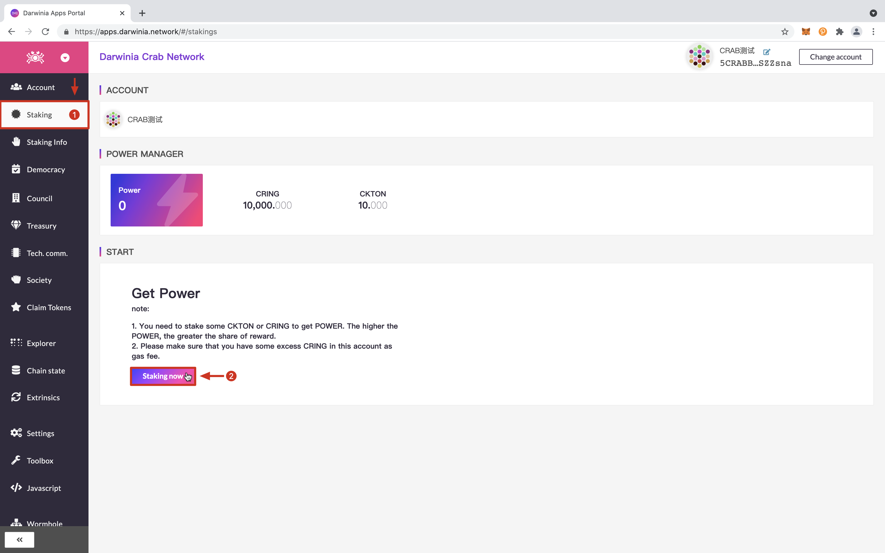
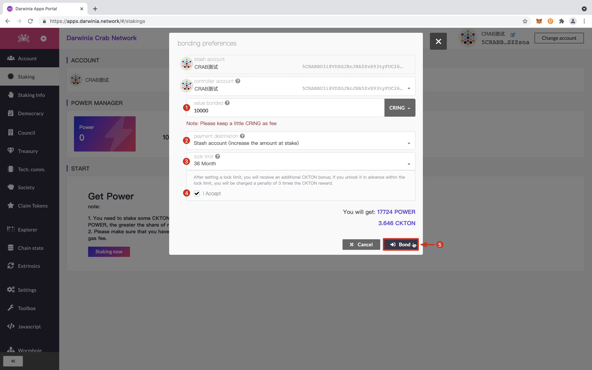
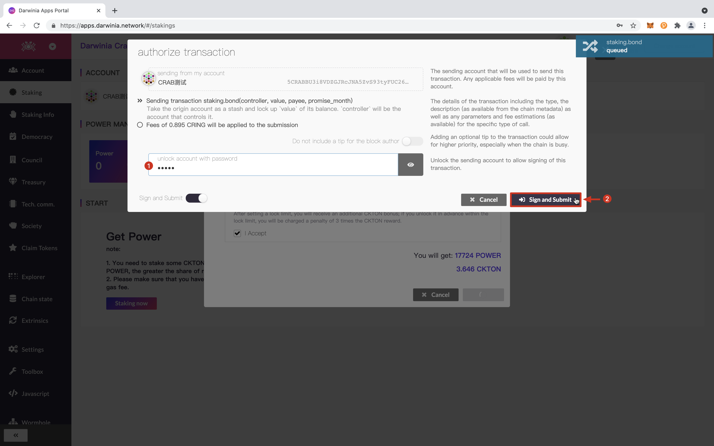
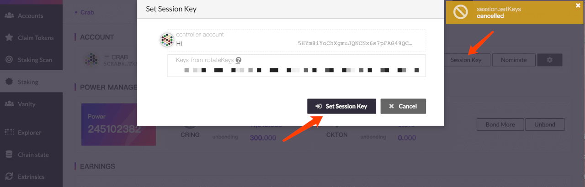
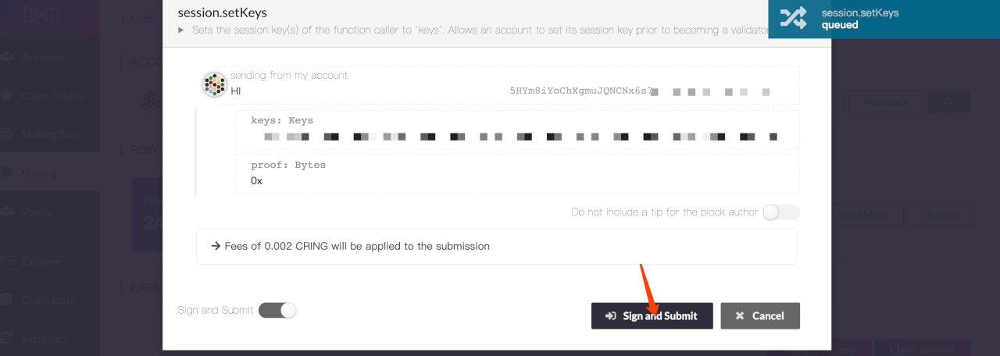
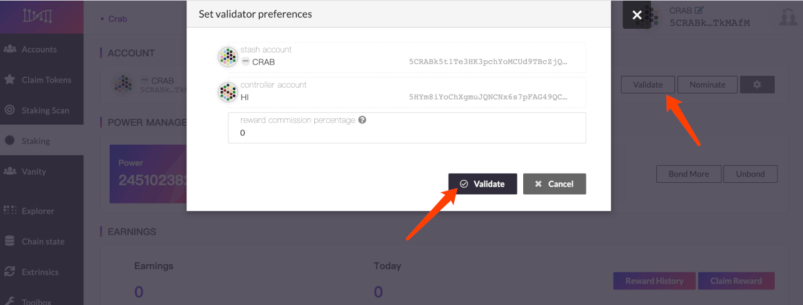
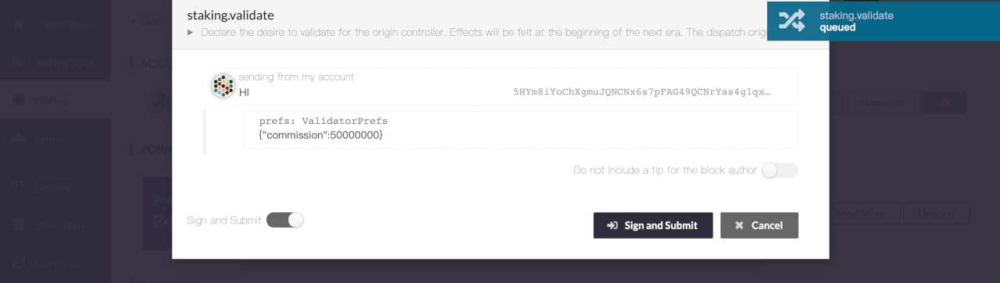
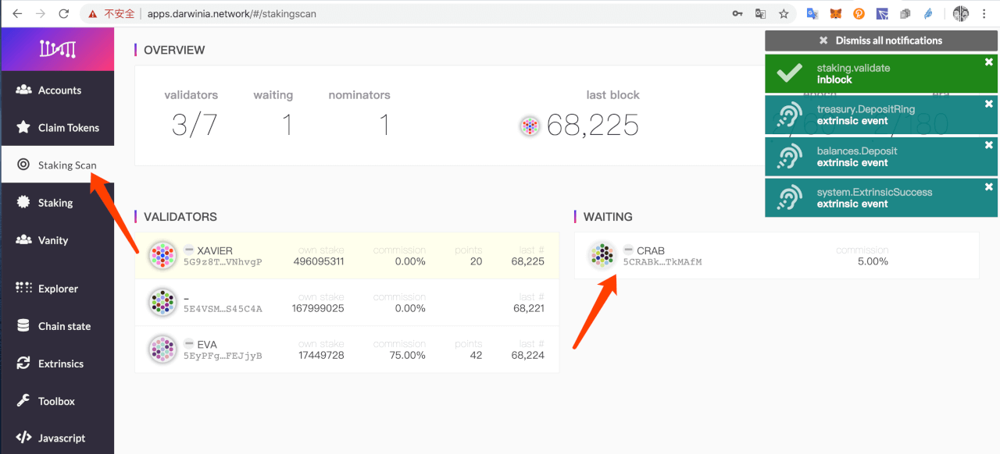
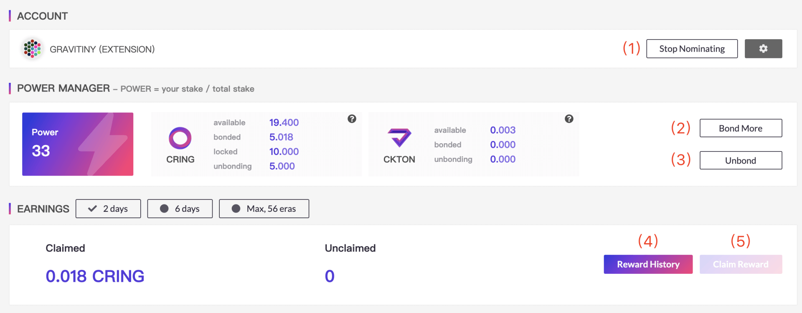
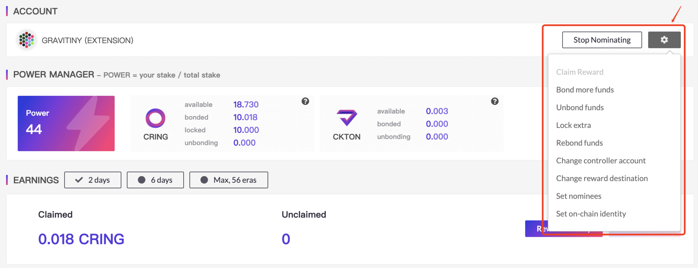

> - Staking is a consensus mechanism based on PoS (Proof of Stake / Proof of Stake). Token holders obtain rewards and benefits through pledge, voting, delegation, and locking.  
> - Before participating in staking, please make sure you have at least **1** Crab address. If you hold more tokens or have higher security requirements, it is recommended to prepare **2** Crab addresses. If there is no address, please refer to: [How to create an account](../crab-tut-create-account.md).  
> - A small amount of CRING must be prepared in Crab Network's address as fee. 

### Run your validator node

You can choose either run node with execute file download before or in docker way. 

- Run validator node with existed node binary

  ```bash
  $ ./darwinia --name "My node's name" --chain crab --validator --rpc-methods=Unsafe
  ```

> please make sure to include `--rpc-methods=Unsafe` in command line to prepare for the generation of session keys.

- Using docker

  ```bash
  $ docker run -it -v node-data:/darwinia/data -p 9933:9933 -p 9944:9944 quay.io/darwinia-network/darwinia:v0.11.4 --base-path /darwinia/data/01 --name "My node's name" --chain crab --validator --rpc-methods=Unsafe --rpc-external --rpc-cors all
  ```

> please make sure to include `--rpc-methods=Unsafe --rpc-external --rpc-cors` in command line to prepare for the generation of session keys.

### Generate your session key

Run the command on the shell where your validator node is running:

```sh
$ curl http://127.0.0.1:9933 -H "Content-Type:application/json;charset=utf-8" -d '{ "jsonrpc":"2.0", "id":1, "method":"author_rotateKeys", "params": [] }'
```

If there is no problem, a result similar to the following will be returned:

```json
{
  "jsonrpc":"2.0", "result":"0xba99ecfb4a87357a44ee3765cf617a6d81adf8f43e522db52e348d2e9d45ccde12d53d562e14bb18523fbc3032b786f44b2b92340f4756386d4baec68bbfb882bbaccce1440c84d7f5b67c8ecb956345130d5dbd07adfeba3d9482f95d9dec6c68d085323e61590f850c38244dd2d2bc4055548d9edfd0471f47da7667c17fe8",
  "id":1
}
```

The result is what you need when setting the session key.

### Staking

Enter [Crab Wallet](https://apps.darwinia.network) and click the `Staking` column on the left , Click `Start staking`.



Fill in the staking parameters



` Stash account` Account for stashing tokens. Tokens participating in staking will come from this account. The operations of this account are mostly related to changes in stash.

`Controller account`  The controller is the account that will be used to control any nominating or validating actions. Should not match another stash or controller.

> The `Stash account` and `Controller account` can be set to the same account. If you hold more tokens or have higher security requirements, it is recommended to set up different accounts here.

`Value bonded` The total amount of the stash balance that will be at stake in any forthcoming rounds (should be less than the total amount available).  This part of the tokens will be temporarily bonded. bonding takes 14 days to unbond; you can choose to bond CRAB or CKTON.

`Payment destination` The destination account for any payment as either a nominator or validator.

`Bond period` Optional; bond CRAB promise for 3-36 months to get additional CKTON rewards. (Promise to lock to accept user terms)

> If you unlock CRAB in advance within the lock limit, you will be charged  a penalty of 3 times the CKTON reward (In the absence of sufficient CKTON, the CRAB can not be used for payment of fines).

After filling in the staking parameters, please click `bond` and `submit`



### To be Validator

Click `Set session keys` on this page, completing the generated session keys and submit.

> The session key must be filled with real data, otherwise it will result in missing blocks and be slashed.



After confirming, click `sign and submit`

> The identities of the validator and the nominator are mutually exclusive and cannot coexist. If you are running a validator, you need to cancel the validator before proceeding with the nomination.



Click `validate` and set the validator parameters

`Reward commission percentage` Set the proportion of the node's priority distribution of income, the range is 0-100. (Example: If a 5% reward commission is set, this node will first receive 5% of the node's revenue, and the remaining 95% of the node's revenue will be distributed in proportion to the amount of mortgages validated by the validator and nominator; Validator's income = node reward commission + mortgage reward share)



After confirming, click `sign and submit`



Go to `staking scan` to view information about validators



> The operation of validate will take effect after the first epoch of the next era. Prior to this, the validator will be in the [waiting] list.

**(Optional) Rerun your validator node**

For security, you need to remove the rpc unsafe parameters and re-run your node:

```bash
$ ./darwinia \
    --base-path <YOUR_DATA_DIR> \
    --name <YOUR_NODE_NAME> \
    --chain crab \
    --validator
```

```bash
$ docker run -it \
  -v <YOUR_DATA_DIR>:/data \
  quay.io/darwinia-network/darwinia:vx.x.x \
    --base-path /data \
    --name <YOUR_NODE_NAME> \
    --chain crab \
    --validator
```

## Other Staking operations

There are other operations in staking for the following purposes:



`Stop nomination` Cancels all nominees.

`Bond` & `Bond more` Adds bonded tokens for staking to obtain more power.

`Unbond` Unbond tokens for staking, and at the same time the power will be reduced proportionally.

> The 14-day bond period is required to unbond. Tokens that are in the bond period cannot be operated. Please be careful.

`Reward history` Go to Subscan explorer to view historical reward records.

`Claim reward` Manually claim the reward, and the reward will be distributed in units of era.

> Please note: 56 era (about 56 days) will be saved, and you will not be able to claim it if it expires.



`Claim Reward` Manually claim the reward, and the reward will be distributed in units of era.

`Bond more funds` Adds bonded tokens for staking to obtain more power.

`Unbond funds` Unbond tokens for staking, and at the same time the power will be reduced proportionally. 

`Lock Extra` Add lock limit for bonded tokens to obtain KTON rewards.

`Rebond funds` Rebond the unbonding funds to earn power.

`Change controller account` Change the account  that will be used to control any nominating or validating actions. Should not match another stash or controller.

`Change reward destination` Change the destination account for any payment as either a nominator or validator.

`Set nominees` Re-nominate validator.

`Change session key` If you want to upgrade to become a validator, you need to fill in this item. 

`Set on-chain identity` Set your personal information, such as display, legal name, email, website, twitter and riot. Other users can view this information and contact you.
