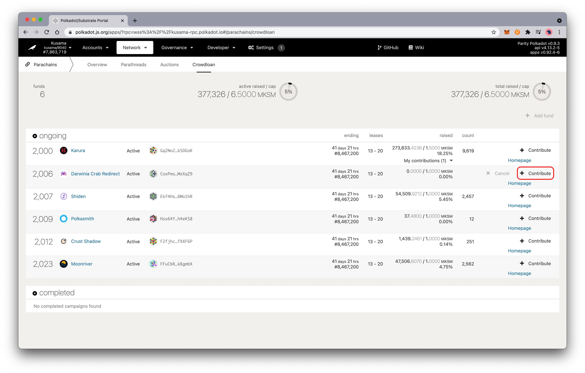
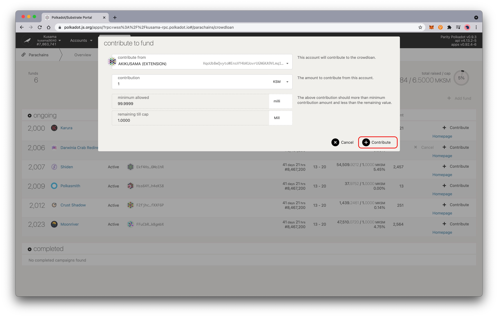

Before participating in the crowdloan via Polkadot.{js}, please make sure that you have:

* Kusama network has been selected.

* Import the address holding KSM into the Polkadot.{js}.

* Or create a new address in the Polkadot.{js}, and transfer KSM from the centralized exchange to this address

## Contribute

1. Click "Network" in the toolbar —> select "Parachains" —> click "Crowdloan".

   

2. Select "Crab Network" in "ongoing" and click "Contribute".

   

3. Enter the amount of KSM you want to contribute, and click "Contribute".

   

4. Finally, sign the transaction.

   