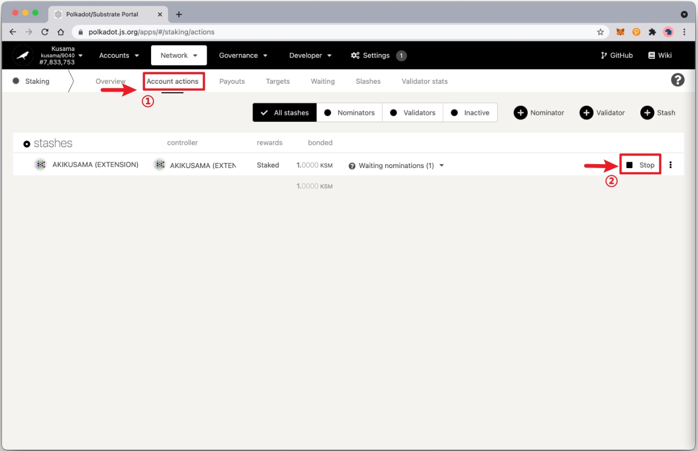
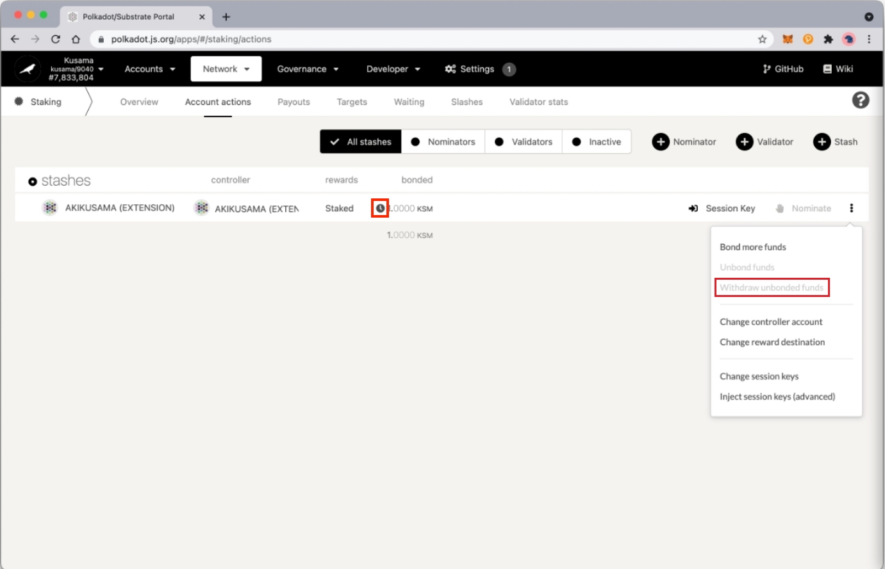

在将您的 KSM 参与到众贷之前，您需要先取消 Staking。 对于刚刚解开 Staking 的 KSM 代币，Kusama 有一个延迟期（7 天）。 在此期间，您将无法转账您的代币。

## 停止 staking

1. 打开 [Polkadot{.js}](https://polkadot.js.org/apps/?rpc=wss%3A%2F%2Fkusama-rpc.polkadot.io#/staking/actions) ，然后进入"Network" > "Staking"。

   

2. 进入 "Account actions". 然后在你想要进行unstake的账户的右边点击 "Stop" 。

   

3. 点击右下角的“Sign and Submit”，对交易进行授权。 您的浏览器扩展程序将提示您输入密码并签署交易。到这里，您就已经停止nominate了，但您的代币仍是绑定状态。

   

4. 要 unbond 您的代币，请单击页面右侧的省略号（三个点），然后单击“Unbond funds”。

   

5. 输入您想要解除绑定的金额，然后点击“Unbond”。 然后签名并提交交易。

   

6. 如果成功完成，您要求解绑的金额旁边应该有一个时钟图标。 您可以将鼠标悬停在该图标上以查看代币完全解锁所需的时间，大约为 7 天。 7 天过后，才能点击“Withdraw unbonded funds”。 这将使您的 KSM 可转账。 

   

7. 您可以返回 “My accounts” 并选择 “balance”  旁边的下拉菜单，以查看您的 KSM 现在都多少可以转账。

   