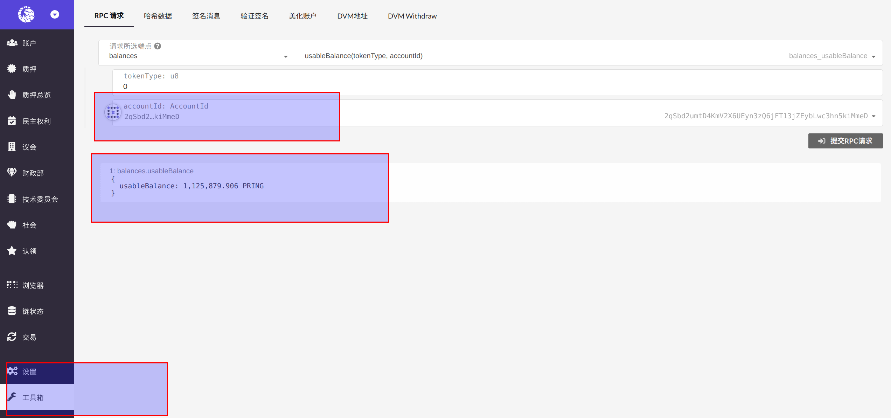

因为 DVM 账户和 Substrate 账户存在一一对应关系，所以可以在 [Web Apps](https://apps.darwinia.network/#/account) 查询 DVM 账户余额。

1. 地址转换

    根据 DVM 账户地址，生成对应的 Substrate 账户地址。见 [地址转换](dvm-address)。

    例如，DVM 账户地址 `0x6Be02d1d3665660d22FF9624b7BE0551ee1Ac91b` 对应的 Substrate 账户地址为 `2qSbd2umtD4KmV2X6UEyn3zQ6jFT13jZEybLwc3hn5kiMmeD`。

2. 查询余额

    点击左侧 `工具箱`，`RPC请求`，`balances` 模块输入:
    
    - accountId： 待查询余额的 Substrate 账户
    - tokentype： 0 查询账户 RING 余额，1 表示查询账户 KTON 余额

    
