DVM 账户充值指的是用户将 Substrate 账户资产转移到 DVM 账户中的过程。本质上，是给 DVM 账户地址关联的 Substrate 账户地址转账。

## 准备 

准备一个接收 PRING 的 DVM 账户，可以用 Metamask 生成。见 [如何使用 Metamask](dvm-metamask)。

## 充值

> 注意: 在使用 Smart App 之前，需要 [安装 Polkadot Js 插件](https://polkadot.js.org/extension/)。

打开 [Smart App](https://smart.darwinia.network/) -> `连接钱包`，关联 Polkadot Js 中的账户。

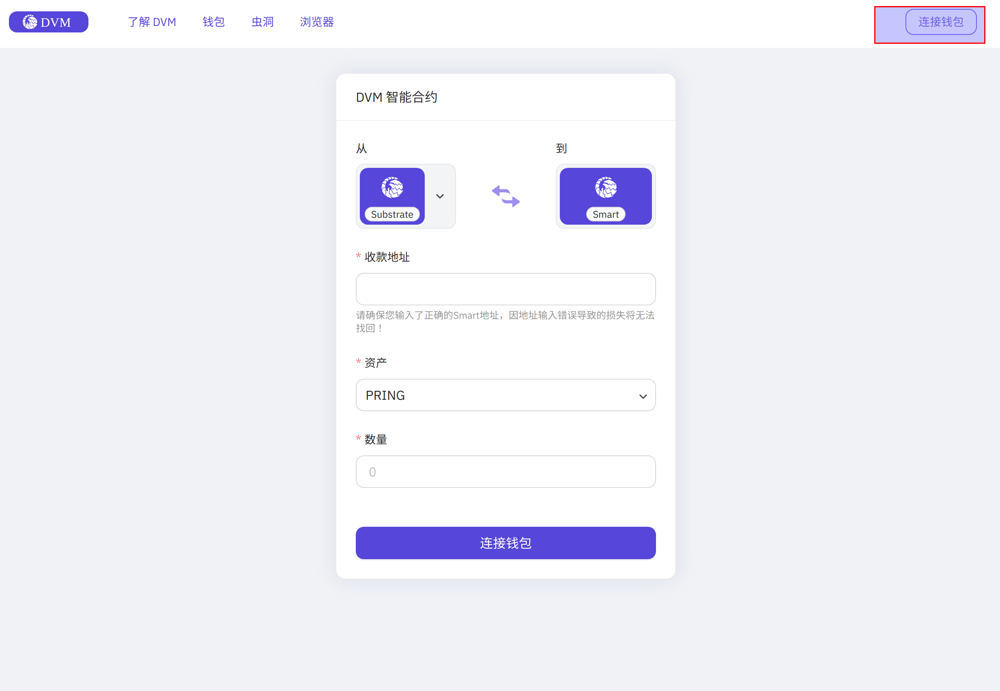

选择一个余额不为 0 的账户，点击 `确定`。免费 `PRING` 在 [Element](https://app.element.io/?pk_vid=6961ca0f7c45f8bf16052310122d2437#/room/#darwinia:matrix.org) 申请即可。

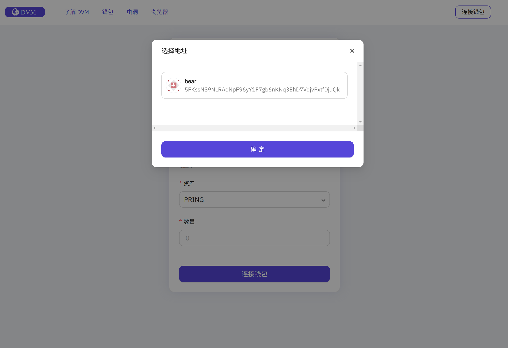

关联 Substrate 账户成功后，如下图所示：

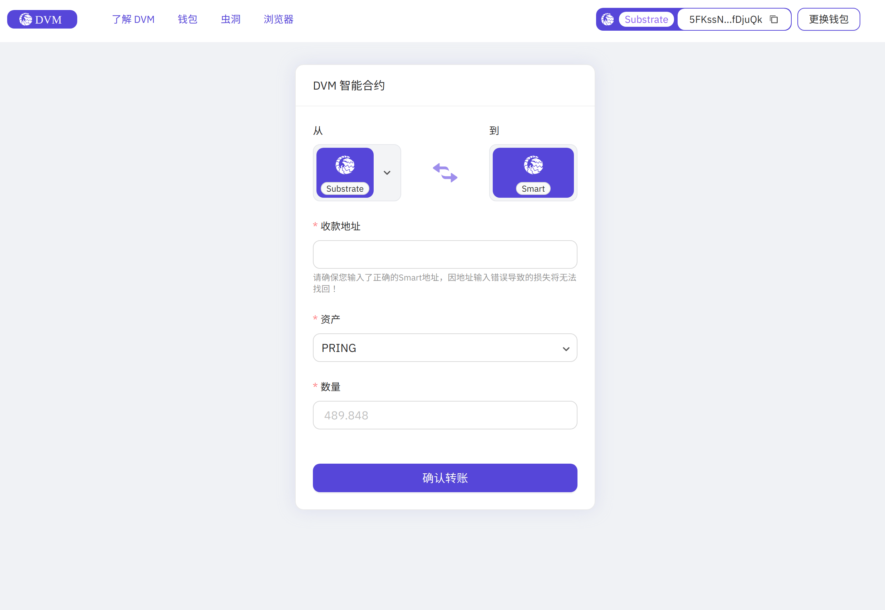

输入提前准备的 DVM 账户，以及充值金额，点击 `确认转账`。示例中的 DVM 账户为 `0xa3503704240f764cf91faBa1775754B42fd2040F`。

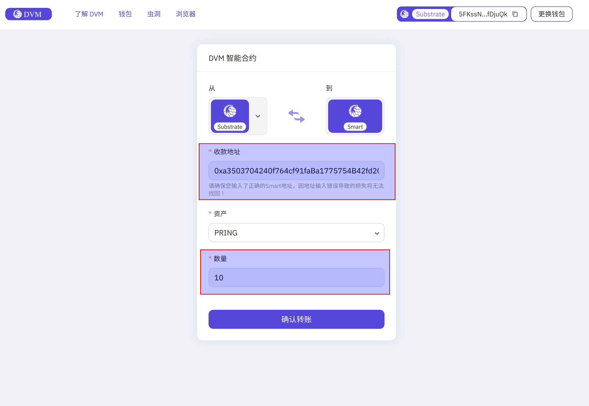

检查并勾选后两项，选择 `下一步`。   

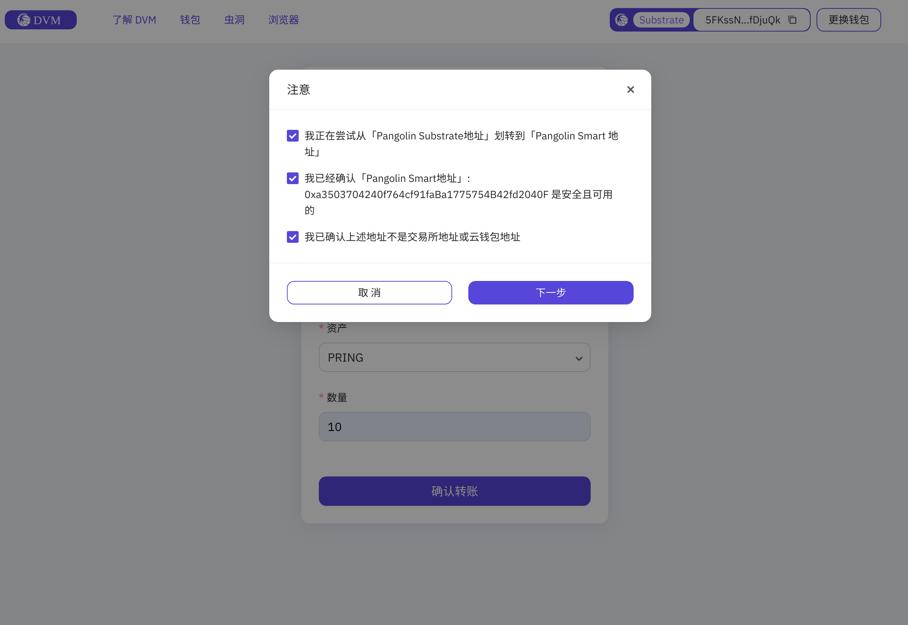

点击 `确定`。

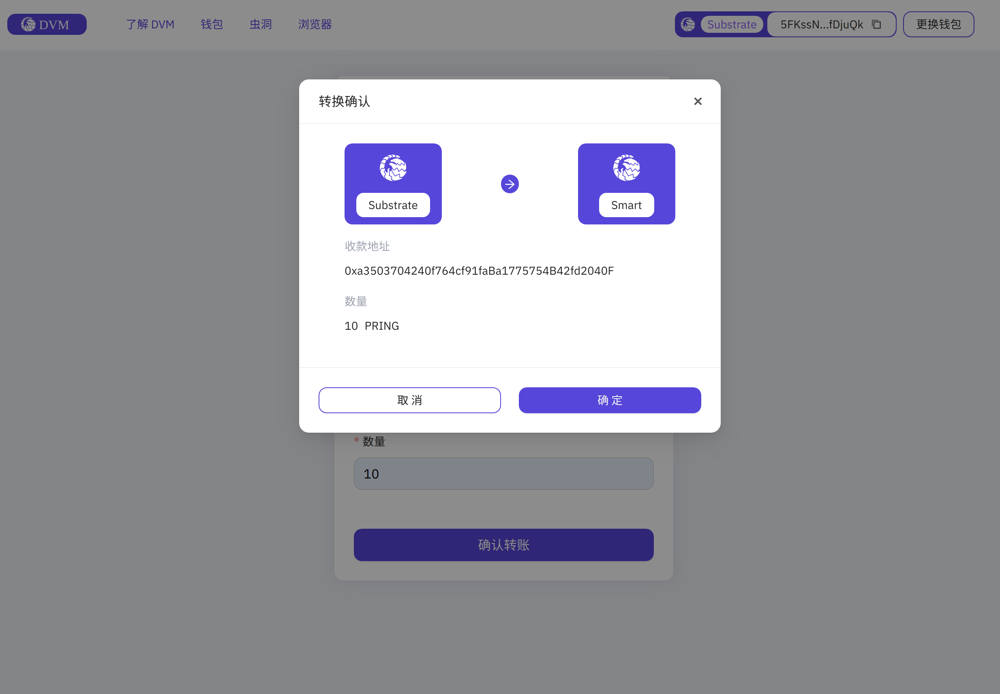

在跳出的 Polkadot Js 窗口内输入密码，签名并发送交易。

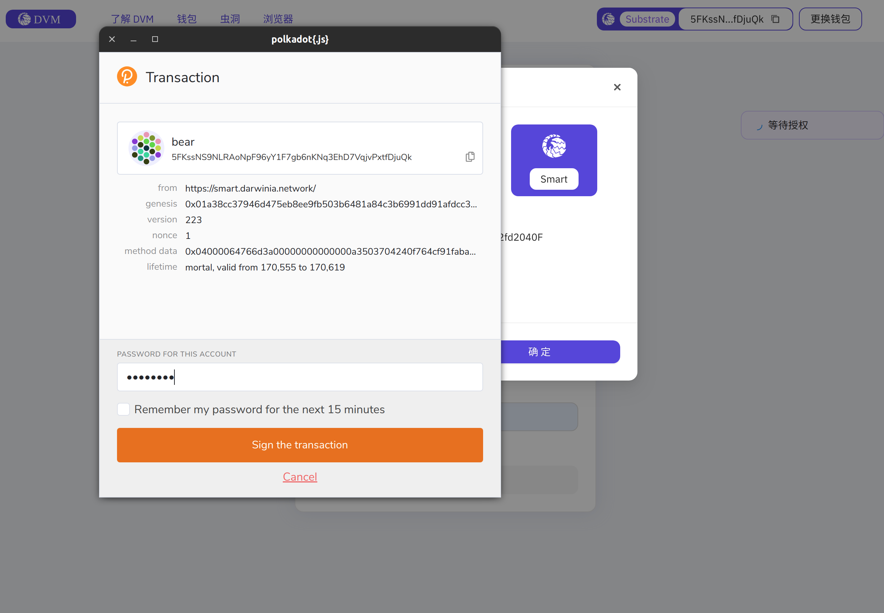

## 查看交易

点击 Substrate 账户详情，在 Subscan 中查看交易执行结果。

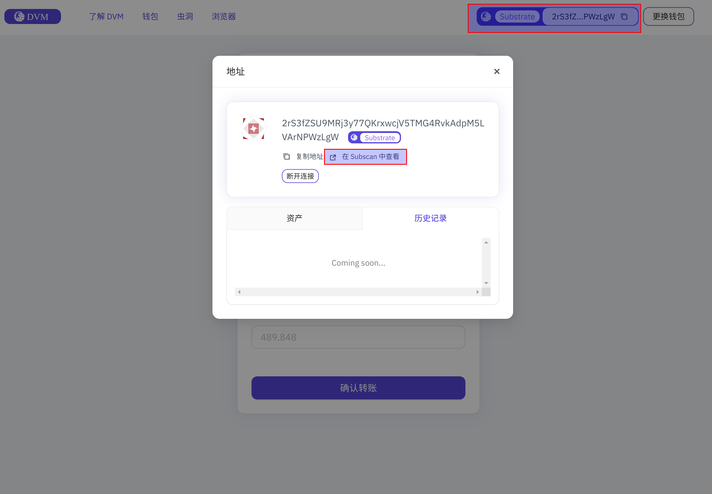
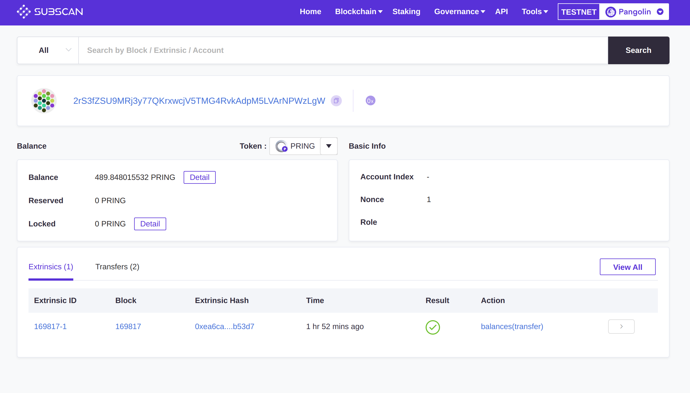

## 确认到账

Subscan 中查看账户余额：

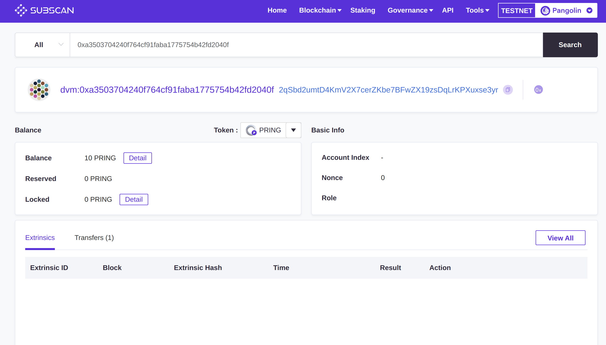

Metamask 中查看账户余额：

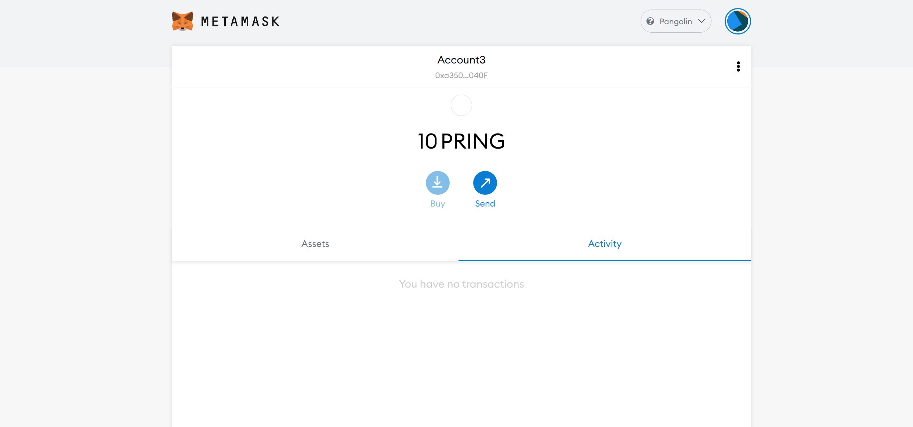