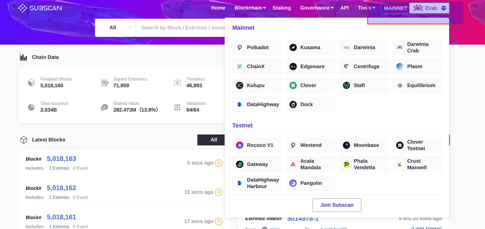
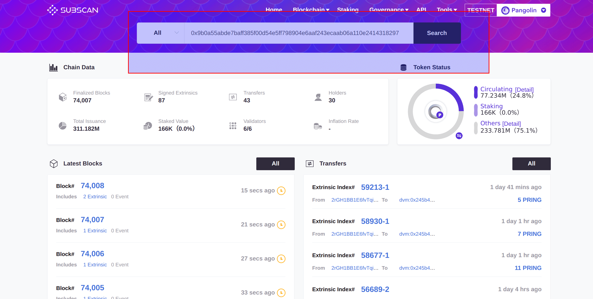
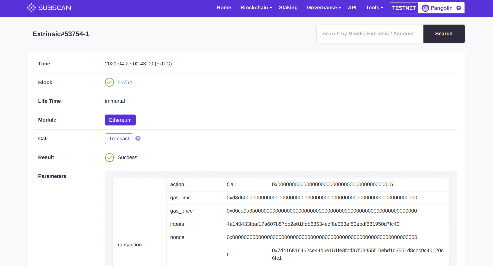

[Subscan](https://crab.subscan.io/) 是一款功能丰富，用户友好的多链浏览器，目前已增加对 DVM 智能合约解决方案的支持。

## 前置

切换网络，选择想要查询数据的网络。

## 查看交易信息

搜索框输入 DVM 交易哈希，点击 `搜索` 即可。

交易信息如下所示：

## 查看账户信息

如上图所示，可以清楚地展示出 DVM 账户和 Substrate 账户之间的对应关系，账户余额，质押以及交易历史等信息。