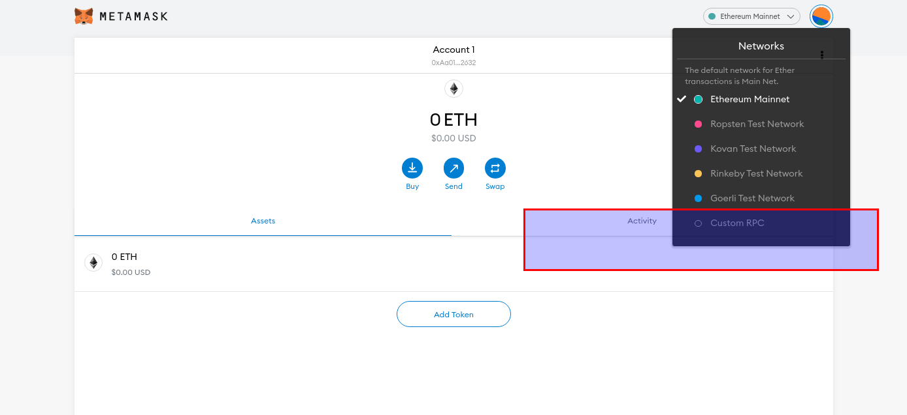
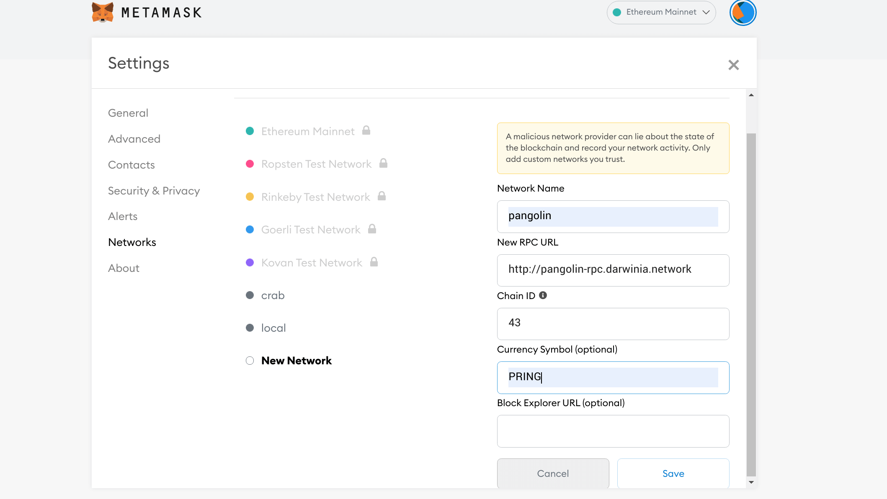
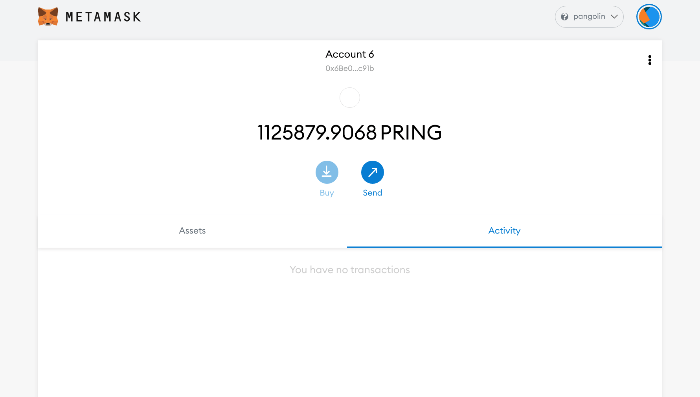
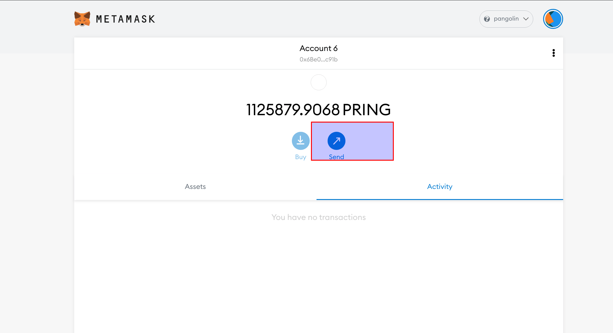
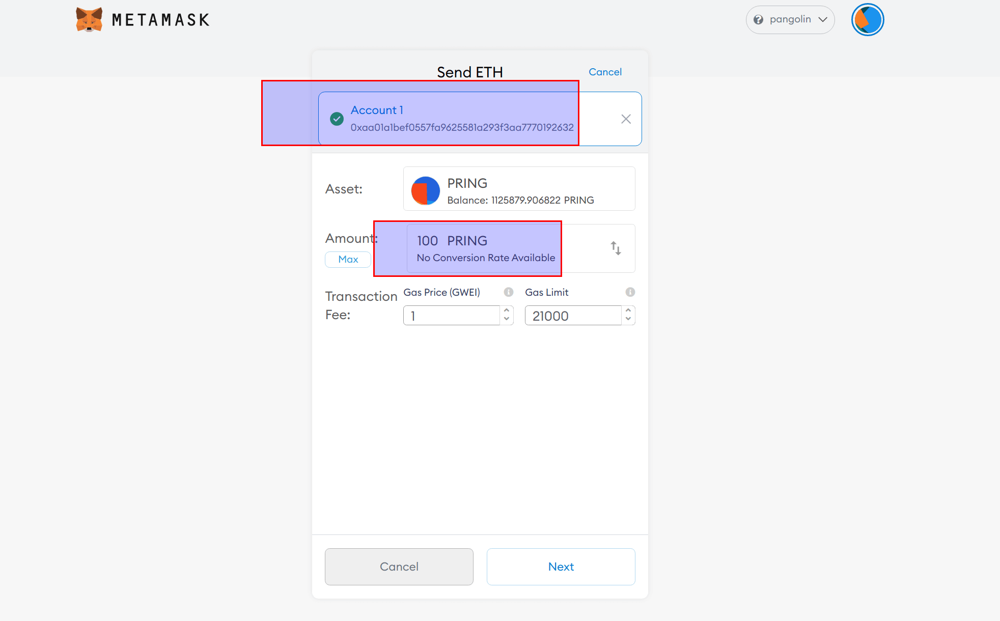
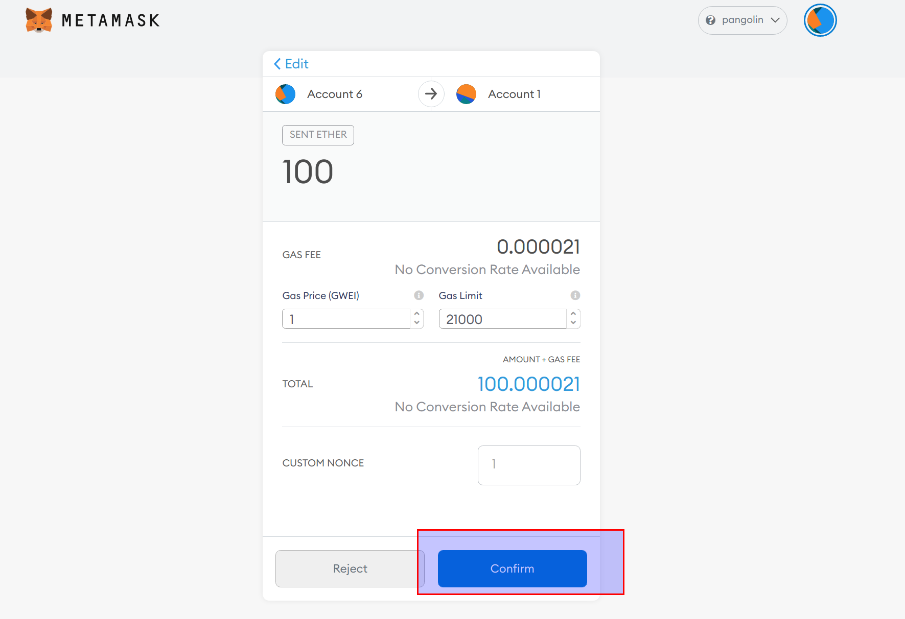
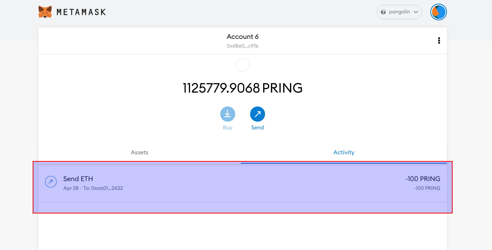
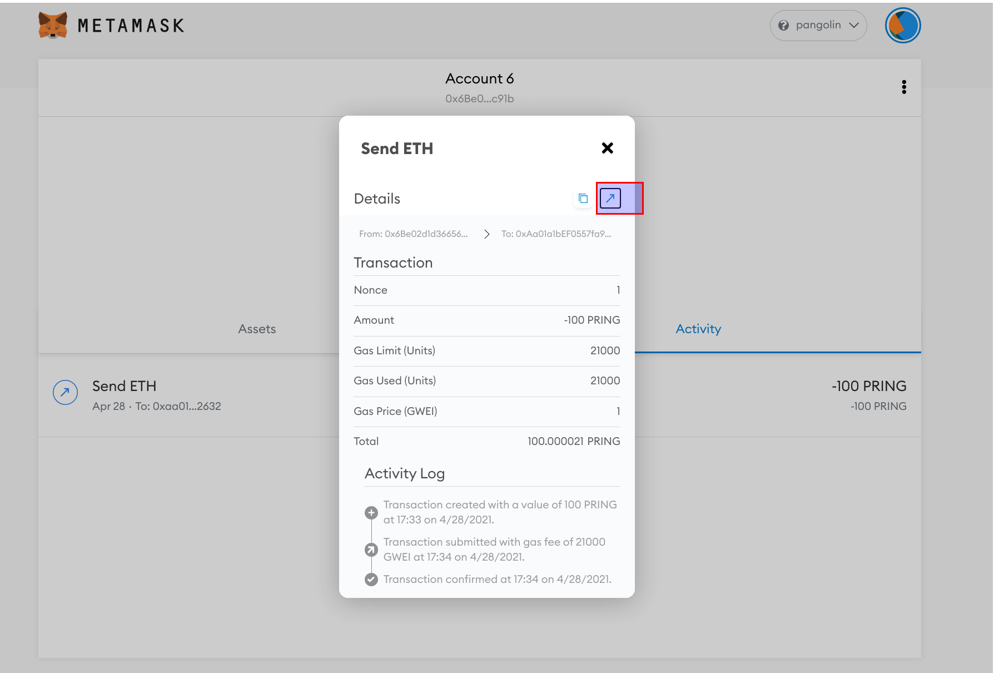
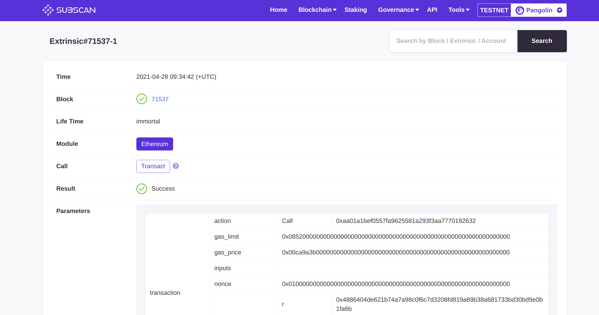

由于 DVM 和以太坊虚拟机在底层范式保持一致，用户可以使用现有以太坊生态中的钱包管理资产，接下来介绍如何使用 Metamask。

### 连接 Metamask

1. 安装 Metamask 插件，自行下载安装。
2. 添加自定义网络，这里以添加 Pangolin 测试网络为例，不同网络配置参数不同。

不同网络连接参数如下：

| 网络名称   | RPC URL                             | ChainId | 代币名称 | 浏览器地址 |
| ---------| ------------------------------------ | -------| --------|---------- |
| Pangolin | http://pangolin-rpc.darwinia.network | 43     | PRING   | https://pangolin.subscan.io/ |
| Crab     | http://crab-rpc.darwinia.network     | 44     | CRING   | https://crab.subscan.io/      |   

连接成功后，如下图所示。

### 转账

在 Pangolin 测试网络展示如何在 DVM 方案中使用 Metamask 转账以及查询交易情况。

1. 单击 `Send`，输入转账参数。 

2. 确认发送交易。

3. 交易完成。

4. 在浏览器中查看交易执行的细节。

