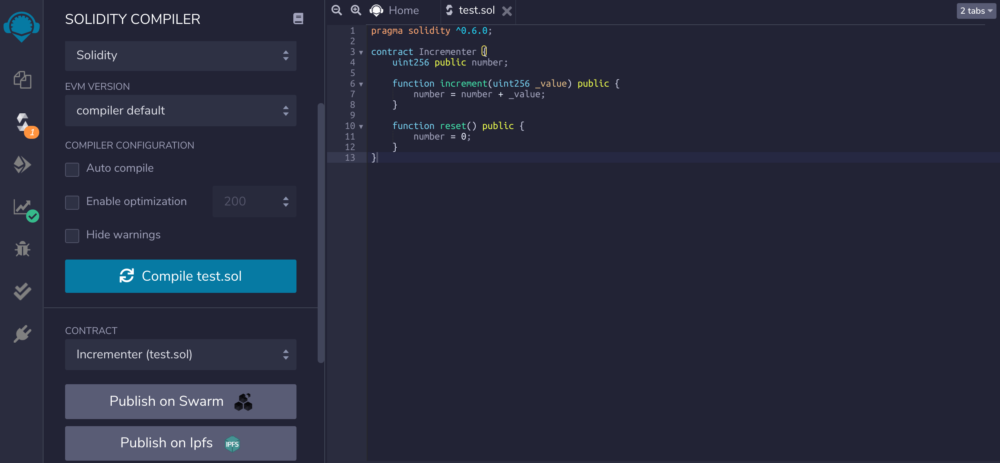
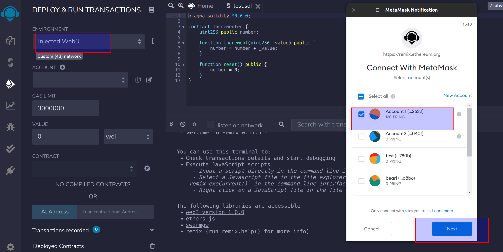
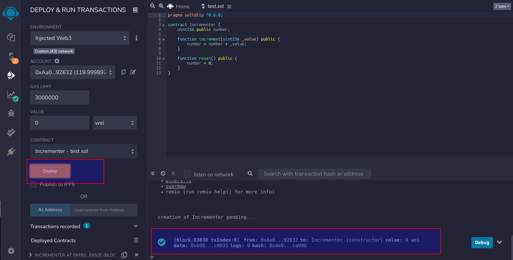
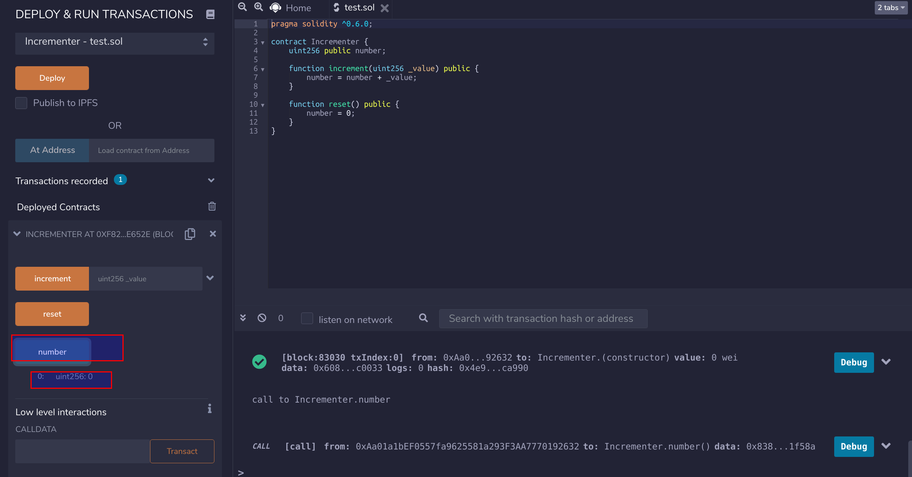
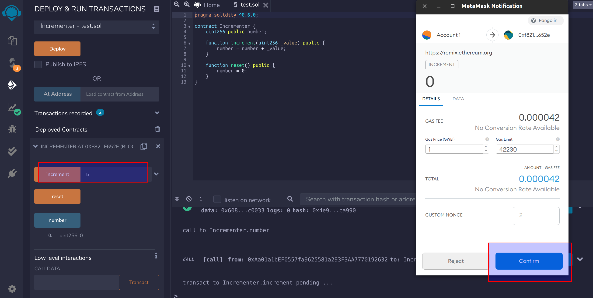
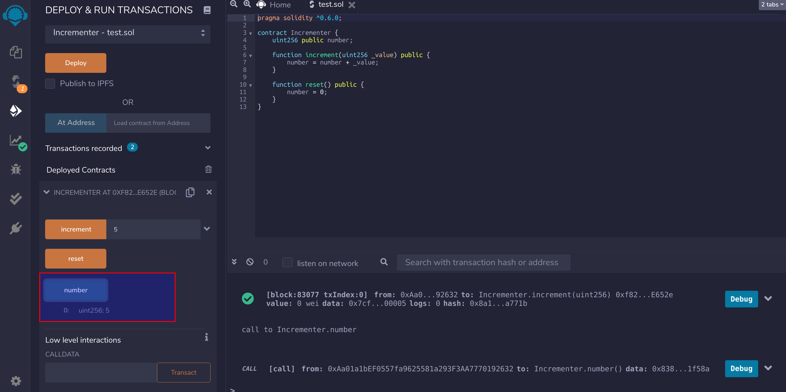

由于 DVM 和以太坊虚拟机在底层范式保持一致，用户可以使用现有以太坊生态智能合约开发工具，接下来介绍如何使用 Remix 操作合约。

## 编写合约代码

```js
pragma solidity ^0.6.0;

contract Incrementer {
    uint256 public number;

    function increment(uint256 _value) public {
        number = number + _value;
    }

    function reset() public {
        number = 0;
    }
}
```

示例合约程序如上图所示，点击 `Compile`，调试程序，保证编译成功。



## 连接 Metamask

Remix 可以关联 Metamask 上的 DVM 账户，并直接部署合约到对应的网络中。需要注意的是，DVM 账户需要提前绑定 Metamask, 请参考 [DVM 账户使用 Metamask](dvm-metamask)。 ENVIRONMENT 选择 `Injected Web3`，弹出的 Metamask 窗口中选择关联的 DVM 账户，点击 `Next`。



## 合约操作

连接 Metamask 成功后，点击 `Deploy` 部署合约，控制台会显示交易的执行情况。



合约部署成功后，执行 `number` 进行合约调用，此时的返回结果为 0。



执行 `increment` 合约，如下图所示：



再次执行 `number` 进行合约调用，返回结果为 5。



