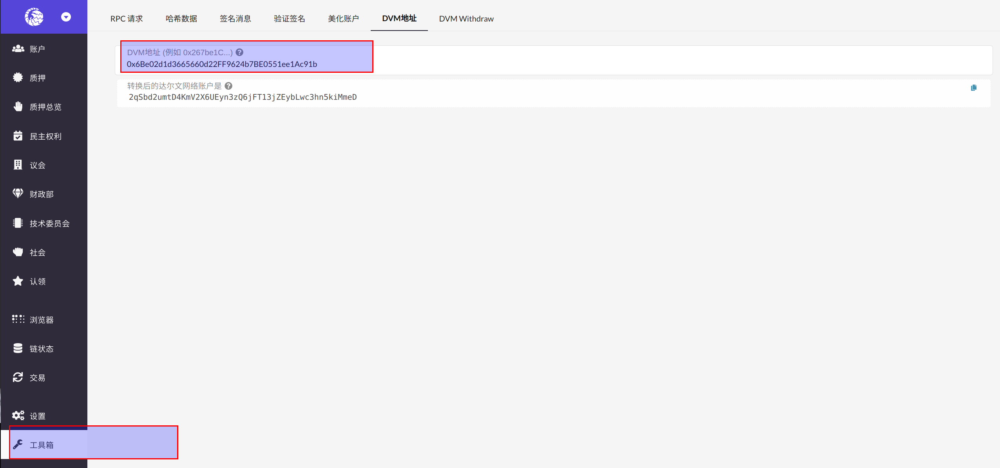

达尔文网络是基于 Substrate 开发的跨链网络，账户地址格式基于 [SS58 Address](https://substrate.dev/docs/en/knowledgebase/advanced/ss58-address-format) 模型。为了兼容以太坊智能合约生态，在现有网络基础上，引入第二种地址格式，即
DVM 账户。

## 转换规范

DVM 账户地址和以太坊账户地址格式，生成方式均一致，每一个 DVM 账户地址对应一个 Substrate 账户地址。

例如，DVM 账户地址 `0x6Be02d1d3665660d22FF9624b7BE0551ee1Ac91b` 对应的 Substrate 账户地址为 `2qSbd2umtD4KmV2X6UEyn3zQ6jFT13jZEybLwc3hn5kiMmeD`。

地址转换的规则如下图所示：

## 地址转换工具

目前使用 [Web Apps](https://apps.darwinia.network/#/account) 的工具完成地址转换，点击左侧 `工具箱`，然后 `DVM 地址`, 输入待转换的 DVM 账户地址即可。

