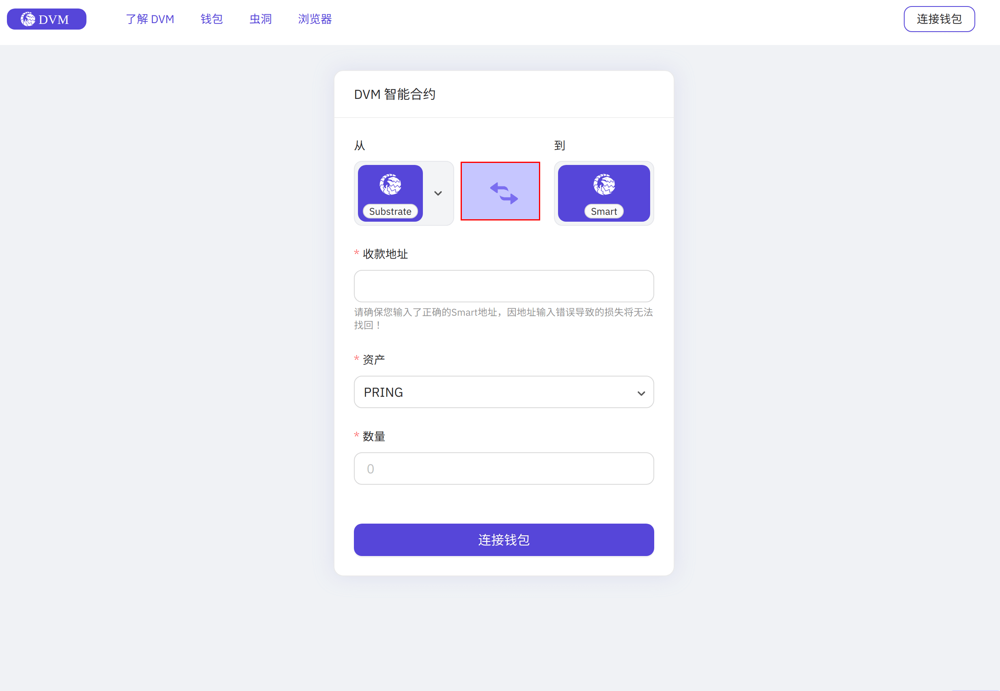
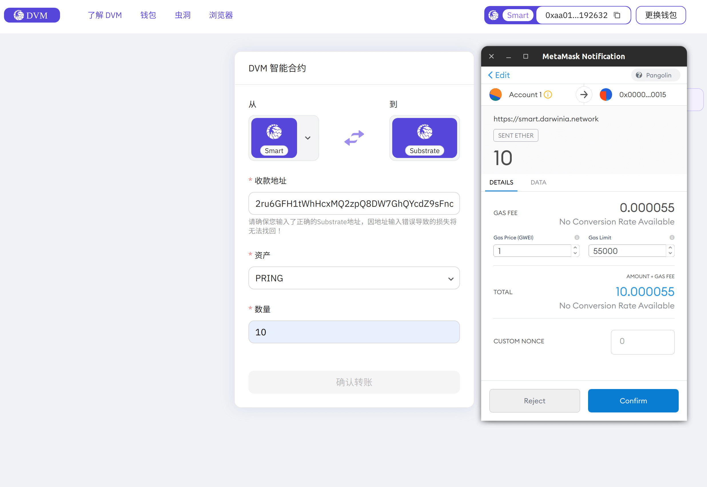

DVM 账户提款指的是将 DVM 账户中的资产转账到 Substrate 地址的过程。

## 准备 

准备一个接收 `PRING/PKTON` 的 Substrate 账户。

## 提取

> 注意: 在使用 Smart App 之前，需要 [安装 Metamask 插件](https://metamask.io/)。

打开 [Smart App](https://smart.darwinia.network/)，点击圈中箭头，设置为从 Smart 到 Substrate。

在跳出的 Metamask 窗口中，选择关联的 DVM 账户（该账户余额不为空）。

关联成功后，如下图所示：

输入提前准备的 Substrate 账户地址，如 `2ru6GFH1tWhHcxMQ2zpQ8DW7GhQYcdZ9sFnoEp98NyhjBimK`。

点击 `确认转账`。 

检查并勾选后两项，选择 `下一步`，在 Metamask 弹出框中选择 `确认`，签名发送交易。

## 确认到账

在 Subscan 中根据 Substrate 账户地址查询余额：

