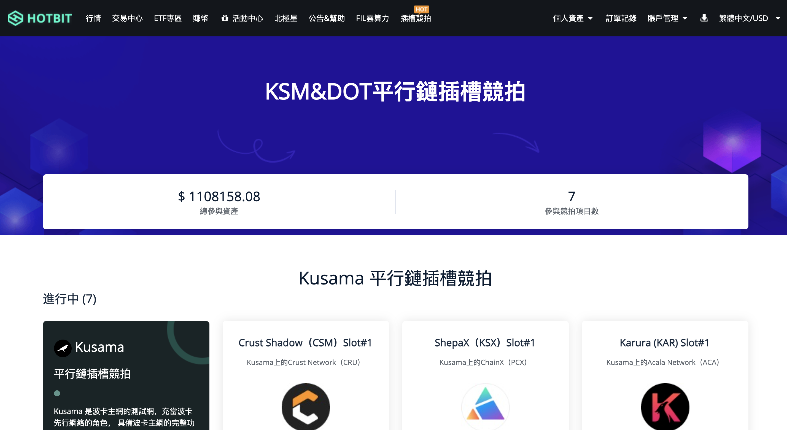
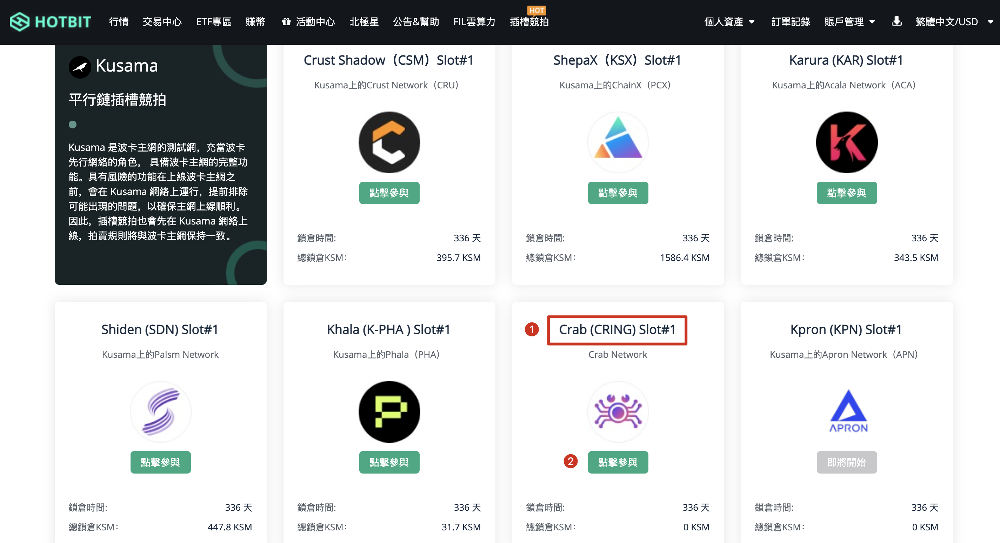

1. 点击进入 Hotbit 插槽拍卖页面：https://www.hotbit.io/slotauction

   

2. 选择 "Crab (CRAB) Slot#1"，选择 "点击参与" 并输入一定数量的 KSM 即可。
   
   
   

3. 用户在 Hotbit 为 Darwinia Crab 锁仓，Hotbit 将代替用户进行链上投票。如果项目拍中，Hotbit 将代替用户领取并发送项目奖励给用户。若项目未拍中，Hotbit 则将用户资产从链上取回，返还给用户并发放众贷期间的奖励。