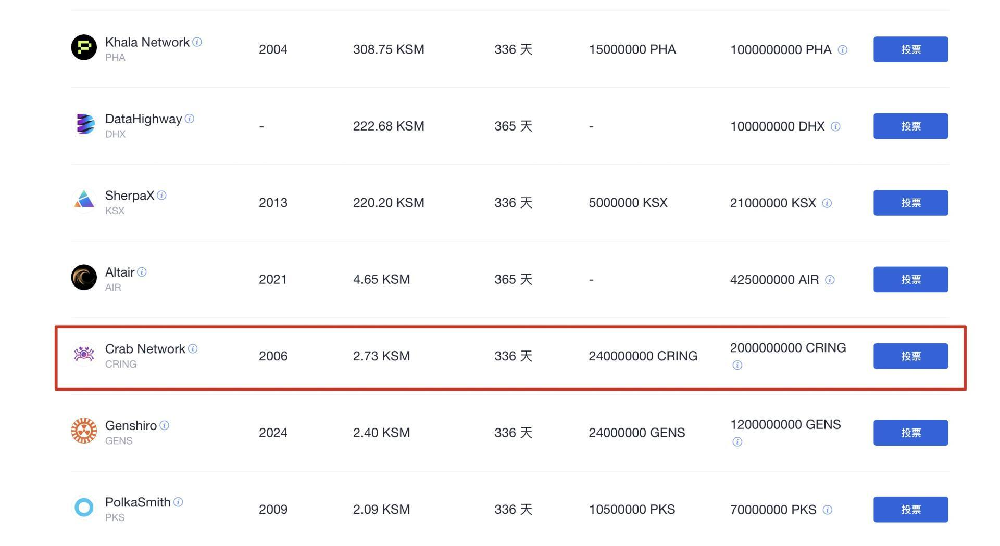
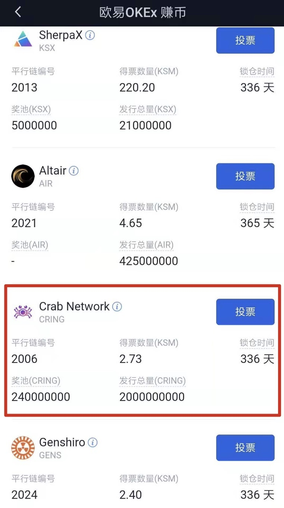

## 方式一：通过网页版 OKEx 加入众贷（Crowdloan） 

1.访问网页版[OKEx](https://www.okex.com/ )，点击"金融业务" > "赚币" > "平行链插槽竞拍"。

   

2.选择 “Crab Network”，点击“投票”，输入想要锁定的 KSM 数量并确认投票。

   

## 方式二：通过手机移动端 OKEx 加入众贷（Crowdloan） 

1.打开手机移动端OKEx，点击“资产” > “金融业务” > “赚币” > “平行链插槽竞拍”。 

   

2.选择 “Crab Network”，点击“投票”，输入想要锁定的 KSM 数量并确认投票。

   

> **重要提示**：我们将使用**25% 的 CRING 以及 1% 的 RING** 将用于支持未来 10 年 Crab 网络在 Kusama 上平行链插槽拍卖。我们将一次性竞拍一个插槽的 8 个 周期，为期 48 周，以保证网络的运行的稳定性不受影响。考虑到前几个插槽有一定不稳定性因素影响，我们计划在**第 4 轮开始进行插槽竞拍。**

> **重要提示**：我们会为支持 Crab 网络的用户提供 **RING** 和 **CRING** 的代币奖励，以及进化星球建立在 Crab 网络上的 哥伦布大陆、建立在 Heco 网络上的拂晓大陆的 **NFT（包括土地、钻头、使徒）奖励**。我们的**超级大奖是** **1 枚 BTC**，最幸运的一位用户可以在获取的土地 NFT 中发现到这枚 BTC 超级“盲盒”大奖。通过合作交易所支持 Crab 网络的用户也可以获得这些奖励。

